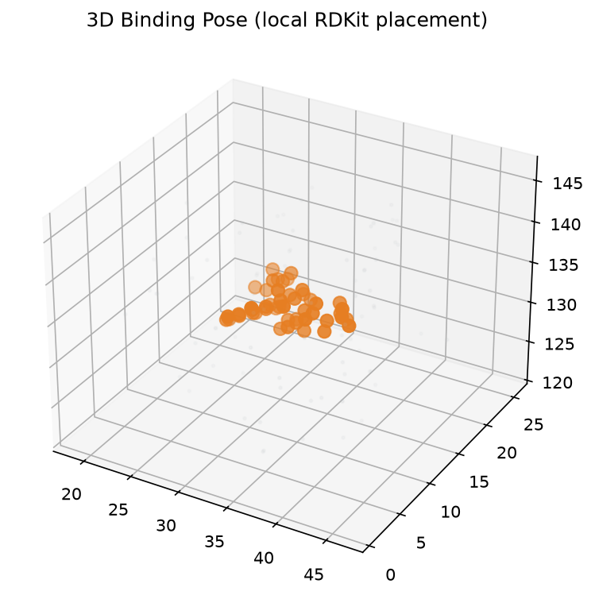
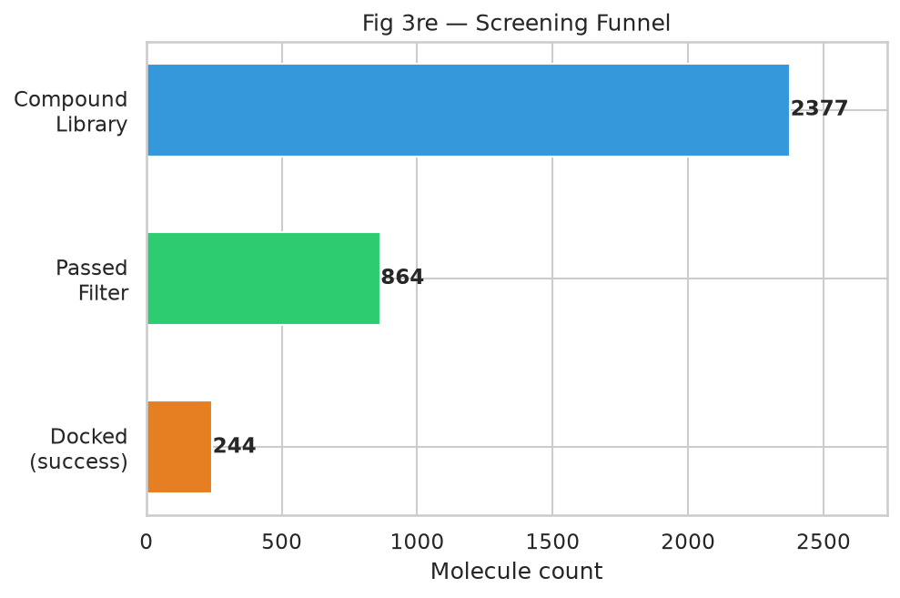

# OmniScreen-AI

**Multi-Modal High-Throughput Drug Screening & Dynamic Verification for PD-L1**

A full-modality drug screening platform for the tumor immunotherapy target **PD-L1** — small molecules · proteins/peptides · nucleic acids — with three parallel funnels sharing one closed loop: **pre-screen → docking/structure → MD kinetics / free energy**.

[](notebooks/OmniScreen_SM_Workflow.ipynb)
[](notebooks/OmniScreen_PE_Workflow.ipynb)
[](notebooks/OmniScreen_NA_Workflow.ipynb)

---

## Three-Modality Screening Overview

| Modality | Notebook | Toolchain | Progress | Documentation |
|----------|----------|-----------|----------|---------------|
| **Small molecules (SM)** | [`OmniScreen_SM_Workflow.ipynb`](notebooks/OmniScreen_SM_Workflow.ipynb) | RDKit · Vina · OpenMM · MM/PBSA | Modules 0–3, 6 ✅ · 4–5 GPU | [**SM modules →**](docs/workflows/SM_MODULES.md) |
| **Protein/peptide (PE)** | [`OmniScreen_PE_Workflow.ipynb`](notebooks/OmniScreen_PE_Workflow.ipynb) | ESM-2 · HDOCKlite · AlphaFold 3 · MM-GBSA | Modules 0–4, 6 ✅ · 5 GPU | [**PE modules →**](docs/workflows/PE_MODULES.md) |
| **Nucleic acids (NA)** | [`OmniScreen_NA_Workflow.ipynb`](notebooks/OmniScreen_NA_Workflow.ipynb) | ViennaRNA · Bowtie2 · AlphaFold 3 | Modules 0–6 ✅ | [**NA modules →**](docs/workflows/NA_MODULES.md) |

> Each pipeline has **module walkthroughs, data dictionaries, figure indexes, and FAQs** in its Markdown doc, with full figures and reproduction notes.

---

## Results Preview

### Small Molecules (SM) — ChEMBL real compound library · ~2,300 → 864 pass pre-screen → Top 250 docked

<p align="center">
  
  
</p>

- **Chemical space & Lipinski pre-screen** → **AutoDock Vina rigid docking** → 3D binding pose visualization
- Key outputs: `chemical_space_props.csv` · `docking_scores.csv` · `fig_3d_binding_pose.html`
- 📖 Full docs & figures: [docs/workflows/SM_MODULES.md](docs/workflows/SM_MODULES.md)

---

### Protein/Peptide (PE) — Nanobody CDR saturation mutagenesis · ESM-2 + PPI interface + AF3

<p align="center">
  
  
</p>

- **ESM-2 sequence fitness** → **PPI docking / interface scoring** → **AlphaFold 3 complex ranking** (Top1: CDR3_P98KV, ipTM ≈ 0.28)
- Key outputs: `mutation_scores.csv` · `ppi_docking_scores.csv` · `af3_pe_metrics.csv`
- 📖 Full docs & figures: [docs/workflows/PE_MODULES.md](docs/workflows/PE_MODULES.md)

---

### Nucleic Acids (NA) — CD274 mRNA siRNA design · off-target filtering · AF3 + thermodynamics

<p align="center">
  
  
</p>

- **Ui-Tei + ViennaRNA** → **Bowtie2 off-target filtering** → **AF3 protein–nucleic acid complexes** + RNA thermodynamics (Top1: CD274_2332_2352, ipTM ≈ 0.61)
- Key outputs: `sirna_candidates.csv` · `thermodynamics.csv` · `af3_na_metrics.csv`
- 📖 Full docs & figures: [docs/workflows/NA_MODULES.md](docs/workflows/NA_MODULES.md)

---

## Project Highlights

- **Three-modality parallel funnels**: chemical space · sequence space · RNA space, compared on the same PD-L1 target
- **Four-stage closed-loop validation**: AI pre-screen → docking/AF3 → MD kinetics → free energy calculation
- **Notebook-driven**: 3 workflow notebooks, modular blocks, tiered Colab / GPU compute
- **Reproducible outputs**: CSV, PNG, PDB/CIF under `data/screened_results/` included in the repo

## Repository Structure

```
OmniScreen-AI/
├── notebooks/          # SM / PE / NA workflows
├── docs/workflows/     # SM_MODULES.md · PE_MODULES.md · NA_MODULES.md (docs + figures)
├── data/
│   ├── receptor/       # PD-L1 PDB (5N2F, 4ZQK, etc.)
│   ├── raw_libraries/  # SMILES / FASTA / mRNA candidate libraries
│   └── screened_results/figures/   # All screening figures
├── docker/
└── requirements.txt
```

## Data Notes

- Screening CSVs, figure PNGs, receptor PDBs, AF3 best-structure CIFs → committed to GitHub
- MD trajectories (`.dcd` / `.xtc`) are too large → not in Git; see `data/*/README.md`

## Limitations & False Negatives

Virtual screening carries **false negative** risk (ligand prep failures, rigid-docking misses, etc.). See [SM modules — limitations & assumptions](docs/workflows/SM_MODULES.md#15-当前局限性与假设). Docking scores and pre-screen labels are **ranking hints**, not final druggability verdicts.

## License

MIT — see [LICENSE](LICENSE)
