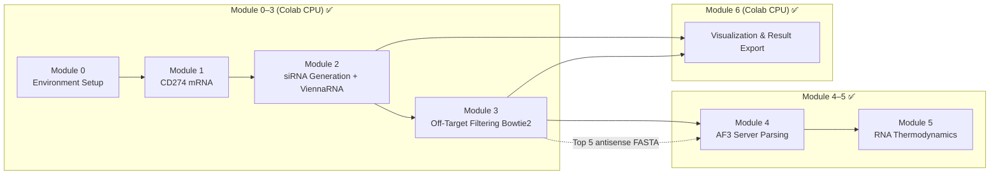

# OmniScreen Nucleic Acid Drug Screening Workflow (NA)

> **Notebook**: [`notebooks/OmniScreen_NA_Workflow.ipynb`](../../notebooks/OmniScreen_NA_Workflow.ipynb)  
> **Target**: CD274 (PD-L1) mRNA  
> **Current progress**: Module 0–6 ✅ (including AF3 Server parsing + thermodynamics) · Whole-genome off-target still chr22 demo

---

## Table of Contents

1. [Overview](#1-overview)
2. [Quick Start](#2-quick-start)
3. [Module Details](#3-module-details)
4. [Data Dictionary](#4-data-dictionary)
5. [Cross-Platform Handoff](#5-cross-platform-handoff-colab--af3--local)
6. [FAQ](#6-faq)
7. [Glossary](#7-glossary)
8. [References](#8-references)
9. [Relationship to SM / PE Workflows](#9-relationship-to-sm--pe-workflows)

---

## 1. Overview

### 1.1 Scientific Background and Project Goals

**PD-L1 (CD274)** is highly expressed in many tumor cells, and its mRNA is a potential target for nucleic acid therapeutics such as **siRNA**, **antisense oligonucleotides (ASO)**, and **Aptamer**. Compared with protein-level inhibition, mRNA-targeting strategies can reduce PD-L1 expression at the post-transcriptional level, but face challenges including **off-target effects**, **delivery efficiency**, and **immune activation**.

The goal of the **OmniScreen NA workflow** is to establish a reproducible funnel of **siRNA design → structural evaluation → genome-wide off-target filtering → protein–nucleic acid complex validation**, rapidly narrowing candidates at the computational level and providing inputs for AF3 structural validation and thermodynamic assessment.

This workflow does not replace cell-based experiments (qPCR, Western blot, off-target gene panels), but instead provides:

- Quantifiable **initial siRNA efficacy scoring** (Ui-Tei rules + ViennaRNA MFE)
- Auditable **off-target alignment results** (Bowtie2; production can upgrade to BWA-MEM2 + hg38)
- Reusable **modular Notebook workflow** (structure aligned with SM / PE workflows)

**Engineering layer (for reproducers)**:

| Layer | Content |
|------|------|
| Compute tiering | Module 0–3, 6 on **Colab CPU**; Module 4 depends on **AlphaFold 3 Server** |
| Notebook modularity | Each Module in independent cells, rerunnable individually |
| Data sync | `export_for_local_sync()` writes `data/` back locally; or GitHub push |
| Collaboration | Cursor + Notebook MCP auto-executes cells; Agent parses sync markers |

### 1.2 Technical Roadmap Overview



**Screening logic (funnel)**:

| Stage | Eliminated | Retention criteria |
|------|----------|----------|
| Module 2 | Abnormal GC content, low Ui-Tei score | `passed_basic == True`; sort by `efficacy_score` descending |
| Module 3 | Too many chr22 off-target hits, too few mismatches (near-perfect complementarity) | `passed_offtarget == True` (demo threshold) |
| Module 4 | Low AF3 ipTM, insufficient interface confidence | Relative `iptm` ranking; reference ≥0.6 |
| Module 5 | Weak hybridization or excessive antisense self-folding | `passed_thermo == True` |

**Figure index and filename reference** (drawn in Module 6; data provenance per module):

| Figure | Filename | Data source | Interpretation |
|------|--------|----------|----------|
| 7a | `fig7a_efficacy_distribution.png` | `sirna_candidates.csv` | [Module 2](#module-2--sirna-candidate-generation--viennarna-structural-evaluation) |
| 7b | `fig7b_gc_vs_mfe_scatter.png` | `sirna_candidates.csv` | Module 2 |
| 7c | `fig7c_mrna_target_map.png` | `sirna_candidates.csv` | Module 2 |
| 7d | `fig7d_offtarget_manhattan.png` | `sirna_offtarget.sam` | [Module 3](#module-3--genome-wide-off-target-filtering-bowtie2--chr22-demo) |
| 7e | `fig7e_offtarget_funnel.png` | Module 2 + 3 summary | Module 3 |
| 8a | `fig8a_rna_structure.png` | Top-5 guide–target hybrid duplex | Module 5 / 6 |
| 8b | `fig8b_thermo_profile.png` | `sirna_candidates.csv` (window MFE) | Module 6 |
| NA-AF3 | `fig_na_af3_iptm_ranking.png` | `af3_na_metrics.csv` | [Module 4](#module-4--alphafold-3-proteinnucleic-acid-complex-validation) |
| NA-AF3 | `fig_na_af3_complex.html` / `.png` | Top1 CIF | Module 4 |
| NA-Thermo | `fig_na_thermo_scatter.png` | `thermodynamics.csv` | [Module 5](#module-5--rna-thermodynamics-and-stability-assessment) |

### 1.3 Technology Stack

| Category | Tool / Library | Purpose |
|------|-----------|------|
| Sequence retrieval | Biopython Entrez | Download CD274 mRNA from NCBI |
| RNA secondary structure | ViennaRNA (`RNA.fold`) | MFE and dot-bracket structure |
| siRNA design rules | Ui-Tei heuristics | Initial efficacy scoring |
| Genome alignment | Bowtie2 (chr22 demo) | Off-target scan; production: BWA-MEM2 + hg38 |
| Structure validation | AlphaFold 3 Server + local parsing | PD-L1 protein + siRNA complex; ipTM / pTM |
| Thermodynamics | ViennaRNA `RNA.duplexfold` / `fold` | siRNA–mRNA hybrid ΔG, antisense hairpin |
| Visualization | matplotlib, seaborn, py3Dmol | Manhattan plot, funnel, AF3 ranking / 3D HTML |
| Runtime | Colab CPU + AF3 Server (semi-automated) | Module 0–3, 5, 6 on CPU; Module 4 requires Server |
| Collaboration | Cursor Agent + `export_for_local_sync` | Write cloud results back locally |

### 1.4 Use Cases and Extension Directions

| Scenario | Replace | Keep modules |
|------|--------|----------|
| **Change mRNA target** | `CD274_ACCESSION`, FASTA file | Module 1–3 logic |
| **Change siRNA length** | `SIRNA_LEN` (19–23 nt) | Module 2 sliding window |
| **Aptamer screening** | Use SELEX sequence library + structure scoring | Module 2 structure evaluation framework |
| **ASO / PMO** | Adjust window length and design rules | Module 2 rule functions |
| **Whole-genome off-target** | chr22 → full hg38 index + BWA-MEM2 | Module 3 alignment engine |
| **Combine with PE** | Share `4ZQK.pdb` for AF3 complex | Module 4 input |
| **Combine with SM** | Same PD-L1 target; protein inhibition + mRNA silencing in parallel | Share `data/receptor/` |

### 1.5 Current Limitations and Assumptions

- **chr22 demo ≠ whole-genome safety**: Module 3 currently scans only the hg38 **chr22** subset for off-targets; **cannot** serve as clinical-grade off-target assessment; production requires full hg38 index.
- **Notebook title says BWA-MEM2, implementation is Bowtie2**: Current code uses Bowtie2 demo; documentation follows actual code.
- **Ui-Tei + MFE ≠ silencing efficiency**: Computational scores require qPCR / luciferase assay validation.
- **21 nt short-window MFE approaches 0**: ViennaRNA shows small folding energy changes for short fragments; Module 5 supplements with siRNA–mRNA hybrid ΔG.
- **AF3 protein–siRNA is structural demonstration**: Real target is mRNA; ipTM is for relative ranking only.
- **Module 5 lenient on perfect complementarity**: 21-mer perfect-pairing duplex ΔG is typically ≪ −20; thresholds mainly exclude abnormal self-folding.
- **Full mRNA sliding window**: Does not distinguish CDS / 3'UTR functional regions; regional annotation filtering can be added later.

---

## 2. Quick Start

### 2.1 Environment Requirements

| Environment | Description |
|------|------|
| **Colab + Cursor (recommended)** | Notebook MCP connected to Colab kernel |
| **Colab CPU** | Module 0–3, 6 all runnable on CPU |
| **System dependencies** | Module 3 requires `bowtie2` (Colab installs via `apt-get`) |
| **Python packages** | `biopython`, `ViennaRNA`, `pandas`, `matplotlib`, `seaborn`, `requests` |
| **Optional** | Set `GITHUB_TOKEN` in Colab Secrets for auto push (non-blocking) |

### 2.2 Recommended Run Order (Module 0–3 → 6)

```
Module 0  →  Initialize PATHS + dependency install cell
    ↓
Module 1  →  Download CD274 mRNA + 4ZQK receptor (< 2 min)
    ↓
Module 2  →  Generate sirna_candidates.csv (~ 2–5 min)
    ↓
Module 3  →  Download chr22 + Bowtie2 index + off-target filtering (first run ~ 10–20 min)
    ↓
Module 6  →  Generate figures/fig7*, fig8* (< 2 min)
```

> Module 4–5 implemented; Module 6 can run independently of AF3 (requires only Module 2–3 data).

### 2.3 Output Directory

```
data/
├── receptor/
│   ├── 4ZQK.pdb                         # Module 1 (for AF3)
│   ├── PD1_4ZQK_chainA.pdb              # Module 1 chain split
│   └── PDL1_4ZQK_chainB.pdb
├── raw_libraries/
│   ├── CD274_mRNA.fasta                 # Module 1
│   ├── cd274_target_metadata.json       # Module 1
│   └── reference/
│       ├── chr22.fa                     # Module 3 (~50 MB, first download)
│       └── sirna_queries.fa             # Module 3 Top-N antisense strands
└── screened_results/
    ├── sirna_candidates.csv             # Module 2
    ├── sirna_offtarget.sam              # Module 3 alignment results
    ├── offtarget_filtered.csv           # Module 3 after off-target filtering
    └── figures/
        ├── fig7a_efficacy_distribution.png
        ├── fig7b_gc_vs_mfe_scatter.png
        ├── fig7c_mrna_target_map.png
        ├── fig7d_offtarget_manhattan.png
        ├── fig7e_offtarget_funnel.png
        ├── fig8a_rna_structure.png
        └── fig8b_thermo_profile.png
```

See [`data/screened_results/README.md`](../../data/screened_results/README.md) for details.

---

## 3. Module Details

> Each module follows a uniform structure: **Purpose → Dependencies → Input → Method → Output → Criteria → Compute → Migration scenarios → Result interpretation (with figures)**

---

### Module 0 — Environment Setup and Path Initialization

**Purpose**: Unify project root `PATHS` and initialize Colab ↔ GitHub ↔ local sync mechanism.

**Prerequisites**: None.

**Input**: GitHub repo `OmniScreen-AI` (Colab auto clone / pull).

**Method**:
- Detect Colab / local environment, set `PROJECT_ROOT`
- Define `PATHS = {receptor, raw, results}`
- Provide `persist_to_github()` and `export_for_local_sync()` for data persistence
- GitHub Token read from environment variable or Colab Secrets (**non-blocking**, avoids `getpass()` blocking MCP)

**Output**: In-memory variables `PATHS`, `PROJECT_ROOT` (no files).

**Compute**: Colab CPU, < 1 minute.

**Migration scenario**: Any project needing Colab cloud compute + local Cursor collaboration can copy Module 0's `setup_project()` template.

> Module 0 is infrastructure; scientific content begins at Module 1.

---

### Module 1 — Data Preparation: CD274 mRNA & Target Metadata

**Purpose**: Obtain full-length PD-L1 (CD274) mRNA sequence from NCBI and prepare PD-L1 protein structure required for AF3.

**Prerequisites**: Module 0.

| Type | Path | Description |
|------|------|------|
| **Input (auto)** | NCBI `NM_014143` | Homo sapiens CD274 mRNA |
| **Input (auto)** | RCSB `4ZQK` | PD-1/PD-L1 complex crystal structure |
| **Output** | `data/raw_libraries/CD274_mRNA.fasta` | mRNA sequence (T→U normalized) |
| **Output** | `data/raw_libraries/cd274_target_metadata.json` | Design parameter metadata |
| **Output** | `data/receptor/4ZQK.pdb` | Full complex (for Module 4) |
| **Output** | `data/receptor/PDL1_4ZQK_chainB.pdb` | PD-L1 chain (AF3 protein input) |

**Method**:
- `Bio.Entrez.efetch` downloads RefSeq mRNA
- `requests` downloads PDB from RCSB and splits by chain

**Key parameters**:

| Parameter | Value | Description |
|------|-----|------|
| `CD274_ACCESSION` | `NM_014143` | RefSeq mRNA |
| `mrna_length` | 3634 nt | Current run result |
| `sirna_length` | 21 nt | Default siRNA length (recorded in metadata) |

**Compute**: Colab CPU, < 2 minutes.

**Migration scenario**: Replace `CD274_ACCESSION` with any NCBI mRNA accession; swap target protein PDB for Module 4.

---

### Module 2 — siRNA Candidate Generation + ViennaRNA Structural Evaluation

**Purpose**: Slide-window cleavage across full mRNA sequence; evaluate each siRNA candidate's efficacy potential using Ui-Tei rules and ViennaRNA MFE.

**Prerequisites**: Module 0, Module 1.

**Input**: `data/raw_libraries/CD274_mRNA.fasta`

**Method**:

| Step | Tool | Description |
|------|------|------|
| Sliding window | Custom | 21 nt window, default step 3 |
| GC content | Custom | 25–60% acceptable range |
| Ui-Tei scoring | Heuristic rules | 5' end A/U, position 19 A, GC 30–55%, etc. |
| Secondary structure | `RNA.fold` | Target strand MFE and dot-bracket |
| Composite efficacy | `efficacy_score` | Ui-Tei + accessibility + GC bonus |

**Key parameters**:

| Parameter | Default | Description |
|------|--------|------|
| `SIRNA_LEN` | 21 | siRNA length (nt) |
| `STEP` | 3 | Window step (demo; production can use 1) |
| `MAX_CANDIDATES` | 800 | Candidate cap |
| `passed_basic` | GC 25–60% and Ui-Tei ≥ 2.0 | Basic filter |

**Output**: `data/screened_results/sirna_candidates.csv`

**Criteria**: Sort by `efficacy_score` **descending**; `passed_basic == True` enters Module 3 priority queue.

**Current run result**: 800 candidates, **567** with `passed_basic == True`; `efficacy_score` median **4.5**, max **7.5**.

**Compute**: Colab CPU, ~ **2–5 minutes** (800 candidates).

**Migration scenarios**:
- **siRNA length**: Change to 19 or 23 nt
- **Step 1**: Full scan; candidate count ≈ mRNA length
- **Region restriction**: Scan only 3'UTR or CDS segments

#### Result Interpretation (Module 2 Visualization)

##### Figure 7a — Efficacy Score Distribution


| Item | Description |
|------|------|
| **Plot meaning** | X-axis: composite efficacy score `efficacy_score` (higher is better); Y-axis: candidate count; dashed line: library median |
| **Reading tips** | Right-skewed distribution indicates most candidates at moderate efficacy; peak in high-score region shows Ui-Tei rules selected a batch of preferred windows |
| **Data conclusion** | Of 800 candidates, **567** pass basic filter; median 4.5, top-tier efficacy reaches **7.5** (e.g. `CD274_2332_2352`) |
| **Meaning & limits** | Efficacy score is computational heuristic; not directly equivalent to in vitro silencing efficiency; qPCR validation required |

##### Figure 7b — GC% vs MFE Scatter Plot


| Item | Description |
|------|------|
| **Plot meaning** | X-axis: GC content (%); Y-axis: ViennaRNA MFE (kcal/mol); color maps `efficacy_score` |
| **Reading tips** | GC too high or low usually reduces siRNA efficacy; more negative MFE indicates more stable local secondary structure (accessibility may decrease) |
| **Data conclusion** | GC range ~ **9.5–81%**; 21 nt short-window MFE mostly near **0** (mostly single-stranded), limited discrimination |
| **Meaning & limits** | Short-fragment MFE does not represent full mRNA folding; hybrid ΔG supplemented in Module 5 |

##### Figure 7c — siRNA Position Distribution on mRNA


| Item | Description |
|------|------|
| **Plot meaning** | X-axis: mRNA position (1–3634 nt); Y-axis: efficacy; green/red distinguishes basic filter pass; dashed lines mark Top-5 off-target-safe candidates |
| **Reading tips** | Observe whether high-efficacy sites cluster in specific regions (e.g. 3'UTR); avoid all Top candidates in one local region |
| **Data conclusion** | Top candidates spread across **nt 211–2332**; not overly concentrated; highest scores at positions 1588, 1651, 211, 2296, 2332, etc. |
| **Meaning & limits** | No transcript isoform or SNP correction; production should combine annotation to filter non-functional regions |

---

### Module 3 — Genome-Wide Off-Target Filtering (Bowtie2 / chr22 Demo)

**Purpose**: Align Top siRNA antisense strands to reference genome; count off-target hits and mismatches; filter high-risk candidates.

**Prerequisites**: Module 0–2.

**Input**:

| File | Description |
|------|------|
| `sirna_candidates.csv` | Top 150 (`passed_basic` prioritized) |
| hg38 chr22 | Demo reference sequence (UCSC download) |

**Method**:

```text
sirna antisense  →  sirna_queries.fa  →  bowtie2-build (chr22)
    →  bowtie2 align (--very-sensitive -k 10)
    →  SAM  →  offtarget_hits_chr22 + best_mismatch  →  passed_offtarget
```

**Key parameters**:

| Parameter | Value | Description |
|------|-----|------|
| `TOP_N` | 150 | Number of siRNAs in off-target analysis |
| `MAX_MISMATCH` | 2 | Maximum allowed mismatches |
| `MAX_OFFTARGET_HITS` | 3 | chr22 demo threshold |
| Bowtie2 | `--very-sensitive -k 10` | Sensitive mode, up to 10 alignments / query |

**Output**:

| File | Description | Downstream |
|------|------|------|
| `offtarget_filtered.csv` | Sorted table after off-target filtering | Module 4 Top-5 selection, Module 6 fig 8a |
| `sirna_offtarget.sam` | Raw alignment results | Module 6 fig 7d |
| `reference/sirna_queries.fa` | Antisense query FASTA | Can submit to external off-target tools |

**Criteria**: `passed_offtarget == True` when chr22 hit count ≤ 3 and best mismatch ≤ 2 (or zero hits).

**Current run result**: 150 in off-target analysis, **150 / 150** pass chr22 demo threshold; Top-5 all have **0** chr22 hits, `efficacy_score = 7.5`.

**Compute**: Colab CPU; **first run** chr22 download + index build ~ **10–20 minutes**; ~ **2–5 minutes** after cache.

**Migration scenarios**:
- **Full hg38**: Replace reference sequence, use BWA-MEM2
- **Stricter thresholds**: `MAX_OFFTARGET_HITS = 0`, `MAX_MISMATCH = 1`
- **Seed-region matching**: Count off-targets only in seed (nt 2–8) region

**Cross-module handoff (Module 3 → 4)**:

| Handoff item | Path | Description |
|--------|------|------|
| Off-target filtered table | `offtarget_filtered.csv` | Take Top 5 with `passed_offtarget == True` |
| PD-L1 structure | `data/receptor/4ZQK.pdb` or `PDL1_4ZQK_chainB.pdb` | AF3 protein chain input |
| Nucleic acid sequence | Top 5 `antisense_seq` | AF3 nucleic acid chain input |
| AF3 JSON | `af3_server/na/batch_top5.json` | Generated; upload to Server |

#### Result Interpretation (Module 3 Visualization)

##### Figure 7d — chr22 Off-Target Manhattan Plot


| Item | Description |
|------|------|
| **Plot meaning** | X-axis: chr22 genomic position (bp); Y-axis: mismatch count (NM tag); each point is one Bowtie2 alignment |
| **Reading tips** | Lower mismatch (near-perfect complementarity) means higher off-target risk; ideal Top candidates have no hits, or only high-mismatch weak binding |
| **Data conclusion** | Current SAM has only **2** valid alignments (demo library + strict seed), indicating Top 150 have low overall off-target pressure on chr22 — **but this does not equal whole-genome safety** |
| **Meaning & limits** | chr22 is only ~1% of genome; must switch to full hg38 for decision-making |

##### Figure 7e — siRNA Screening Funnel


| Item | Description |
|------|------|
| **Plot meaning** | Three-stage candidate counts: Module 2 full library → basic filter → chr22 off-target safe |
| **Reading tips** | Funnel narrowing reflects screening intensity; if Module 3 eliminates almost none, demo threshold is loose or reference set too small |
| **Data conclusion** | **800 → 567 → 150** (Module 3 analyzes Top 150 only, and all 150 pass) |
| **Meaning & limits** | Funnel numbers reflect workflow health, not silencing efficiency; whole-genome off-target will significantly narrow funnel |

---

### Module 4 — AlphaFold 3 Protein–Nucleic Acid Complex Validation

**Purpose**: Parse Top 5 protein–siRNA complexes downloaded from AlphaFold Server; rank relatively by ipTM / pTM; export best CIF + 3D preview.

**Prerequisites**: Module 3; AF3 Server results extracted to `data/screened_results/af3_server/na/na_cd274_*_pdl1/`.

**Input**:

| File | Description |
|------|------|
| `af3_server/na/batch_top5.json` | Upload JSON (generated) |
| `af3_server/na/na_cd274_*_pdl1/` | Server download zip extract directory |
| `*_summary_confidences_*.json` | Per-model confidence |

**Method**:

```text
AF3 Server zip
  → Parse summary_confidences (iptm / ptm / ranking_score / chain_pair_iptm)
  → Select best model by ranking_score
  → Copy *_best.cif → af3_na_complexes/
  → Draw ipTM ranking plot + Top1 py3Dmol HTML
```

**Key parameters / reading reference**:

| Metric | Reference | Description |
|------|------|------|
| ipTM | ≥ 0.6 relatively credible | Interface confidence; used for relative ranking in this demo |
| pTM | — | Overall fold confidence |
| prot_rna_iptm_max | — | Max protein–RNA chain-pair ipTM |
| has_clash | Should be 0 | Steric clash flag |

**Output**:

| File | Description |
|------|------|
| `af3_na_metrics.csv` | ipTM / pTM / ranking_score per candidate |
| `af3_na_complexes/*_best.cif` | Best model per job |
| `figures/fig_na_af3_iptm_ranking.png` | ipTM ranking plot |
| `figures/fig_na_af3_complex.html` | Top1 interactive 3D |
| `figures/fig_na_af3_complex.png` | Top1 complex PyMOL cartoon snapshot |

**Current run result (best models)**:

| siRNA | ipTM | pTM | Protein–RNA≈ | ranking_score |
|-------|------|-----|-----------|---------------|
| **CD274_2332_2352** | **0.61** | 0.62 | 0.57 | 0.61 |
| CD274_1651_1671 | 0.49 | 0.59 | 0.44 | 0.51 |
| CD274_2296_2316 | 0.47 | 0.59 | 0.45 | 0.50 |
| CD274_211_231 | 0.35 | 0.59 | 0.29 | 0.40 |
| CD274_1588_1608 | 0.22 | 0.56 | 0.12 | 0.29 |

All `has_clash = 0`. Only Top1 crosses ipTM≈0.6 reference line.

**Compute**: AF3 Server (semi-automated upload/download) + local/Colab CPU parsing, < 1 minute.

#### Result Interpretation (Module 4 Visualization)

##### Figure NA-AF3 — ipTM Interface Confidence Ranking


| Item | Description |
|------|------|
| **Plot meaning** | Top 5 AF3 complexes as horizontal bar chart by ipTM; orange = best; red dashed line = ipTM≈0.6 reference |
| **Reading tips** | Longer bar = more credible interface; only candidates crossing dashed line prioritized for structural discussion |
| **Data conclusion** | **CD274_2332_2352 (ipTM=0.61)** only one above line; others 0.22–0.49, interface uncertain |
| **Meaning & limits** | Protein–siRNA is structural demo; real silencing target is mRNA; low ipTM ≠ poor efficacy, only means AF3 has low confidence on that interface |

##### Figure NA-AF3 — Top1 Complex 3D


| Item | Description |
|------|------|
| **Plot meaning** | Top1 (`CD274_2332_2352`) protein–siRNA complex PyMOL cartoon; blue=protein(A), orange/green=siRNA duplex(B/C) |
| **Interactive** | Open [`fig_na_af3_complex.html`](../../data/screened_results/figures/fig_na_af3_complex.html) to rotate and zoom |
| **Structure file** | `af3_na_complexes/CD274_2332_2352_best.cif` (model 0) |
| **Data conclusion** | ipTM=0.61, pTM=0.62; protein–RNA interface ~0.57, RNA duplex self ~0.49 |
| **Meaning & limits** | Static prediction snapshot; not directly usable as experimental binding pose; experimental validation required |

---

### Module 5 — RNA Thermodynamics and Stability Assessment

**Purpose**: Use ViennaRNA to compute **siRNA–mRNA hybrid ΔG** and antisense hairpin ΔG for off-target-safe candidates, supplementing Module 2 short-window MFE's limited discrimination.

**Prerequisites**: Module 3 (`offtarget_filtered.csv`).

**Input**: Candidates with `passed_offtarget == True` (evaluate up to Top 150, by `efficacy_score`).

**Method**:

```text
antisense + target (sense)
  → RNA.duplexfold → duplex_dg, duplex_structure
antisense
  → RNA.fold → hairpin_dg, hairpin_structure
  → passed_thermo = (duplex_dg ≤ -20) AND (hairpin_dg ≥ -5)
```

**Key parameters**:

| Parameter | Value | Description |
|------|-----|------|
| `MAX_THERMO` | 150 | Evaluation cap |
| `MAX_DUPLEX_DG` | −20.0 kcal/mol | Hybrid must be sufficiently stable (more negative is better) |
| `MIN_HAIRPIN_DG` | −5.0 kcal/mol | Antisense should not over-self-fold |

**Output**:

| File | Description |
|------|------|
| `thermodynamics.csv` | Full thermodynamics table |
| `figures/fig_na_thermo_scatter.png` | Hybrid vs self-folding scatter |

**Criteria**: `passed_thermo == True` iff hybrid sufficiently stable and hairpin not too strong.

**Current run result**: 150 / 150 pass. Perfect-complementarity 21-mer duplex ΔG generally −30 ~ −41 kcal/mol, hairpin near 0. AF3 Top5 cross with thermodynamics:

| siRNA | ipTM | duplex_dg | hairpin_dg | passed_thermo |
|-------|------|-----------|------------|---------------|
| CD274_2332_2352 | 0.61 | −31.2 | 0.0 | True |
| CD274_1651_1671 | 0.49 | −33.8 | −0.3 | True |
| CD274_2296_2316 | 0.47 | −31.1 | −0.6 | True |
| CD274_211_231 | 0.35 | −36.3 | −0.3 | True |
| CD274_1588_1608 | 0.22 | −31.5 | 0.0 | True |

**Compute**: Colab / local CPU, < 1 minute.

#### Result Interpretation (Module 5 Visualization)

##### Figure NA-Thermo — Hybrid ΔG vs Antisense Hairpin


| Item | Description |
|------|------|
| **Plot meaning** | X-axis: duplex ΔG (left = more stable); Y-axis: antisense hairpin ΔG (higher = less self-folding); green = pass |
| **Reading tips** | Ideal region: left of dashed line (strong hybrid) and above dashed line (weak self-folding) |
| **Data conclusion** | **150 / 150** in pass region; cloud concentrated at duplex ≈ −30 ~ −41, hairpin ≈ −4 ~ 0 |
| **Meaning & limits** | Thresholds lenient for perfect complementarity, hard to further discriminate; real separation via Module 2/3/4. Mismatch/chemical modification sequences would increase discrimination |

---

### Module 6 — Visualization and Result Export

**Purpose**: Aggregate Module 2–5 data into publication-grade figures and write back locally via `export_for_local_sync()`.

**Prerequisites**: Module 2–3 complete; Module 4–5 figures written directly by respective modules (independent of Module 6).

**Output directory**: `data/screened_results/figures/`

**Figure index and data provenance**:

| Figure | Filename | Data source | Interpretation |
|------|--------|----------|--------|
| 7a–7c | `fig7a_*` … `fig7c_*` | Module 2 | [Module 2 Result Interpretation](#result-interpretation-module-2-visualization) |
| 7d–7e | `fig7d_*` … `fig7e_*` | Module 3 | [Module 3 Result Interpretation](#result-interpretation-module-3-visualization) |
| 8a–8b | `fig8a_*` … `fig8b_*` | Module 2 + 3 combined | This section |
| NA-AF3 | `fig_na_af3_*` | Module 4 | [Module 4 Result Interpretation](#result-interpretation-module-4-visualization) |
| NA-Thermo | `fig_na_thermo_scatter.png` | Module 5 | [Module 5 Result Interpretation](#result-interpretation-module-5-visualization) |

#### Result Interpretation (Module 6 Combined Visualization)

##### Figure 8a — Top-5 siRNA–mRNA Hybrid Duplex


| Item | Description |
|------|------|
| **Plot meaning** | Top-5 off-target-safe candidates' **guide–target hybrid duplex**: top row guide (5′→3′), bottom row target (3′→5′); bases colored by A/U/G/C; vertical lines indicate pairing |
| **Reading tips** | Solid = Watson–Crick / G·U pairing; dashed = mismatch; title shows efficacy, off-target hits, hybrid ΔG |
| **Data conclusion** | Top-5 nearly full-pairing duplexes, hybrid ΔG ~ −31 to −36 kcal/mol (see Module 5) |
| **Meaning & limits** | Short 21 nt hairpins mostly unpaired; this figure shows **hybrid** not intramolecular secondary structure; schematic, not experimental crystal structure |

##### Figure 8b — mRNA Position Thermodynamic Profile


| Item | Description |
|------|------|
| **Plot meaning** | Minimum MFE per window along mRNA position; orange points mark Top-5 off-target-safe candidate positions |
| **Reading tips** | Troughs (more negative MFE) indicate locally stable structure; siRNA accessibility may decrease |
| **Data conclusion** | Full library MFE overall near 0; Top-5 sites not in obvious troughs, consistent with high efficacy scores |
| **Meaning & limits** | Current summary of Module 2 window MFE; hybrid thermodynamics in Module 5 `fig_na_thermo_scatter.png` |

**Sync method**: Module 6 end calls `export_for_local_sync(_saved)`, outputs `__OMNISCREEN_SYNC_START__` marker; run locally:

```bash
python3 .cursor/colab_sync.py <sync_output.txt> /Users/schmit/Documents/OmniScreen-AI
```

---

## 4. Data Dictionary

### 4.1 `sirna_candidates.csv` (Module 2)

| Column | Type | Description | Example |
|------|------|------|------|
| `sirna_id` | str | Start–end position identifier | `CD274_2332_2352` |
| `start` | int | mRNA 1-based start | `2332` |
| `end` | int | 1-based end | `2352` |
| `target_seq` | str | Target strand (mRNA fragment) | `UAGUGUCUGGUAUUGUUUAAC` |
| `antisense_seq` | str | Antisense guide strand | `GUUAAACAAUACCAGACACUA` |
| `gc_pct` | float | GC content (%) | `33.33` |
| `mfe` | float | ViennaRNA MFE (kcal/mol) | `0.0` |
| `structure` | str | dot-bracket | `.....................` |
| `ui_tei_score` | float | Ui-Tei heuristic score | `5.5` |
| `efficacy_score` | float | Composite efficacy, **higher is better** | `7.5` |
| `passed_basic` | bool | Basic filter | `True` |

### 4.2 `offtarget_filtered.csv` (Module 3)

| Column | Type | Description | Example |
|------|------|------|------|
| `sirna_id` | str | siRNA identifier | `CD274_2332_2352` |
| `start` | int | mRNA start position | `2332` |
| `target_seq` | str | Target sequence | `UAGUGUCUGGUAUUGUUUAAC` |
| `antisense_seq` | str | Antisense sequence | `GUUAAACAAUACCAGACACUA` |
| `efficacy_score` | float | Module 2 efficacy score | `7.5` |
| `offtarget_hits_chr22` | int | chr22 alignment hit count | `0` |
| `best_mismatch` | int | Best alignment mismatch | empty or `0` |
| `passed_offtarget` | bool | Off-target filter | `True` |

### 4.3 `af3_na_metrics.csv` (Module 4)

| Column | Type | Description | Example |
|------|------|------|------|
| `sirna_id` | str | siRNA identifier | `CD274_2332_2352` |
| `job_dir` | str | AF3 result directory name | `na_cd274_2332_2352_pdl1` |
| `model` | int | Best model index 0–4 | `0` |
| `iptm` | float | Interface confidence | `0.61` |
| `ptm` | float | Overall fold confidence | `0.62` |
| `ranking_score` | float | AF3 ranking score | `0.61` |
| `prot_rna_iptm_max` | float | Max protein–RNA chain-pair ipTM | `0.57` |
| `rna_duplex_iptm` | float | RNA duplex chain-pair ipTM | `0.49` |
| `has_clash` | float | Clash flag | `0.0` |
| `complex_cif` | str | Best CIF relative path | `data/.../CD274_2332_2352_best.cif` |

### 4.4 `thermodynamics.csv` (Module 5)

| Column | Type | Description | Example |
|------|------|------|------|
| `sirna_id` | str | siRNA identifier | `CD274_2332_2352` |
| `duplex_dg` | float | Hybrid ΔG (kcal/mol), **more negative is better** | `-31.2` |
| `duplex_structure` | str | duplexfold structure | `((((...&))))...` |
| `hairpin_dg` | float | Antisense hairpin MFE | `0.0` |
| `hairpin_structure` | str | dot-bracket | `.....................` |
| `passed_thermo` | bool | Thermodynamics filter | `True` |

### 4.5 `cd274_target_metadata.json` (Module 1)

| Field | Description | Current value |
|------|------|--------|
| `accession` | NCBI accession | `NM_014143` |
| `gene` | Gene symbol | `CD274` |
| `mrna_length` | mRNA length (nt) | `3634` |
| `sirna_length` | Design length | `21` |
| `receptor_pdb` | PD-L1 structure path | `data/receptor/4ZQK.pdb` |

### 4.6 Figure File Naming Convention

| Prefix | Meaning |
|------|------|
| `fig7a`–`fig7e` | siRNA efficacy and off-target analysis |
| `fig8a`–`fig8b` | RNA structure and window MFE profile |
| `fig_na_af3_*` | AF3 protein–nucleic acid complex (ranking / 3D) |
| `fig_na_thermo_*` | Module 5 hybrid thermodynamics |

---

## 5. Cross-Platform Handoff (Colab → AF3 → Local)

```text
Colab Module 0–3 complete
    ↓ export_for_local_sync() or GitHub push
Local data/ + af3_server/na/batch_top5.json
    ↓ Upload JSON → AlphaFold Server → download zip
Extract to af3_server/na/na_cd274_*_pdl1/
    ↓ Module 4 parse → af3_na_metrics.csv + 3D figures
Module 5 thermodynamics (Colab/local CPU) → thermodynamics.csv
    ↓
Module 6 visualization (fig7*/fig8*) + Module 4/5 dedicated figures
```

**Handoff file checklist** (Module 3 → 4):

| File | Required |
|------|------|
| `offtarget_filtered.csv` | ✅ |
| `data/receptor/4ZQK.pdb` | ✅ |
| Top 5 `antisense_seq` | ✅ |
| `af3_server/na/batch_top5.json` | ✅ Generated |
| AF3 zip / `na_cd274_*_pdl1/` | ✅ Extract after Server download |

---

## 6. FAQ

| Issue | Cause | Solution |
|------|------|------|
| `CD274_mRNA.fasta` missing | Module 1 not run | Run Module 1 first |
| `PATHS` undefined | Kernel restarted without Module 0 | Re-run Module 0 |
| ViennaRNA install fails | pip package name | `pip install ViennaRNA` |
| `AttributeError: RNA.reverse_complement` | ViennaRNA API difference | Use notebook's custom `reverse_complement_rna()` |
| chr22 download slow | UCSC server | Wait on first run; `chr22.fa` cached in `reference/` |
| bowtie2 not found | apt not installed | Module 3 auto `apt-get install bowtie2` |
| Module 4 cannot find result directory | zip not extracted to expected path | Extract to `af3_server/na/na_cd274_*_pdl1/` |
| All thermodynamics pass | Perfect-complementarity 21-mer hybrid very strong | Expected; use Module 2/3/4 for discrimination |
| All off-target pass | chr22 demo set too small | Do not over-interpret before full hg38; tighten `MAX_OFFTARGET_HITS` |
| GitHub Token cell hangs | `getpass()` blocks MCP | Use Colab Secrets or env var (now non-blocking) |
| Sync marker truncated | Large base64 figure payload | Re-run Module 6 locally from CSV, or `git pull` after GitHub push |
| BWA-MEM2 vs Bowtie2 mismatch | Title vs implementation difference | Current: Bowtie2 + chr22; upgrade see Module 3 migration notes |

---

## 7. Glossary

| Term | Definition |
|------|------|
| **siRNA** | Small interfering RNA; degrades target mRNA via RISC |
| **Antisense strand** | siRNA guide strand complementary to target mRNA |
| **Ui-Tei rules** | siRNA design empirical rules (5' end A/U preference, etc.) |
| **MFE** | Minimum Free Energy; RNA secondary structure minimum free energy |
| **Off-target** | Silencing from siRNA binding unintended mRNA |
| **Seed region** | siRNA 5' end ~ nt 2–8; most critical for off-target |
| **Manhattan plot** | Genomic position vs mismatch/hit count scatter plot |
| **dot-bracket** | Parenthesis notation for RNA secondary structure |
| **AF3 / ipTM** | AlphaFold 3; ipTM is interface prediction confidence, higher is better |
| **duplex ΔG** | siRNA–mRNA hybrid free energy (kcal/mol); more negative = more stable hybrid |
| **Bowtie2** | Short-read genome aligner; used in this demo for siRNA off-target scan |

---

## 8. References

- ViennaRNA: Lorenz et al. *Algorithms Mol. Biol.* **6**, 26 (2011). https://www.tbi.univie.ac.at/RNA/
- Ui-Tei et al. *Nucleic Acids Res.* **32**, 936–948 (2004).
- Bowtie2: Langmead & Salzberg *Nat. Methods* **9**, 357–359 (2012).
- BWA-MEM2: Vasimuddin et al. *IEEE IPDPS* (2019).
- AlphaFold 3: Abramson et al. *Nature* (2024).
- RefSeq NM_014143: Homo sapiens CD274 mRNA.

---

## 9. Relationship to SM / PE Workflows

| Workflow | Modality | Candidate space | 3D binding validation | Documentation |
|------|------|----------|-------------|------|
| **SM** | Small molecule | SMILES | Ligand–PD-L1 pocket (Vina + py3Dmol) | [SM_MODULES.md](./SM_MODULES.md) |
| **PE** | Protein/peptide | Amino acid sequence | Nanobody–PD-L1 (AF3 Server) | [PE_MODULES.md](./PE_MODULES.md) |
| **NA** | Nucleic acid | siRNA / Aptamer | Protein–nucleic acid complex (AF3 parsed) | This document |

All three workflows share the PD-L1 target and `data/receptor/` structure resources (SM uses `5N2F`, PE/NA use `4ZQK`); output CSV and figure numbering are independent (SM: fig3/4, PE: fig5/6, NA: fig7/8).

---

*Document version: 2026-07 · Module 0–6 implemented (AF3 Server semi-automated + thermodynamics CPU)*
