# OmniScreen 核酸药物筛选流程 (NA)

> **Notebook**：[`notebooks/OmniScreen_NA_Workflow.ipynb`](../../notebooks/OmniScreen_NA_Workflow.ipynb)  
> **靶点**：CD274 (PD-L1) mRNA  
> **当前进度**：Module 0–6 ✅（含 AF3 Server 解析 + 热力学）· 全基因组脱靶仍为 chr22 演示

---

## 目录

1. [概述](#1-概述)
2. [快速开始](#2-快速开始)
3. [模块详解](#3-模块详解)
4. [数据字典](#4-数据字典)
5. [跨平台交接](#5-跨平台交接-colab--af3)
6. [常见问题](#6-常见问题)
7. [术语表](#7-术语表)
8. [参考文献](#8-参考文献)
9. [与 SM / PE 线路的关系](#9-与-sm--pe-线路的关系)

---

## 1. 概述

### 1.1 科学背景与项目目的

**PD-L1（CD274）** 在多种肿瘤细胞中高表达，其 mRNA 是 **siRNA**、**反义寡核苷酸（ASO）** 和 **Aptamer** 等核酸药物的潜在靶标。与蛋白水平抑制相比，mRNA 靶向策略可在转录后水平降低 PD-L1 表达，但面临 **脱靶效应**、**递送效率** 和 **免疫激活** 等挑战。

**OmniScreen NA 线路**的目标是：建立一条可复现的 **siRNA 设计 → 结构评估 → 基因组脱靶过滤 → 蛋白-核酸复合物验证** 漏斗，在计算层面快速缩小候选范围，并为 AF3 结构验证与热力学评估提供输入。

本线路不替代细胞实验（qPCR、Western、脱靶基因 panel），而是提供：

- 可量化的 **siRNA 效能初评**（Ui-Tei 规则 + ViennaRNA MFE）
- 可审计的 **脱靶比对结果**（Bowtie2；生产环境可升级 BWA-MEM2 + hg38）
- 可复用的 **模块化 Notebook 流程**（与 SM / PE 线路结构对齐）

**工程层（复现者关注）**：

| 层级 | 内容 |
|------|------|
| 算力分层 | Module 0–3、6 在 **Colab CPU** 完成；Module 4 依赖 **AlphaFold 3 Server** |
| Notebook 模块化 | 每个 Module 独立 cell，可单独重跑 |
| 数据同步 | `export_for_local_sync()` 将 `data/` 写回本地；或 GitHub push |
| 协作方式 | Cursor + Notebook MCP 自动执行 cell，Agent 解析同步标记 |

### 1.2 技术路线总览

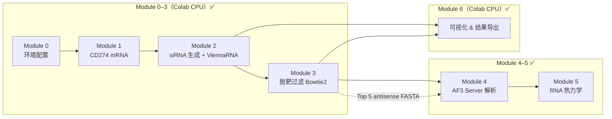

**筛选逻辑（漏斗）**：

| 阶段 | 淘汰对象 | 保留标准 |
|------|----------|----------|
| Module 2 | GC 含量异常、Ui-Tei 得分过低 | `passed_basic == True`；按 `efficacy_score` 降序 |
| Module 3 | chr22 脱靶命中过多、错配过少（近乎完美互补） | `passed_offtarget == True`（演示阈值） |
| Module 4 | AF3 ipTM 过低、界面置信不足 | `iptm` 相对排序；参考 ≥0.6 |
| Module 5 | 杂交过弱或反义链自折叠过强 | `passed_thermo == True` |

**图号与文件名总表**（Module 6 绘制，数据归属见各模块）：

| 图号 | 文件名 | 数据来源 | 解读归属 |
|------|--------|----------|----------|
| 7a | `fig7a_efficacy_distribution.png` | `sirna_candidates.csv` | [Module 2](#module-2--sirna-候选生成--viennarna-结构评估) |
| 7b | `fig7b_gc_vs_mfe_scatter.png` | `sirna_candidates.csv` | Module 2 |
| 7c | `fig7c_mrna_target_map.png` | `sirna_candidates.csv` | Module 2 |
| 7d | `fig7d_offtarget_manhattan.png` | `sirna_offtarget.sam` | [Module 3](#module-3--全基因组脱靶过滤bowtie2--chr22-演示) |
| 7e | `fig7e_offtarget_funnel.png` | Module 2 + 3 汇总 | Module 3 |
| 8a | `fig8a_rna_structure.png` | Top-5 `offtarget_filtered.csv` | Module 2 / 6 |
| 8b | `fig8b_thermo_profile.png` | `sirna_candidates.csv`（窗口 MFE） | Module 6 |
| NA-AF3 | `fig_na_af3_iptm_ranking.png` | `af3_na_metrics.csv` | [Module 4](#module-4--alphafold-3-蛋白-核酸复合物验证) |
| NA-AF3 | `fig_na_af3_complex.html` / `.png` | Top1 CIF | Module 4 |
| NA-Thermo | `fig_na_thermo_scatter.png` | `thermodynamics.csv` | [Module 5](#module-5--rna-热力学与稳定性评估) |

### 1.3 技术栈一览

| 类别 | 工具 / 库 | 用途 |
|------|-----------|------|
| 序列获取 | Biopython Entrez | 从 NCBI 下载 CD274 mRNA |
| RNA 二级结构 | ViennaRNA (`RNA.fold`) | MFE 与 dot-bracket 结构 |
| siRNA 设计规则 | Ui-Tei 启发式 | 效能初评 |
| 基因组比对 | Bowtie2（演示 chr22）| 脱靶扫描；生产环境换 BWA-MEM2 + hg38 |
| 结构验证 | AlphaFold 3 Server + 本地解析 | PD-L1 蛋白 + siRNA 复合物；ipTM / pTM |
| 热力学 | ViennaRNA `RNA.duplexfold` / `fold` | siRNA–mRNA 杂交 ΔG、反义链发夹 |
| 可视化 | matplotlib、seaborn、py3Dmol | 曼哈顿图、漏斗、AF3 排名 / 3D HTML |
| 运行环境 | Colab CPU + AF3 Server（半自动） | Module 0–3、5、6 可 CPU；Module 4 需 Server |
| 协作 | Cursor Agent + `export_for_local_sync` | 云端结果写回本地 |

### 1.4 应用场景与可扩展方向

| 场景 | 替换项 | 保留模块 |
|------|--------|----------|
| **换 mRNA 靶标** | `CD274_ACCESSION`、FASTA 文件 | Module 1–3 逻辑 |
| **换 siRNA 长度** | `SIRNA_LEN`（19–23 nt） | Module 2 滑动窗口 |
| **Aptamer 筛选** | 改用 SELEX 序列库 + 结构打分 | Module 2 结构评估框架 |
| **ASO / PMO** | 调整窗口长度与设计规则 | Module 2 规则函数 |
| **全基因组脱靶** | chr22 → hg38 完整索引 + BWA-MEM2 | Module 3 比对引擎 |
| **与 PE 联用** | 共享 `4ZQK.pdb` 用于 AF3 复合物 | Module 4 输入 |
| **与 SM 联用** | 同一 PD-L1 靶点，蛋白抑制 + mRNA 沉默并行 | 共享 `data/receptor/` |

### 1.5 当前局限性与假设

- **chr22 演示 ≠ 全基因组安全**：Module 3 当前仅对 hg38 **chr22** 子集做脱靶扫描，**不能**作为临床级 off-target 评估；生产环境需完整 hg38 索引。
- **Notebook 标题写 BWA-MEM2，实现为 Bowtie2**：当前代码使用 Bowtie2 演示；文档以实际代码为准。
- **Ui-Tei + MFE ≠ 沉默效率**：计算分数需 qPCR / 荧光素酶实验验证。
- **21 nt 短窗口 MFE 趋近 0**：ViennaRNA 对短片段折叠能量变化小；Module 5 已用 siRNA–mRNA 杂交 ΔG 补充。
- **AF3 蛋白–siRNA 为结构演示**：真实靶标为 mRNA；ipTM 仅作相对排序。
- **Module 5 对完美互补偏松**：21-mer 完美配对 duplex ΔG 通常 ≪ −20，阈值主要用于排除异常自折叠。
- **mRNA 全序列滑动窗口**：未区分 CDS / 3'UTR 功能区域；可后续加入区域注释过滤。

---

## 2. 快速开始

### 2.1 环境要求

| 环境 | 说明 |
|------|------|
| **Colab + Cursor（推荐）** | Notebook MCP 连接 Colab 内核 |
| **Colab CPU** | Module 0–3、6 均可 CPU 运行 |
| **系统依赖** | Module 3 需 `bowtie2`（Colab 通过 `apt-get` 安装） |
| **Python 包** | `biopython`, `ViennaRNA`, `pandas`, `matplotlib`, `seaborn`, `requests` |
| **可选** | Colab Secrets 中设置 `GITHUB_TOKEN` 用于自动 push（非阻塞） |

### 2.2 推荐运行顺序（Module 0–3 → 6）

```
Module 0  →  初始化 PATHS + 依赖安装 cell
    ↓
Module 1  →  下载 CD274 mRNA + 4ZQK 受体（< 2 min）
    ↓
Module 2  →  生成 sirna_candidates.csv（约 2–5 min）
    ↓
Module 3  →  下载 chr22 + Bowtie2 索引 + 脱靶过滤（首次约 10–20 min）
    ↓
Module 6  →  生成 figures/fig7*、fig8*（< 2 min）
```

> Module 4–5 已实现；Module 6 可独立于 AF3 运行（仅需 Module 2–3 数据）。

### 2.3 输出目录

```
data/
├── receptor/
│   ├── 4ZQK.pdb                         # Module 1（供 AF3）
│   ├── PD1_4ZQK_chainA.pdb              # Module 1 链拆分
│   └── PDL1_4ZQK_chainB.pdb
├── raw_libraries/
│   ├── CD274_mRNA.fasta                 # Module 1
│   ├── cd274_target_metadata.json       # Module 1
│   └── reference/
│       ├── chr22.fa                     # Module 3（~50 MB，首次下载）
│       └── sirna_queries.fa             # Module 3 Top-N 反义链
└── screened_results/
    ├── sirna_candidates.csv             # Module 2
    ├── sirna_offtarget.sam              # Module 3 比对结果
    ├── offtarget_filtered.csv           # Module 3 脱靶过滤后
    └── figures/
        ├── fig7a_efficacy_distribution.png
        ├── fig7b_gc_vs_mfe_scatter.png
        ├── fig7c_mrna_target_map.png
        ├── fig7d_offtarget_manhattan.png
        ├── fig7e_offtarget_funnel.png
        ├── fig8a_rna_structure.png
        └── fig8b_thermo_profile.png
```

详见 [`data/screened_results/README.md`](../../data/screened_results/README.md)。

---

## 3. 模块详解

> 每个模块采用统一结构：**目的 → 依赖 → 输入 → 方法 → 输出 → 判定标准 → 算力 → 可迁移场景 → 结果解读（含图）**

---

### Module 0 — 环境配置与路径初始化

**目的**：统一项目根目录 `PATHS`，初始化 Colab ↔ GitHub ↔ 本地同步机制。

**前置依赖**：无。

**输入**：GitHub 仓库 `OmniScreen-AI`（Colab 自动 clone / pull）。

**方法**：
- 检测 Colab / 本地环境，设置 `PROJECT_ROOT`
- 定义 `PATHS = {receptor, raw, results}`
- 提供 `persist_to_github()` 与 `export_for_local_sync()` 用于数据持久化
- GitHub Token 通过环境变量或 Colab Secrets 读取（**非阻塞**，避免 `getpass()` 卡住 MCP）

**输出**：内存变量 `PATHS`、`PROJECT_ROOT`（无文件）。

**算力**：Colab CPU，< 1 分钟。

**可迁移场景**：任何需要 Colab 云端算力 + 本地 Cursor 协作的项目，可复制 Module 0 的 `setup_project()` 模板。

> Module 0 为基础设施模块，科学内容从 Module 1 开始。

---

### Module 1 — 数据准备：CD274 mRNA & 靶向元数据

**目的**：从 NCBI 获取 PD-L1（CD274）mRNA 全长序列，并准备 AF3 所需的 PD-L1 蛋白结构。

**前置依赖**：Module 0。

| 类型 | 路径 | 说明 |
|------|------|------|
| **输入（自动）** | NCBI `NM_014143` | Homo sapiens CD274 mRNA |
| **输入（自动）** | RCSB `4ZQK` | PD-1/PD-L1 复合物晶体结构 |
| **输出** | `data/raw_libraries/CD274_mRNA.fasta` | mRNA 序列（T→U 规范化） |
| **输出** | `data/raw_libraries/cd274_target_metadata.json` | 设计参数元数据 |
| **输出** | `data/receptor/4ZQK.pdb` | 完整复合物（Module 4 用） |
| **输出** | `data/receptor/PDL1_4ZQK_chainB.pdb` | PD-L1 链（AF3 蛋白输入） |

**方法**：
- `Bio.Entrez.efetch` 下载 RefSeq mRNA
- `requests` 从 RCSB 下载 PDB，并按链拆分

**关键参数**：

| 参数 | 值 | 说明 |
|------|-----|------|
| `CD274_ACCESSION` | `NM_014143` | RefSeq mRNA |
| `mrna_length` | 3634 nt | 当前运行结果 |
| `sirna_length` | 21 nt | 默认 siRNA 长度（元数据记录） |

**算力**：Colab CPU，< 2 分钟。

**可迁移场景**：替换 `CD274_ACCESSION` 为任意 NCBI mRNA 登录号；换靶点蛋白 PDB 用于 Module 4。

---

### Module 2 — siRNA 候选生成 + ViennaRNA 结构评估

**目的**：对 mRNA 全序列做滑动窗口剪切，用 Ui-Tei 规则与 ViennaRNA MFE 评估每条 siRNA 候选的效能潜力。

**前置依赖**：Module 0、Module 1。

**输入**：`data/raw_libraries/CD274_mRNA.fasta`

**方法**：

| 步骤 | 工具 | 说明 |
|------|------|------|
| 滑动窗口 | 自定义 | 21 nt 窗口，默认步长 3 |
| GC 含量 | 自定义 | 25–60% 为可接受范围 |
| Ui-Tei 打分 | 启发式规则 | 5'端 A/U、位置 19 A、GC 30–55% 等 |
| 二级结构 | `RNA.fold` | 靶向链 MFE 与 dot-bracket |
| 综合效能 | `efficacy_score` | Ui-Tei + 可及性 + GC 奖励 |

**关键参数**：

| 参数 | 默认值 | 说明 |
|------|--------|------|
| `SIRNA_LEN` | 21 | siRNA 长度（nt） |
| `STEP` | 3 | 窗口步长（演示用；生产可改 1） |
| `MAX_CANDIDATES` | 800 | 候选上限 |
| `passed_basic` | GC 25–60% 且 Ui-Tei ≥ 2.0 | 基础过滤 |

**输出**：`data/screened_results/sirna_candidates.csv`

**判定标准**：按 `efficacy_score` **降序**排列；`passed_basic == True` 进入 Module 3 优先队列。

**当前运行结果**：800 条候选，**567** 条 `passed_basic == True`；`efficacy_score` 中位数 **4.5**，最高 **7.5**。

**算力**：Colab CPU，约 **2–5 分钟**（800 候选）。

**可迁移场景**：
- **siRNA 长度**：改为 19 或 23 nt
- **步长 1**：完整扫描，候选数 ≈ mRNA 长度
- **区域限制**：仅扫描 3'UTR 或 CDS 区段

#### 结果解读（Module 2 可视化）

##### 图 7a — Efficacy Score 分布

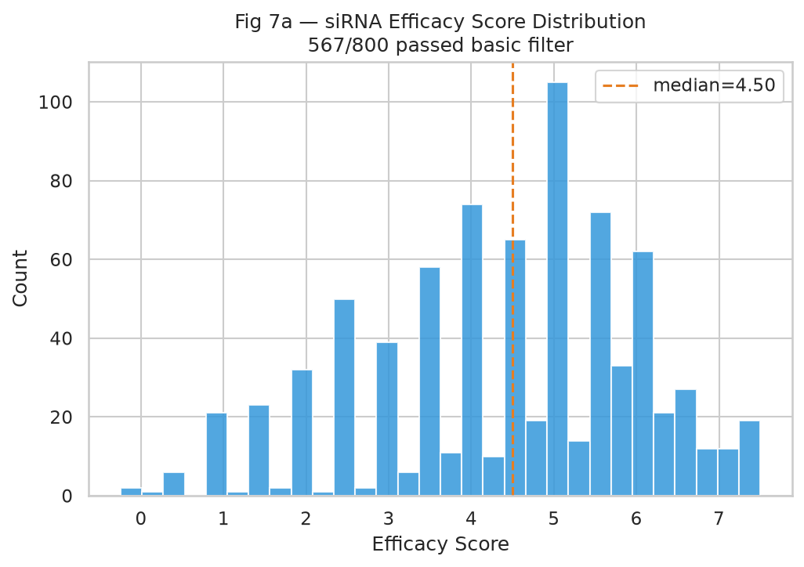

| 项目 | 说明 |
|------|------|
| **图意** | 横轴为综合效能分 `efficacy_score`（越高越好），纵轴为候选条数；虚线为全库中位数 |
| **读图要点** | 分布右偏说明多数候选处于中等效能；高峰在高分区表示 Ui-Tei 规则筛选出一批优选窗口 |
| **本数据结论** | 800 条候选中 **567** 条通过基础过滤；中位数 4.5，Top 档 efficacy 达 **7.5**（如 `CD274_2332_2352`） |
| **含义与局限** | 效能分为计算启发式，不能直接等同于体外沉默效率；需 qPCR 验证 |

##### 图 7b — GC% vs MFE 散点图

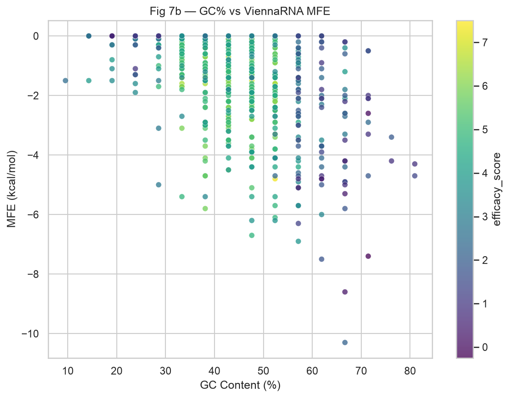

| 项目 | 说明 |
|------|------|
| **图意** | 横轴 GC 含量（%），纵轴 ViennaRNA MFE（kcal/mol）；颜色映射 `efficacy_score` |
| **读图要点** | GC 过高或过低通常降低 siRNA 效能；MFE 越负表示局部二级结构越稳定（可及性可能变差） |
| **本数据结论** | GC 范围约 **9.5–81%**；21 nt 短窗口 MFE 大多接近 **0**（单链为主），区分度有限 |
| **含义与局限** | 短片段 MFE 不能代表全 mRNA 折叠；杂交 ΔG 将在 Module 5 补充 |

##### 图 7c — siRNA 在 mRNA 上的位置分布

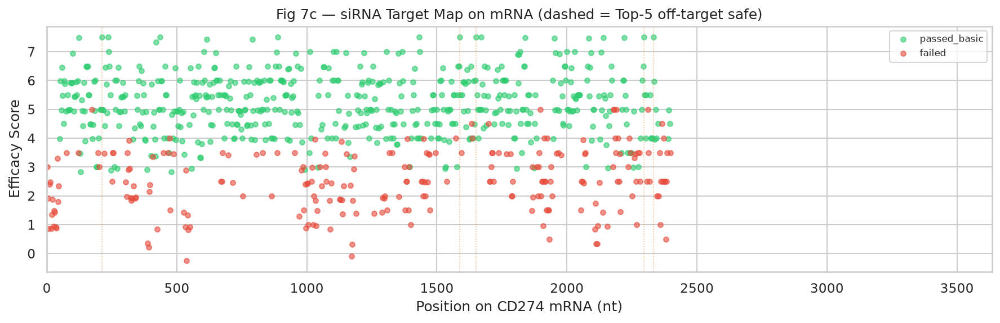

| 项目 | 说明 |
|------|------|
| **图意** | 横轴为 mRNA 位置（1–3634 nt），纵轴为 efficacy；绿/红区分是否通过基础过滤；虚线标 Top-5 脱靶安全候选 |
| **读图要点** | 观察高效能位点是否聚集于特定区域（如 3'UTR）；避免所有 Top 候选落在同一局部 |
| **本数据结论** | Top 候选分散于 **nt 211–2332** 区间，未过度集中；最高分配对分布在 1588、1651、211、2296、2332 等位点 |
| **含义与局限** | 未做转录本异构体或 SNP 校正；生产环境应结合注释过滤非功能区 |

---

### Module 3 — 全基因组脱靶过滤（Bowtie2 / chr22 演示）

**目的**：将 Top siRNA 反义链与参考基因组比对，统计脱靶命中数与错配，过滤高风险候选。

**前置依赖**：Module 0–2。

**输入**：

| 文件 | 说明 |
|------|------|
| `sirna_candidates.csv` | Top 150（`passed_basic` 优先） |
| hg38 chr22 | 演示用参考序列（UCSC 下载） |

**方法**：

```text
sirna antisense  →  sirna_queries.fa  →  bowtie2-build (chr22)
    →  bowtie2 align (--very-sensitive -k 10)
    →  SAM  →  offtarget_hits_chr22 + best_mismatch  →  passed_offtarget
```

**关键参数**：

| 参数 | 值 | 说明 |
|------|-----|------|
| `TOP_N` | 150 | 参与脱靶分析的 siRNA 数 |
| `MAX_MISMATCH` | 2 | 允许最大错配 |
| `MAX_OFFTARGET_HITS` | 3 | chr22 上演示阈值 |
| Bowtie2 | `--very-sensitive -k 10` | 灵敏模式，最多 10 条比对 / 查询 |

**输出**：

| 文件 | 说明 | 下游 |
|------|------|------|
| `offtarget_filtered.csv` | 脱靶过滤后排序表 | Module 4 Top-5 选取、Module 6 图 8a |
| `sirna_offtarget.sam` | 原始比对结果 | Module 6 图 7d |
| `reference/sirna_queries.fa` | 反义链查询 FASTA | 可提交外部脱靶工具 |

**判定标准**：`passed_offtarget == True` 当 chr22 命中数 ≤ 3 且最佳错配 ≤ 2（或零命中）。

**当前运行结果**：150 条参与脱靶分析，**150 / 150** 通过 chr22 演示阈值；Top-5 均为 **0** chr22 命中、`efficacy_score = 7.5`。

**算力**：Colab CPU；**首次**下载 chr22 + 建索引约 **10–20 分钟**；后续缓存后约 **2–5 分钟**。

**可迁移场景**：
- **完整 hg38**：替换参考序列，使用 BWA-MEM2
- **更严格阈值**：`MAX_OFFTARGET_HITS = 0`，`MAX_MISMATCH = 1`
- **种子区匹配**：仅统计 seed（nt 2–8）区域脱靶

**跨模块交接（Module 3 → 4）**：

| 交接物 | 路径 | 说明 |
|--------|------|------|
| 脱靶过滤表 | `offtarget_filtered.csv` | 取 `passed_offtarget == True` 的 Top 5 |
| PD-L1 结构 | `data/receptor/4ZQK.pdb` 或 `PDL1_4ZQK_chainB.pdb` | AF3 蛋白链输入 |
| 核酸序列 | Top 5 `antisense_seq` | AF3 核酸链输入 |
| AF3 JSON | `af3_server/na/batch_top5.json` | 已生成；Upload 至 Server |

#### 结果解读（Module 3 可视化）

##### 图 7d — chr22 脱靶曼哈顿图

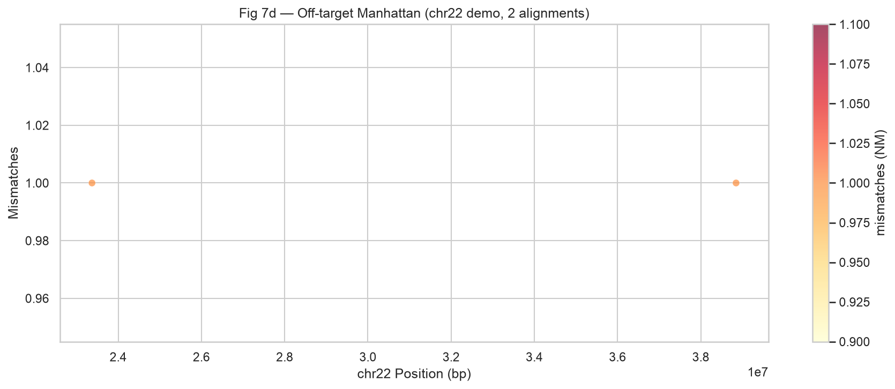

| 项目 | 说明 |
|------|------|
| **图意** | 横轴 chr22 基因组位置（bp），纵轴错配数（NM tag）；每个点为一条 Bowtie2 比对 |
| **读图要点** | 错配越低（近乎完美互补）脱靶风险越大；理想情况 Top 候选应无命中，或仅有高错配弱结合 |
| **本数据结论** | 当前 SAM 仅 **2** 条有效比对（演示库 + 严格种子），说明 Top 150 在 chr22 上整体脱靶压力低——**但这不等于全基因组安全** |
| **含义与局限** | chr22 仅占基因组 ~1%；必须换 hg38 全库才能用于决策 |

##### 图 7e — siRNA 筛选漏斗

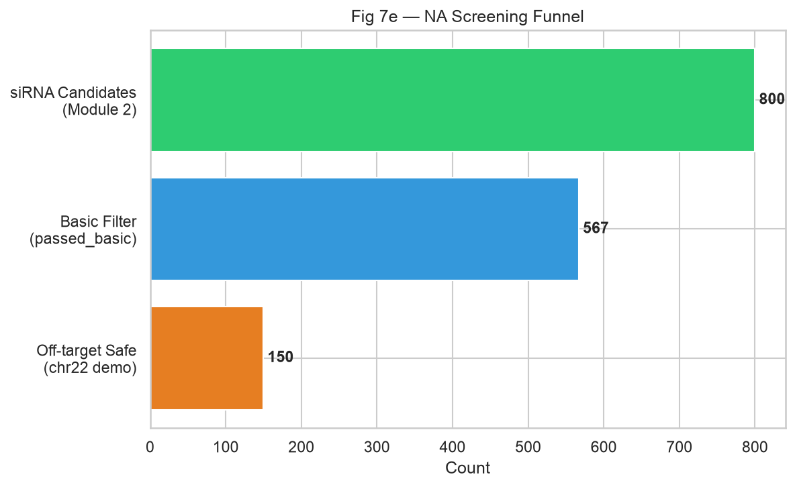

| 项目 | 说明 |
|------|------|
| **图意** | 三阶段候选数：Module 2 全库 → 基础过滤 → chr22 脱靶安全 |
| **读图要点** | 漏斗收窄幅度反映筛选强度；若 Module 3 几乎不淘汰，说明演示阈值偏松或参考集过小 |
| **本数据结论** | **800 → 567 → 150**（Module 3 仅分析 Top 150，且 150 条全部 pass） |
| **含义与局限** | 漏斗数字反映流程健康度，非沉默效率；全基因组脱靶后漏斗会显著收窄 |

---

### Module 4 — AlphaFold 3 蛋白-核酸复合物验证

**目的**：解析 AlphaFold Server 下载的 Top 5 蛋白–siRNA 复合物，用 ipTM / pTM 做相对排序，并导出最佳 CIF + 3D 预览。

**前置依赖**：Module 3；AF3 Server 结果解压至 `data/screened_results/af3_server/na/na_cd274_*_pdl1/`。

**输入**：

| 文件 | 说明 |
|------|------|
| `af3_server/na/batch_top5.json` | 上传用 JSON（已生成） |
| `af3_server/na/na_cd274_*_pdl1/` | Server 下载 zip 解压目录 |
| `*_summary_confidences_*.json` | 各模型置信度 |

**方法**：

```text
AF3 Server zip
  → 解析 summary_confidences（iptm / ptm / ranking_score / chain_pair_iptm）
  → 按 ranking_score 取最佳模型
  → 复制 *_best.cif → af3_na_complexes/
  → 绘制 ipTM 排名图 + Top1 py3Dmol HTML
```

**关键参数 / 读数参考**：

| 指标 | 参考 | 说明 |
|------|------|------|
| ipTM | ≥ 0.6 较可信 | 界面置信度；本演示用于相对排序 |
| pTM | — | 整体折叠置信度 |
| prot_rna_iptm_max | — | 蛋白–RNA 链对 ipTM 最大值 |
| has_clash | 应为 0 | 立体冲突标记 |

**输出**：

| 文件 | 说明 |
|------|------|
| `af3_na_metrics.csv` | 每条候选的 ipTM / pTM / ranking_score |
| `af3_na_complexes/*_best.cif` | 各 job 最佳模型 |
| `figures/fig_na_af3_iptm_ranking.png` | ipTM 排名图 |
| `figures/fig_na_af3_complex.html` | Top1 交互 3D |
| `figures/fig_na_af3_complex.png` | Top1 复合物 PyMOL cartoon 快照 |

**当前运行结果（最佳模型）**：

| siRNA | ipTM | pTM | 蛋白–RNA≈ | ranking_score |
|-------|------|-----|-----------|---------------|
| **CD274_2332_2352** | **0.61** | 0.62 | 0.57 | 0.61 |
| CD274_1651_1671 | 0.49 | 0.59 | 0.44 | 0.51 |
| CD274_2296_2316 | 0.47 | 0.59 | 0.45 | 0.50 |
| CD274_211_231 | 0.35 | 0.59 | 0.29 | 0.40 |
| CD274_1588_1608 | 0.22 | 0.56 | 0.12 | 0.29 |

全部 `has_clash = 0`。仅 Top1 越过 ipTM≈0.6 参考线。

**算力**：AF3 Server（半自动上传/下载）+ 本地/Colab CPU 解析，< 1 分钟。

#### 结果解读（Module 4 可视化）

##### 图 NA-AF3 — ipTM 界面置信度排名

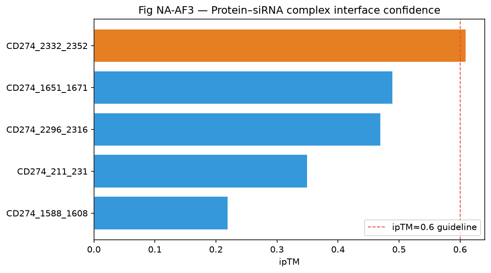

| 项目 | 说明 |
|------|------|
| **图意** | Top 5 AF3 复合物按 ipTM 横向条形图；橙色为最优；红虚线为 ipTM≈0.6 参考 |
| **读图要点** | 条越长界面越可信；只有越过虚线的候选可优先进入结构讨论 |
| **本数据结论** | **CD274_2332_2352（ipTM=0.61）** 唯一过线；其余 0.22–0.49，界面不确定 |
| **含义与局限** | 蛋白–siRNA 为结构演示，真实沉默靶标是 mRNA；ipTM 低不等于药效差，只说明 AF3 对该界面把握不足 |

##### 图 NA-AF3 — Top1 复合物 3D

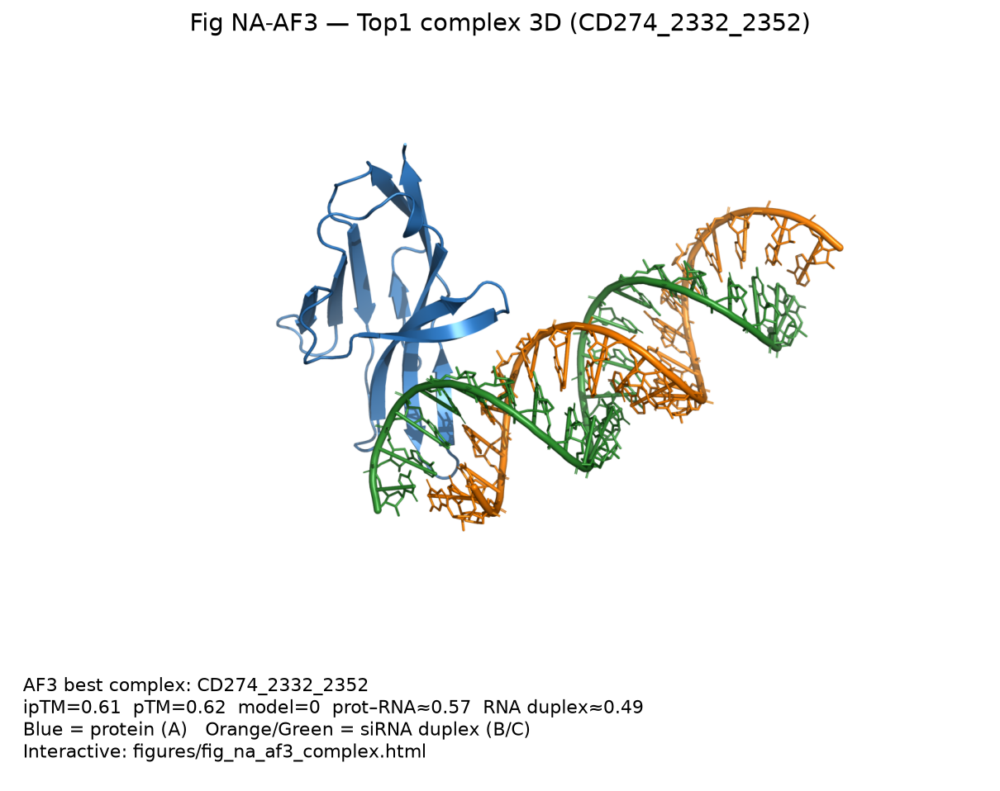

| 项目 | 说明 |
|------|------|
| **图意** | Top1（`CD274_2332_2352`）蛋白–siRNA 复合物 PyMOL cartoon；蓝=蛋白(A)，橙/绿=siRNA 双链(B/C) |
| **交互版** | 打开 [`fig_na_af3_complex.html`](../../data/screened_results/figures/fig_na_af3_complex.html) 可旋转缩放 |
| **结构文件** | `af3_na_complexes/CD274_2332_2352_best.cif`（model 0） |
| **本数据结论** | ipTM=0.61，pTM=0.62；蛋白–RNA 界面约 0.57，RNA 双链自身约 0.49 |
| **含义与局限** | 静态预测截图；不宜直接当作实验结合姿态；需实验验证 |

---

### Module 5 — RNA 热力学与稳定性评估

**目的**：用 ViennaRNA 计算脱靶安全候选的 **siRNA–mRNA 杂交 ΔG** 与反义链发夹 ΔG，补充 Module 2 短窗口 MFE 区分度不足的问题。

**前置依赖**：Module 3（`offtarget_filtered.csv`）。

**输入**：`passed_offtarget == True` 的候选（最多评估 Top 150，按 `efficacy_score`）。

**方法**：

```text
antisense + target (sense)
  → RNA.duplexfold → duplex_dg, duplex_structure
antisense
  → RNA.fold → hairpin_dg, hairpin_structure
  → passed_thermo = (duplex_dg ≤ -20) AND (hairpin_dg ≥ -5)
```

**关键参数**：

| 参数 | 值 | 说明 |
|------|-----|------|
| `MAX_THERMO` | 150 | 评估上限 |
| `MAX_DUPLEX_DG` | −20.0 kcal/mol | 杂交需足够稳定（更负更好） |
| `MIN_HAIRPIN_DG` | −5.0 kcal/mol | 反义链不宜过度自折叠 |

**输出**：

| 文件 | 说明 |
|------|------|
| `thermodynamics.csv` | 全量热力学表 |
| `figures/fig_na_thermo_scatter.png` | 杂交 vs 自折叠散点 |

**判定标准**：`passed_thermo == True` 当且仅当杂交足够稳且自身发夹不过强。

**当前运行结果**：150 / 150 通过。完美互补 21-mer 的 duplex ΔG 普遍在 −30 ~ −41 kcal/mol，发夹接近 0。AF3 Top5 与热力学交叉：

| siRNA | ipTM | duplex_dg | hairpin_dg | passed_thermo |
|-------|------|-----------|------------|---------------|
| CD274_2332_2352 | 0.61 | −31.2 | 0.0 | True |
| CD274_1651_1671 | 0.49 | −33.8 | −0.3 | True |
| CD274_2296_2316 | 0.47 | −31.1 | −0.6 | True |
| CD274_211_231 | 0.35 | −36.3 | −0.3 | True |
| CD274_1588_1608 | 0.22 | −31.5 | 0.0 | True |

**算力**：Colab / 本地 CPU，< 1 分钟。

#### 结果解读（Module 5 可视化）

##### 图 NA-Thermo — 杂交 ΔG vs 反义链发夹

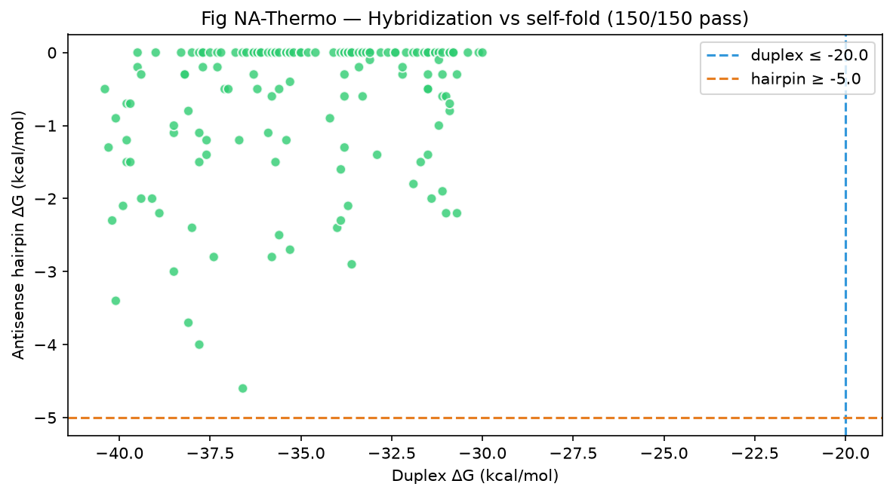

| 项目 | 说明 |
|------|------|
| **图意** | 横轴 duplex ΔG（越左越稳），纵轴 antisense 发夹 ΔG（越高越不易自折叠）；绿点=通过 |
| **读图要点** | 理想区：虚线左侧（杂交强）且虚线上方（自折叠弱） |
| **本数据结论** | **150 / 150** 落在通过区；点云集中在 duplex ≈ −30 ~ −41、hairpin ≈ −4 ~ 0 |
| **含义与局限** | 对完美互补序列阈值偏松，难以再拉开差距；真正区分靠 Module 2/3/4。若引入错配/化学修饰序列，本图区分度会上升 |

---

### Module 6 — 可视化与结果导出

**目的**：将 Module 2–5 的数据汇总为发表级图表，并通过 `export_for_local_sync()` 写回本地。

**前置依赖**：Module 2–3 已跑完；Module 4–5 图表由对应模块直接写出（可独立于 Module 6）。

**输出目录**：`data/screened_results/figures/`

**图号与数据归属**：

| 图号 | 文件名 | 数据来源 | 解读见 |
|------|--------|----------|--------|
| 7a–7c | `fig7a_*` … `fig7c_*` | Module 2 | [Module 2 结果解读](#结果解读module-2-可视化) |
| 7d–7e | `fig7d_*` … `fig7e_*` | Module 3 | [Module 3 结果解读](#结果解读module-3-可视化) |
| 8a–8b | `fig8a_*` … `fig8b_*` | Module 2 + 3 综合 | 本节 |
| NA-AF3 | `fig_na_af3_*` | Module 4 | [Module 4 结果解读](#结果解读module-4-可视化) |
| NA-Thermo | `fig_na_thermo_scatter.png` | Module 5 | [Module 5 结果解读](#结果解读module-5-可视化) |

#### 结果解读（Module 6 综合可视化）

##### 图 8a — Top-5 siRNA 二级结构示意

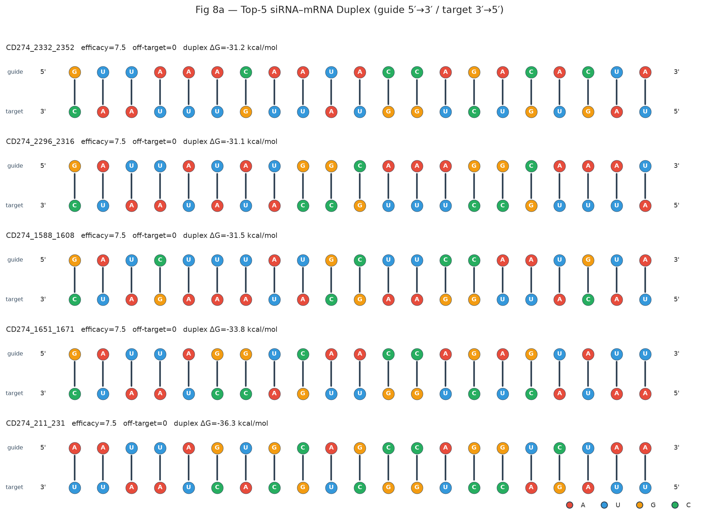

| 项目 | 说明 |
|------|------|
| **图意** | 每条 Top 候选展示靶向序列（RNA 字母）与 ViennaRNA dot-bracket 二级结构 |
| **读图要点** | `.` 表示未配对碱基；`(` `)` 表示配对；结构过于折叠可能降低 RISC 加载效率 |
| **本数据结论** | Top-5（如 `CD274_2332_2352`）靶向链均为 **全 unpaired**（`.....................`），MFE ≈ 0，可及性较好 |
| **含义与局限** | 文本示意图非 VARNA/forna 渲染；全 unpaired 是短窗口常见现象，不代表杂交后结构 |

##### 图 8b — mRNA 位置热力学轮廓

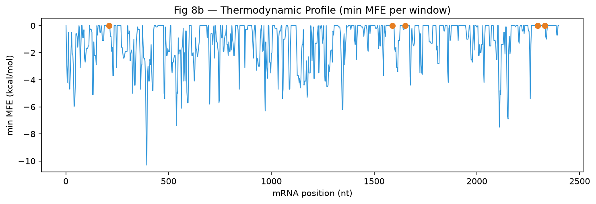

| 项目 | 说明 |
|------|------|
| **图意** | 沿 mRNA 位置绘制各窗口最小 MFE；橙色点标 Top-5 脱靶安全候选位置 |
| **读图要点** | 低谷（更负 MFE）表示局部易形成稳定结构，siRNA 可及性可能下降 |
| **本数据结论** | 全库 MFE 整体接近 0；Top-5 位点未落在明显低谷区，与高效能评分一致 |
| **含义与局限** | 当前为 Module 2 窗口 MFE 的汇总；杂交热力学见 Module 5 的 `fig_na_thermo_scatter.png` |

**同步方式**：Module 6 末尾调用 `export_for_local_sync(_saved)`，输出 `__OMNISCREEN_SYNC_START__` 标记；本地运行：

```bash
python3 .cursor/colab_sync.py <sync_output.txt> /Users/schmit/Documents/OmniScreen-AI
```

---

## 4. 数据字典

### 4.1 `sirna_candidates.csv`（Module 2）

| 列名 | 类型 | 说明 | 示例 |
|------|------|------|------|
| `sirna_id` | str | 起止位点标识 | `CD274_2332_2352` |
| `start` | int | mRNA 1-based 起始 | `2332` |
| `end` | int | 1-based 结束 | `2352` |
| `target_seq` | str | 靶向链（mRNA 片段） | `UAGUGUCUGGUAUUGUUUAAC` |
| `antisense_seq` | str | 反义引导链 | `GUUAAACAAUACCAGACACUA` |
| `gc_pct` | float | GC 含量 (%) | `33.33` |
| `mfe` | float | ViennaRNA MFE (kcal/mol) | `0.0` |
| `structure` | str | dot-bracket | `.....................` |
| `ui_tei_score` | float | Ui-Tei 启发式分 | `5.5` |
| `efficacy_score` | float | 综合效能，**越高越好** | `7.5` |
| `passed_basic` | bool | 基础过滤 | `True` |

### 4.2 `offtarget_filtered.csv`（Module 3）

| 列名 | 类型 | 说明 | 示例 |
|------|------|------|------|
| `sirna_id` | str | siRNA 标识 | `CD274_2332_2352` |
| `start` | int | mRNA 起始位 | `2332` |
| `target_seq` | str | 靶向序列 | `UAGUGUCUGGUAUUGUUUAAC` |
| `antisense_seq` | str | 反义序列 | `GUUAAACAAUACCAGACACUA` |
| `efficacy_score` | float | Module 2 效能分 | `7.5` |
| `offtarget_hits_chr22` | int | chr22 比对命中数 | `0` |
| `best_mismatch` | int | 最佳比对错配 | 空或 `0` |
| `passed_offtarget` | bool | 脱靶过滤 | `True` |

### 4.3 `af3_na_metrics.csv`（Module 4）

| 列名 | 类型 | 说明 | 示例 |
|------|------|------|------|
| `sirna_id` | str | siRNA 标识 | `CD274_2332_2352` |
| `job_dir` | str | AF3 结果目录名 | `na_cd274_2332_2352_pdl1` |
| `model` | int | 最佳模型编号 0–4 | `0` |
| `iptm` | float | 界面置信度 | `0.61` |
| `ptm` | float | 整体折叠置信度 | `0.62` |
| `ranking_score` | float | AF3 排序分 | `0.61` |
| `prot_rna_iptm_max` | float | 蛋白–RNA 链对 ipTM 最大 | `0.57` |
| `rna_duplex_iptm` | float | RNA 双链链对 ipTM | `0.49` |
| `has_clash` | float | 是否碰撞 | `0.0` |
| `complex_cif` | str | 最佳 CIF 相对路径 | `data/.../CD274_2332_2352_best.cif` |

### 4.4 `thermodynamics.csv`（Module 5）

| 列名 | 类型 | 说明 | 示例 |
|------|------|------|------|
| `sirna_id` | str | siRNA 标识 | `CD274_2332_2352` |
| `duplex_dg` | float | 杂交 ΔG (kcal/mol)，**越负越好** | `-31.2` |
| `duplex_structure` | str | duplexfold 结构 | `((((...&))))...` |
| `hairpin_dg` | float | 反义链发夹 MFE | `0.0` |
| `hairpin_structure` | str | dot-bracket | `.....................` |
| `passed_thermo` | bool | 热力学过滤 | `True` |

### 4.5 `cd274_target_metadata.json`（Module 1）

| 字段 | 说明 | 当前值 |
|------|------|--------|
| `accession` | NCBI 登录号 | `NM_014143` |
| `gene` | 基因符号 | `CD274` |
| `mrna_length` | mRNA 长度 (nt) | `3634` |
| `sirna_length` | 设计长度 | `21` |
| `receptor_pdb` | PD-L1 结构路径 | `data/receptor/4ZQK.pdb` |

### 4.6 图文件命名规范

| 前缀 | 含义 |
|------|------|
| `fig7a`–`fig7e` | siRNA 效能与脱靶分析 |
| `fig8a`–`fig8b` | RNA 结构与窗口 MFE 轮廓 |
| `fig_na_af3_*` | AF3 蛋白–核酸复合物（排名 / 3D） |
| `fig_na_thermo_*` | Module 5 杂交热力学 |

---

## 5. 跨平台交接（Colab → AF3 → 本地）

```text
Colab Module 0–3 完成
    ↓ export_for_local_sync() 或 GitHub push
本地 data/ + af3_server/na/batch_top5.json
    ↓ Upload JSON → AlphaFold Server → 下载 zip
解压到 af3_server/na/na_cd274_*_pdl1/
    ↓ Module 4 解析 → af3_na_metrics.csv + 3D 图
Module 5 热力学（Colab/本地 CPU）→ thermodynamics.csv
    ↓
Module 6 可视化（fig7*/fig8*）+ Module 4/5 专图
```

**交接文件清单**（Module 3 → 4）：

| 文件 | 必需 |
|------|------|
| `offtarget_filtered.csv` | ✅ |
| `data/receptor/4ZQK.pdb` | ✅ |
| Top 5 `antisense_seq` | ✅ |
| `af3_server/na/batch_top5.json` | ✅ 已生成 |
| AF3 zip / `na_cd274_*_pdl1/` | ✅ Server 下载后解压 |

---

## 6. 常见问题

| 问题 | 原因 | 解决 |
|------|------|------|
| `CD274_mRNA.fasta` 不存在 | 未跑 Module 1 | 先运行 Module 1 |
| `PATHS` 未定义 | 内核重启后未跑 Module 0 | 重新运行 Module 0 |
| ViennaRNA 安装失败 | pip 包名 | `pip install ViennaRNA` |
| `AttributeError: RNA.reverse_complement` | ViennaRNA API 差异 | 使用 notebook 内自定义 `reverse_complement_rna()` |
| chr22 下载慢 | UCSC 服务器 | 首次耐心等待；`chr22.fa` 会缓存于 `reference/` |
| bowtie2 未找到 | 未 apt 安装 | Module 3 自动 `apt-get install bowtie2` |
| Module 4 找不到结果目录 | zip 未解压到约定路径 | 解压到 `af3_server/na/na_cd274_*_pdl1/` |
| 热力学全部 pass | 完美互补 21-mer 杂交极强 | 预期行为；用 Module 2/3/4 做区分 |
| 脱靶全部 pass | chr22 演示集过小 | 换 hg38 全库前勿过度解读；收紧 `MAX_OFFTARGET_HITS` |
| GitHub Token cell 卡住 | `getpass()` 阻塞 MCP | 使用 Colab Secrets 或环境变量（已改为非阻塞） |
| 同步标记过大被截断 | 图文件 base64 体积大 | 本地用 CSV 重跑 Module 6，或 GitHub push 后 `git pull` |
| BWA-MEM2 与 Bowtie2 不一致 | 标题与实现差异 | 当前实现为 Bowtie2 + chr22；升级见 Module 3 迁移说明 |

---

## 7. 术语表

| 术语 | 解释 |
|------|------|
| **siRNA** | 小干扰 RNA，通过 RISC 降解靶 mRNA |
| **反义链（antisense）** | siRNA 中与靶 mRNA 互补的引导链 |
| **Ui-Tei 规则** | siRNA 设计经验法则（5'端 A/U 偏好等） |
| **MFE** | Minimum Free Energy，RNA 二级结构最小自由能 |
| **脱靶（off-target）** | siRNA 与非意图 mRNA 结合导致的沉默 |
| **种子区（seed）** | siRNA 5' 端约 nt 2–8，对脱靶最关键 |
| **Manhattan 图** | 基因组位置 vs 错配/命中数的散点图 |
| **dot-bracket** | RNA 二级结构的括号表示法 |
| **AF3 / ipTM** | AlphaFold 3；ipTM 为界面预测置信度，越高越好 |
| **duplex ΔG** | siRNA–mRNA 杂交自由能（kcal/mol），越负杂交越稳 |
| **Bowtie2** | 短序列基因组比对工具；本演示用于 siRNA 脱靶扫描 |

---

## 8. 参考文献

- ViennaRNA: Lorenz et al. *Algorithms Mol. Biol.* **6**, 26 (2011). https://www.tbi.univie.ac.at/RNA/
- Ui-Tei et al. *Nucleic Acids Res.* **32**, 936–948 (2004).
- Bowtie2: Langmead & Salzberg *Nat. Methods* **9**, 357–359 (2012).
- BWA-MEM2: Vasimuddin et al. *IEEE IPDPS* (2019).
- AlphaFold 3: Abramson et al. *Nature* (2024).
- RefSeq NM_014143: Homo sapiens CD274 mRNA.

---

## 9. 与 SM / PE 线路的关系

| 线路 | 模态 | 候选空间 | 3D 结合验证 | 文档 |
|------|------|----------|-------------|------|
| **SM** | 小分子 | SMILES | 配体-PD-L1 口袋（Vina + py3Dmol） | [SM_MODULES.md](./SM_MODULES.md) |
| **PE** | 蛋白/多肽 | 氨基酸序列 | 纳米抗体-PD-L1（AF3 Server） | [PE_MODULES.md](./PE_MODULES.md) |
| **NA** | 核酸 | siRNA / Aptamer | 蛋白-核酸复合物（AF3 已解析） | 本文档 |

三条线路共享 PD-L1 靶点与 `data/receptor/` 结构资源（SM 用 `5N2F`，PE/NA 用 `4ZQK`），输出 CSV 与图号独立（SM: fig3/4，PE: fig5/6，NA: fig7/8）。

---

*文档版本：2026-07 · Module 0–6 已实现（AF3 Server 半自动 + 热力学 CPU）*
