# OmniScreen 蛋白质/多肽筛选流程 (PE)

> **Notebook**：[`notebooks/OmniScreen_PE_Workflow.ipynb`](../../notebooks/OmniScreen_PE_Workflow.ipynb)  
> **靶点**：PD-L1 (CD274)  
> **当前进度**：Module 0–6 ✅（Module 5 = OpenMM MM-GBSA / CUDA）

---

## 目录

1. [概述](#1-概述)
2. [快速开始](#2-快速开始)
3. [模块详解](#3-模块详解)
4. [数据字典](#4-数据字典)
5. [跨平台交接](#5-跨平台交接-colab--runpod)
6. [常见问题](#6-常见问题)
7. [术语表](#7-术语表)
8. [参考文献](#8-参考文献)

---

## 1. 概述

### 1.1 科学背景与项目目的

**PD-L1**（Programmed Death-Ligand 1）是肿瘤免疫检查点关键膜蛋白，与 T 细胞表面 **PD-1** 结合可抑制抗肿瘤免疫。除小分子抑制剂外，**纳米抗体（VHH）**、工程化多肽等 **蛋白/多肽模态** 可靶向 PD-L1 界面，在免疫治疗与诊断领域具有应用潜力。

**OmniScreen PE 线路**的目标是：建立一条可复现的 **序列空间 → 结构空间 → 动力学/自由能** 筛选漏斗，对纳米抗体 CDR 饱和突变库进行计算排序，并为后续高精度结构验证（AlphaFold 3）与结合自由能解析提供候选列表。

本线路不替代湿实验（SPR、细胞阻断实验等），而是提供：

- 可量化的 **序列适应度排序**（ESM-2 ΔLL）
- 可审计的 **蛋白-蛋白界面粗评**（热点接触 + 界面得分）
- 可复用的 **模块化 Notebook 流程**（与 SM / NA 线路结构对齐）

### 1.2 技术路线总览

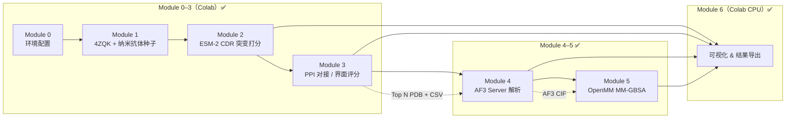

**筛选逻辑（漏斗）**：

| 阶段 | 淘汰对象 | 保留标准 |
|------|----------|----------|
| Module 2 | CDR 单点突变中序列适应度差的变体 | 按 `esm_score`（ΔLL）降序；默认取 Top 20 进入 Module 3 |
| Module 3 | 结构生成失败、界面评分异常 | `status == ok`；综合 ESM + PPI 指标排序 |
| Module 4 | AF3 ipTM 过低、界面置信不足 | `iptm` 相对排序；参考 ≥0.6 |
| Module 5 | 结合自由能无优势、界面能量分解不合理 | `dG_bind_kcalmol` 越负越好；结合残基 VDW/ELE 贡献 |

### 1.3 技术栈一览

| 类别 | 工具 / 库 | 用途 |
|------|-----------|------|
| 序列建模 | ESM-2 (`fair-esm`) | CDR 突变序列 log-likelihood / ΔLL 打分 |
| 结构预测（可选） | ESMFold | GPU 下纳米抗体 3D 结构；CPU 回退 extended-CA |
| 蛋白-蛋白对接 | HDOCKlite（可选） | 全原子对接；不可用时仅用界面评分 |
| 结构解析 | BioPython | PDB 解析、NeighborSearch 接触统计 |
| 可视化 | matplotlib、seaborn、py3Dmol | DMS 热图、漏斗、AF3 排名 / 3D HTML、MM-GBSA 能量图 |
| 结构验证 | AlphaFold 3 Server + 本地解析 | 纳米抗体–PD-L1 复合物；ipTM / pTM |
| 自由能 | OpenMM MM-GBSA（Amber14 + GBn2） | ΔG_bind + 界面残基 VDW/ELE 拆解（CUDA） |
| 运行环境 | Colab CPU + AF3 Server + GPU | Module 0–3、6 CPU；Module 4 Server；Module 5 CUDA GPU |
| 协作 | Cursor Agent + `export_for_local_sync` | 云端结果写回本地 |

### 1.4 应用场景与可扩展方向

| 场景 | 替换项 | 保留模块 |
|------|--------|----------|
| **换靶点** | 受体 PDB（如 EGFR、HER2）及对应热点残基列表 | Module 0–2 逻辑；Module 3 重定义 `pdl1_hotspots` |
| **换抗体骨架** | `pd_l1_nanobody_seed.fasta` + `nanobody_cdr_regions.json` | Module 2–3 全流程 |
| **扩展 CDR 扫描** | `SCAN_REGIONS = ["CDR1","CDR2","CDR3"]` | Module 2 突变库规模增大 |
| **双特异性 / 融合蛋白** | 多条链 FASTA、分段 CDR 注释 | Module 2 序列输入扩展 |
| **多肽（非 VHH）** | 较短 FASTA、无 FR 区的 CDR 定义 | Module 2 ESM-2 仍适用；Module 3 对接策略需调整 |
| **与 SM / NA 联用** | 同一 PD-L1 靶点不同模态并行筛选 | 共享 `data/receptor/`，结果各自 CSV |

### 1.5 当前局限性与假设

- **ESM-2 ΔLL ≠ 结合亲和力**：反映序列在进化/语言模型意义下的「可折叠性/稳定性」趋势，不能直接等同于 Kd 或 IC50。
- **extended-CA 粗模**：Colab CPU 无 GPU 时，Module 3 使用 **CA 延伸链** 代替全原子结构，**所有 Top 突变体的 PPI 几何指标可能相同**（当前演示即如此：ppi=19.766，hotspot=9）；界面图仅供流程验证，不能作为发表级结合姿态。
- **HDOCKlite 未强制启用**：演示流程以 **界面接触打分**（5 Å 内 CA 接触 + PD-L1 热点加权）为主；完整对接需安装 HDOCKlite 或 GPU 上启用 ESMFold。
- **CDR 区域为 Kabat 近似**：`nanobody_cdr_regions.json` 中的 CDR1/2/3 边界需与实验或 ANARCI 注释交叉验证。
- **Module 4 AF3 界面置信偏低**：当前 Top5 ipTM 均 < 0.3，结构仅供相对排序；可能与 PD-L1 仅用 4ZQK 短 IgV 片段有关。
- **Module 5 MM-GBSA 为隐式溶剂单点估算**：对 AF3 复合物最小化后计算 ΔG；**非显式水盒 MD / 非实验 Kd**。残基拆解为真空配对 VDW+ELE，不含完整 GB 项分摊，宜作相对比较。

---

## 2. 快速开始

### 2.1 环境要求

| 环境 | 说明 |
|------|------|
| **Colab + Cursor（推荐）** | Cursor 通过 Notebook MCP 连接 Colab 内核执行 cell |
| **Colab GPU（Module 2 推荐）** | ESM-2 打分在 GPU 上显著加速；CPU 可跑但较慢 |
| **Colab CPU** | Module 0–1、3（extended-CA）、6 可在 CPU 完成 |
| **CUDA GPU（Module 5）** | OpenMM MM-GBSA；推荐 `omniscreen-md` 环境 + A100 |
| **本地** | Python 3.10+、PyTorch、`fair-esm`、`biopython`；Module 3 全原子对接需 GPU + openfold（ESMFold） |

### 2.2 推荐运行顺序（Module 0–6）

```
Module 0  →  初始化 PATHS / 同步函数
    ↓
Module 1  →  下载 4ZQK、写入纳米抗体种子 & CDR 元数据
    ↓
Module 2  →  生成 mutation_scores.csv（361 条 CDR3 突变，约 5–15 min，视 GPU 而定）
    ↓
Module 3  →  生成 ppi_docking_scores.csv + pe_docking/*.pdb（Top 20，约 2–5 min）
    ↓
Module 4  →  解析 AF3 → af3_pe_metrics.csv + fig_pe_af3_*
    ↓
Module 5  →  OpenMM MM-GBSA → ppi_mmgbsa_summary.csv + 能量图（CUDA，约 1 min / 复合物）
    ↓
Module 6  →  汇总 fig5* / fig6* / fig_pe_*（含 MM-GBSA 图 7b–7d）
```

> **注意**：Module 5 需 CUDA 可用的 OpenMM 环境（如 `omniscreen-md` / A100）。脚本：`scripts/pe_module5_mmgbsa.py`。

### 2.3 输出目录

```
data/
├── receptor/
│   ├── 4ZQK.pdb                      # Module 1：PD-1/PD-L1 复合物
│   ├── PDL1_4ZQK_chainB.pdb          # Module 1：PD-L1 链（对接受体）
│   └── PD1_4ZQK_chainA.pdb           # Module 1：PD-1 链（参考）
├── raw_libraries/
│   ├── pd_l1_nanobody_seed.fasta     # Module 1：KN035 纳米抗体种子
│   └── nanobody_cdr_regions.json     # Module 1：CDR 区域 & 热点残基
└── screened_results/
    ├── mutation_scores.csv           # Module 2
    ├── ppi_docking_scores.csv        # Module 3
    ├── pe_docking/*.pdb              # Module 3：突变体结构（extended-CA 或 ESMFold）
    ├── af3_pe_metrics.csv            # Module 4
    ├── af3_pe_complexes/*_best.cif   # Module 4
    ├── ppi_mmgbsa_summary.csv        # Module 5
    ├── ppi_energy_decomposition.csv  # Module 5
    ├── pe_complexes/*_min.pdb        # Module 5：最小化复合物
    └── figures/                      # Module 6（fig5*/fig6*/fig_pe_*）
```

详见 [`data/screened_results/README.md`](../../data/screened_results/README.md)。

---

## 3. 模块详解

> 每个模块采用统一结构：**目的 → 依赖 → 输入 → 方法 → 输出 → 判定标准 → 算力 → 可迁移场景 → 结果解读（含图）**

---

### Module 0 — 环境配置与路径初始化

**目的**：统一项目根目录 `PATHS`，初始化 Colab ↔ 本地同步机制。

**前置依赖**：无。

**输入**：GitHub 仓库 `OmniScreen-AI`（Colab 自动 clone 至 `/content/OmniScreen-AI`）。

**方法**：
- 检测 Colab / 本地环境，设置 `PROJECT_ROOT`
- 定义 `PATHS = {receptor, raw, results}`
- 提供 `persist_to_github()` 与 `export_for_local_sync()` 用于数据持久化

**输出**：内存变量 `PATHS`、`PROJECT_ROOT`（无文件）。

**算力**：Colab CPU，< 1 分钟。

**可迁移场景**：任何 Colab + Cursor 协作项目可复制 Module 0 模板。

> Module 0 为基础设施，科学内容从 Module 1 开始。环境与复现细节见 [§2 快速开始](#2-快速开始)。

---

### Module 1 — 数据准备：PD-1/PD-L1 界面 & 纳米抗体种子

**目的**：获取 PD-1/PD-L1 共晶结构作为界面参考，加载 KN035 纳米抗体种子序列及 CDR 注释。

**前置依赖**：Module 0。

| 类型 | 路径 | 说明 |
|------|------|------|
| **输入（自动下载）** | — | PDB `4ZQK`（PD-1 / PD-L1 复合物） |
| **输入（种子）** | `data/raw_libraries/pd_l1_nanobody_seed.fasta` | KN035 VHH，122 aa |
| **输出** | `data/receptor/4ZQK.pdb` | 完整复合物 |
| **输出** | `data/receptor/PDL1_4ZQK_chainB.pdb` | PD-L1 链（Module 3 受体） |
| **输出** | `data/receptor/PD1_4ZQK_chainA.pdb` | PD-1 链（界面参考） |
| **输出** | `data/raw_libraries/nanobody_cdr_regions.json` | CDR 区域 + PD-L1 热点残基 |

**方法**：
- 从 RCSB 下载 `4ZQK.pdb`，按链拆分 PD-L1（Chain B）与 PD-1（Chain A）
- 写入纳米抗体种子 FASTA 与 CDR 元数据 JSON

**关键参数**：

| 参数 | 值 | 说明 |
|------|-----|------|
| `RECEPTOR_PDB` | `4ZQK` | PD-1/PD-L1 复合物（Zak et al.） |
| `PDL1_CHAIN` | `B` | 对接受体链 |
| CDR 区域（Kabat 近似） | CDR1: 25–32, CDR2: 49–56, CDR3: 96–114 | 0-indexed 写入 JSON |
| PD-L1 热点残基 | TYR56, MET115, ALA121, ASP122, LYS124, TYR123 | Module 3 界面评分用 |

**算力**：Colab CPU，< 2 分钟。

**可迁移场景**：
- 换靶点：替换受体 PDB 与 `pdl1_hotspots`
- 换抗体：替换 `SEED_SEQ` 并重新标注 CDR

---

### Module 2 — ESM-2 CDR 饱和突变与序列打分

**目的**：对 CDR 区域进行单点饱和突变，用 ESM-2 计算突变相对野生型的 log-likelihood 变化（ΔLL），快速缩小序列搜索空间。

**前置依赖**：Module 0、Module 1。

**输入**：

| 文件 | 说明 |
|------|------|
| `nanobody_cdr_regions.json` | 野生型序列与 CDR 边界 |
| `pd_l1_nanobody_seed.fasta` | 种子序列备份 |

**方法**：

| 步骤 | 工具 | 说明 |
|------|------|------|
| 突变库生成 | 自定义 `iter_cdr_mutations` | 对指定 CDR 每位点做 19 种氨基酸替换 |
| 序列打分 | ESM-2 | 平均 token log-probability |
| ΔLL 计算 | `mut_ll - wt_ll` | 写入 `esm_score` |

**关键参数**：

| 参数 | 默认值 | 说明 |
|------|--------|------|
| `SCAN_REGIONS` | `["CDR3"]` | 可扩展为 `["CDR1","CDR2","CDR3"]` |
| `MAX_MUTATIONS` | `400` | 突变数量上限 |
| `MODEL_NAME` | `esm2_t6_8M_UR50D` | Colab 友好小模型；GPU 可换 `esm2_t12_35M_UR50D` |

**输出**：`data/screened_results/mutation_scores.csv`

**判定标准**：
- `esm_score > 0`：突变序列在 ESM-2 意义下优于或等于野生型趋势（ΔLL 为正）
- 排序：**`esm_score` 越高越好**（降序取 Top N）

**当前运行结果**：
- 生成 **361** 条 CDR3 饱和突变（19 aa × 19 位点）
- **Top 1**：`CDR3_P98KV`（P98K→V），`esm_score = 0.0150`
- 多位点 P98、P109 附近突变占据 Top 榜（与 CDR3 环区柔性相关）

**算力**：Colab GPU 推荐，约 **5–15 分钟**；CPU 约 **20–40 分钟**。

**可迁移场景**：
- **全 CDR 扫描**：修改 `SCAN_REGIONS`，突变数可达数千
- **定向进化模拟**：仅允许疏水 / 带电子集突变
- **双点突变**：在 Module 2 后增加组合枚举子模块

#### 结果解读（Module 2 可视化）

##### 图 5a — CDR3 饱和突变 DMS 热图

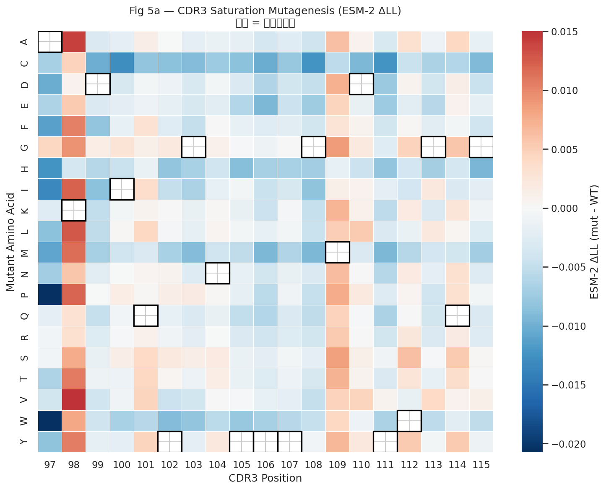

| 项目 | 说明 |
|------|------|
| **图意** | 行 = 突变氨基酸，列 = CDR3 位点；颜色 = ESM-2 ΔLL（红正蓝负） |
| **读图要点** | 黑框标出野生型残基；同一列中偏红表示该位点偏好特定替换 |
| **本数据结论** | P98、P109 等位点对多种带电/疏水氨基酸容忍度较高；部分位点对突变敏感（深蓝） |
| **含义与局限** | 反映序列模型偏好，非结合亲和力；需 Module 3/4 结构验证 |

##### 图 5b — ESM 得分分布

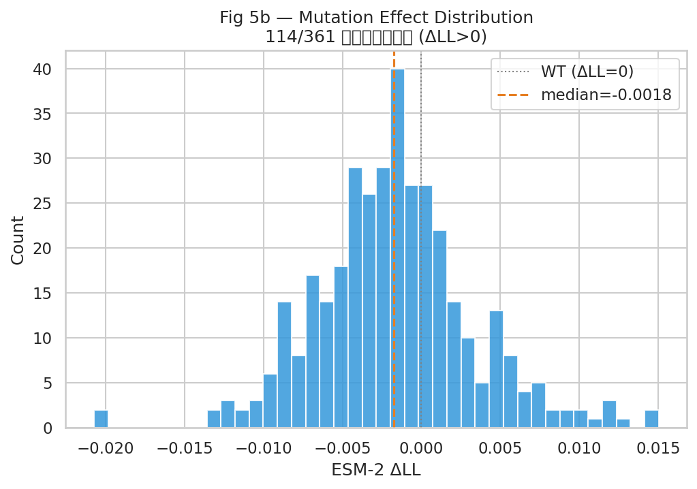

| 项目 | 说明 |
|------|------|
| **图意** | 361 条突变 ΔLL 的直方图，虚线为 WT（0）与中位数 |
| **读图要点** | 分布右偏说明部分突变优于野生型；负值区为不利突变 |
| **本数据结论** | 仅少数突变 ΔLL > 0，符合随机饱和突变预期 |
| **含义与局限** | 不能从分布直接推断实验成功率 |

##### 图 5c — Top-20 突变体排名

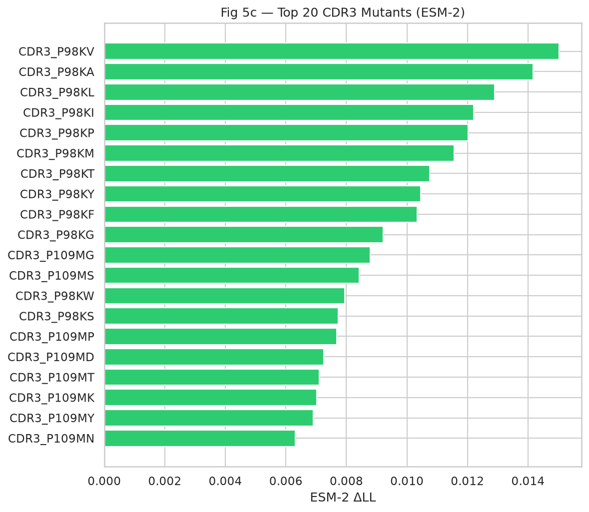

| 项目 | 说明 |
|------|------|
| **图意** | 按 `esm_score` 降序的 Top 20 横向条形图 |
| **本数据结论** | **CDR3_P98KV** 居首；Top 20 多集中在 P98X / P109X 取代 |
| **含义与局限** | 此排名为 Module 3 的输入列表，非最终推荐 |

##### 图 5d — 逐位点突变耐受曲线

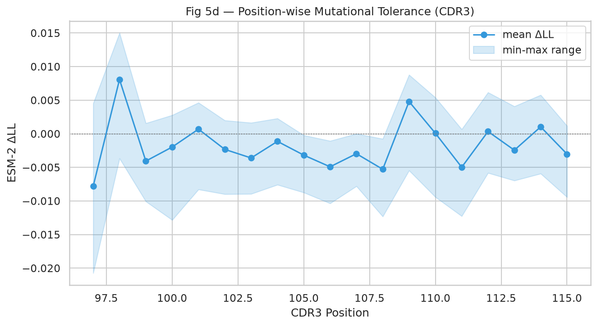

| 项目 | 说明 |
|------|------|
| **图意** | 每位点 ΔLL 均值曲线，阴影为 min–max 范围 |
| **读图要点** | 峰值位点 = 突变容忍度高；平坦或负值区 = 保守位点 |
| **本数据结论** | CDR3 中段（约 98–109）平均 ΔLL 相对较高 |
| **含义与局限** | 指导下一轮饱和突变或组合设计 |

---

### Module 3 — 蛋白-蛋白对接与界面评分

**目的**：对 Module 2 Top N 突变体生成纳米抗体结构，评估其与 PD-L1 界面的接触质量，输出 PPI 综合得分。

**前置依赖**：Module 0–2。

**输入**：

| 文件 | 说明 |
|------|------|
| `mutation_scores.csv` | Top N 突变序列（默认 N=20） |
| `PDL1_4ZQK_chainB.pdb` | PD-L1 受体结构 |
| `nanobody_cdr_regions.json` | 热点残基编号 |

**方法**：

```text
突变序列  →  ESMFold（GPU）或 extended-CA（CPU 回退）  →  nanobody.pdb
nanobody + PD-L1  →  界面接触统计（5 Å CA-CA）  →  ppi_score
可选：HDOCKlite  →  hdock_score
```

**关键参数**：

| 参数 | 默认值 | 说明 |
|------|--------|------|
| `TOP_N` | `20` | 从 Module 2 取前 N 条突变 |
| `CONTACT_CUTOFF` | `5.0` Å | CA 接触距离阈值 |
| `USE_ESMFOLD_ON_CPU` | `False` | CPU 上禁用 ESMFold，使用 extended-CA |
| PPI 打分公式 | `hotspot×2 + contacts×0.1 − min_dist` | 热点加权界面分 |

**输出**：

| 文件 | 说明 |
|------|------|
| `ppi_docking_scores.csv` | 突变体界面评分汇总 |
| `pe_docking/{mut_id}.pdb` | 纳米抗体结构（extended-CA 或 ESMFold） |

**判定标准**：
- `status == ok`：结构文件生成且界面评分成功
- 排序：综合 `esm_score` 与 `ppi_score`（当前演示中 PPI 指标相同，实质以 ESM 区分）

**当前运行结果（CPU / extended-CA）**：

| 指标 | 值 | 说明 |
|------|-----|------|
| 对接数量 | 20 / 20 ok | 全部成功 |
| `fold_method` | `extended_ca` | 粗模，非全原子折叠 |
| `ppi_score` | 19.766（全部相同） | 几何一致导致指标饱和 |
| `hotspot_contacts` | 9 | 与 6 个 PD-L1 热点中 9 个接触计数一致 |
| `min_distance_A` | 1.034 | 最近 CA 距离（Å） |

**算力**：Colab CPU + extended-CA，约 **2–5 分钟**；ESMFold 需 GPU，约 **10–30 分钟**（20 条）。

**可迁移场景**：
- **GPU 启用 ESMFold**：设置 Colab GPU 或 `USE_ESMFOLD_ON_CPU = True`（需 openfold）
- **完整 HDOCKlite 对接**：安装 `tools/hdocklite`，获得 `hdock_score`
- **换受体构象**：使用 MD 松弛后的 PD-L1 结构

#### 结果解读（Module 3 可视化）

##### 图 6a — PPI 界面接触指标

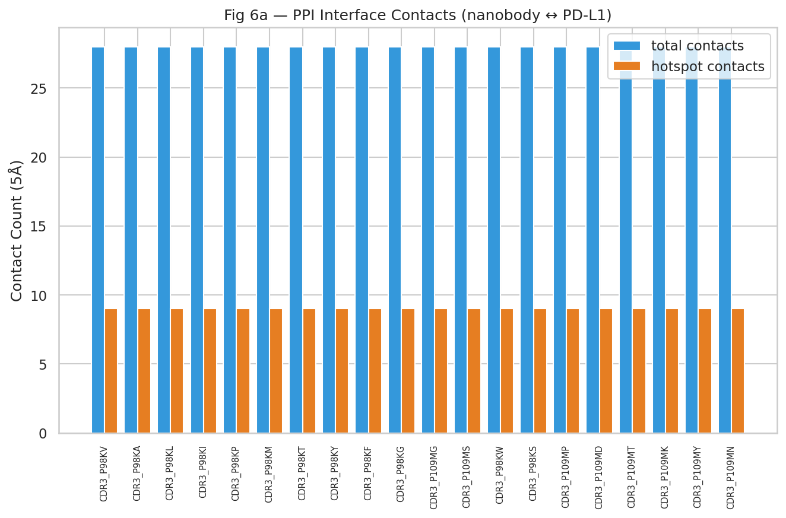

| 项目 | 说明 |
|------|------|
| **图意** | 双柱对比：总接触数 vs 热点接触数（5 Å 内） |
| **读图要点** | 热点接触占比高更优；需结合 min_dist 看界面紧密程度 |
| **本数据结论** | 20 个突变体指标相同（extended-CA 几何一致），**无法在此阶段区分界面优劣** |
| **含义与局限** | 仅验证流程；需 ESMFold/AF3 后才能做真实界面比较 |

##### 图 6b — ESM 得分 vs PPI 得分

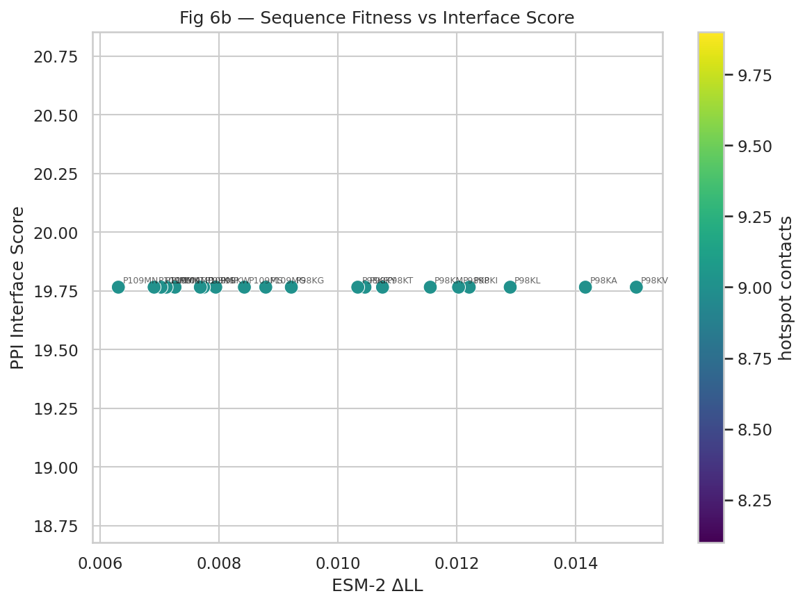

| 项目 | 说明 |
|------|------|
| **图意** | 横轴 ESM ΔLL，纵轴 PPI score；颜色 = hotspot contacts |
| **本数据结论** | 点沿水平线分布（PPI 相同），**区分度完全来自 ESM 轴** |
| **含义与局限** | Module 4 之前不宜宣称「双准则优化」 |

---

### Module 4 — AlphaFold 3 界面高精度验证

**目的**：解析 AlphaFold Server 下载的 Top 5 纳米抗体–PD-L1 复合物，用 ipTM / pTM 做相对排序，并导出最佳 CIF + 3D 预览。

**前置依赖**：Module 3；AF3 结果解压至 `data/screened_results/af3_server/pe/pe_cdr3_*_pdl1/`。

**输入**：

| 文件 | 说明 |
|------|------|
| `af3_server/pe/batch_top5.json` | 上传用 JSON（已生成） |
| `af3_server/pe/pe_cdr3_*_pdl1/` | Server zip 解压目录 |
| `ppi_docking_scores.csv` | 可选合并 ESM / PPI 分数 |

**方法**：

```text
AF3 Server zip
  → 解析 summary_confidences（iptm / ptm / ranking_score / chain_pair_iptm）
  → 按 ranking_score 取最佳模型
  → 复制 *_best.cif → af3_pe_complexes/
  → 合并 esm_score / ppi_score
  → 绘制 ipTM 排名图 + Top1 py3Dmol HTML
```

**关键读数参考**：

| 指标 | 参考 | 说明 |
|------|------|------|
| ipTM | ≥ 0.6 较可信 | 界面置信度；本批用于相对排序 |
| pTM | — | 整体折叠置信度 |
| chain_pair_iptm_AB | — | 纳米抗体–PD-L1 链对 ipTM |
| has_clash | 应为 0 | 立体冲突 |

**输出**：

| 文件 | 说明 |
|------|------|
| `af3_pe_metrics.csv` | ipTM / pTM / ranking + ESM/PPI |
| `af3_pe_complexes/*_best.cif` | 各突变体最佳模型 |
| `figures/fig_pe_af3_iptm_ranking.png` | ipTM 排名图 |
| `figures/fig_pe_af3_complex.html` | Top1 交互 3D |
| `figures/fig_pe_af3_complex.png` | Top1 指标摘要 |

**当前运行结果（最佳模型）**：

| 突变体 | ipTM | pTM | pair_iptm | ESM ΔLL | ranking |
|--------|------|-----|-----------|---------|---------|
| **CDR3_P98KV** | **0.28** | 0.60 | 0.28 | 0.0150 | 0.35 |
| CDR3_P98KA | 0.26 | 0.59 | 0.26 | 0.0142 | 0.33 |
| CDR3_P98KI | 0.25 | 0.56 | 0.25 | 0.0122 | 0.31 |
| CDR3_P98KP | 0.21 | 0.57 | 0.21 | 0.0120 | 0.29 |
| CDR3_P98KL | 0.17 | 0.54 | 0.17 | 0.0129 | 0.25 |

全部 `has_clash = 0`。ipTM 均 < 0.3，**无一越过 0.6 参考线**；相对排序与 ESM Top 方向一致（P98KV 最好）。

**算力**：AF3 Server（半自动）+ 本地/Colab CPU 解析，< 1 分钟。

#### 结果解读（Module 4 可视化）

##### 图 PE-AF3 — ipTM 界面置信度排名

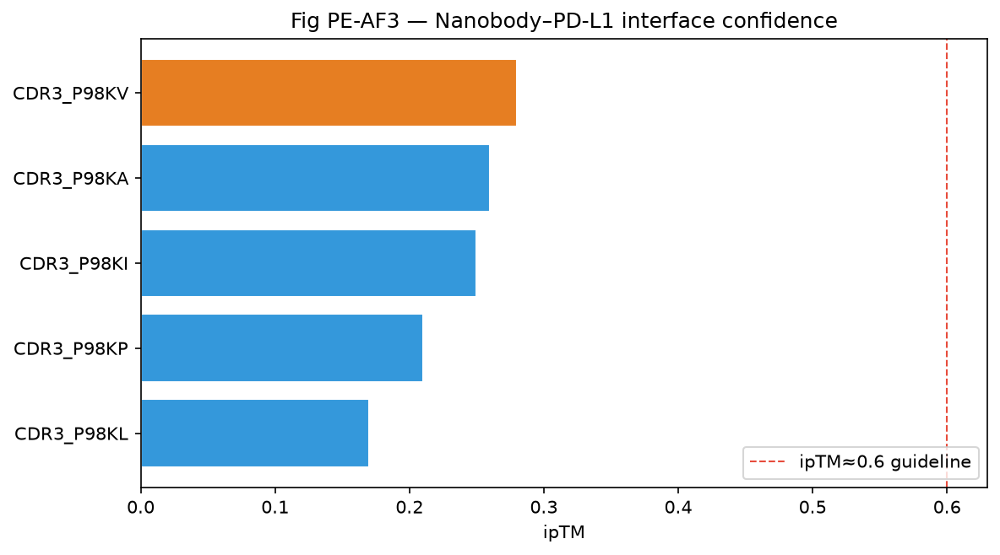

| 项目 | 说明 |
|------|------|
| **图意** | Top 5 纳米抗体–PD-L1 复合物按 ipTM 横向条形图；橙色为最优；红虚线为 ipTM≈0.6 |
| **读图要点** | 条越长界面越可信；本批全部低于虚线，宜作相对比较而非绝对采信 |
| **本数据结论** | **CDR3_P98KV（ipTM=0.28）** 排名第一；P98KL（0.17）最弱 |
| **含义与局限** | 单体折叠尚可（pTM~0.54–0.60），界面不确定。可能因 PD-L1 仅用 4ZQK 短 IgV（106 aa）或 CDR3 单点差异有限 |

##### 图 PE-AF3 — Top1 复合物 3D

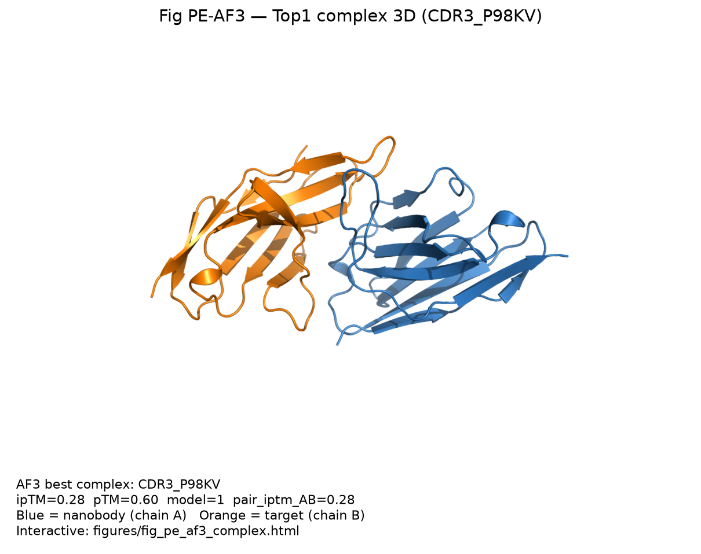

| 项目 | 说明 |
|------|------|
| **图意** | Top1（`CDR3_P98KV`）PyMOL cartoon 静态截图：蓝=纳米抗体（链 A），橙=靶蛋白（链 B） |
| **交互版** | 打开 [`fig_pe_af3_complex.html`](../../data/screened_results/figures/fig_pe_af3_complex.html) 可旋转缩放 |
| **结构文件** | `af3_pe_complexes/CDR3_P98KV_best.cif` |
| **本数据结论** | ipTM=0.28，pTM=0.60，model=1；双色 cartoon 展示界面相对位置 |
| **含义与局限** | 静态预测截图；不宜直接当作实验结合姿态；Module 5 MM-GBSA 可进一步评估能量 |

---

### Module 5 — 结合自由能解析（OpenMM MM-GBSA）

**目的**：对 Module 4 的 AF3 纳米抗体–靶蛋白复合物做 OpenMM MM-GBSA，估算结合自由能 ΔG_bind，并对界面残基做 VDW/ELE 拆解（HawkDock 风格相对归因）。

**前置依赖**：Module 4（`af3_pe_metrics.csv` + `af3_pe_complexes/*_best.cif`）；CUDA 可用的 OpenMM 环境。

**输入**：

| 文件 | 说明 |
|------|------|
| `af3_pe_metrics.csv` | AF3 Top 复合物清单（含 ipTM / ESM / PPI） |
| `af3_pe_complexes/{mut_id}_best.cif` | AF3 最佳模型（链 A = 纳米抗体，链 B = 靶蛋白） |

**方法**：

```text
AF3 CIF
  → PDBFixer 补全缺失原子 / 加氢
  → Amber14 + GBn2 隐式溶剂建系
  → CUDA 能量最小化
  → ΔG_bind ≈ E(complex) − E(receptor) − E(ligand)
  → 界面残基（≤5 Å）配对 VDW + ELE 拆解
  → 写出 CSV + 排名 / 残基贡献 / ΔG–ipTM 图
```

脚本入口：[`scripts/pe_module5_mmgbsa.py`](../../scripts/pe_module5_mmgbsa.py)。Notebook Module 5 cell 调用该脚本；已有结果时默认跳过重算（`FORCE_RERUN=1` 强制重跑）。

**关键参数**：

| 参数 | 默认值 | 说明 |
|------|--------|------|
| 力场 | `amber14-all.xml` + `implicit/gbn2.xml` | 蛋白 + GBn2 隐式溶剂 |
| 平台 | CUDA（`Precision=mixed`） | A100 / 兼容 NVIDIA GPU |
| 最小化 | `maxIterations=200` | OpenMM `minimizeEnergy` |
| 非键截断 | 2.0 nm | `CutoffNonPeriodic` |
| 界面定义 | 重原子 min dist ≤ 0.5 nm | 纳米抗体链 A 相对靶蛋白链 B |
| 残基拆解 | 配对 Coulomb + LJ（≤2.0 nm） | 不含完整 GB 项分摊 |

**输出**：

| 文件 | 说明 |
|------|------|
| `ppi_mmgbsa_summary.csv` | 各突变体 ΔG_bind + 合并 ipTM/ESM |
| `ppi_energy_decomposition.csv` | 界面残基 VDW/ELE 贡献 |
| `pe_complexes/{mut_id}_min.pdb` | 最小化后复合物 |
| `figures/fig_pe_mmgbsa_ranking.png` | ΔG 排序（图 7b） |
| `figures/fig_pe_residue_energy_decomposition.png` | Top 突变体残基拆解（图 7c） |
| `figures/fig_pe_mmgbsa_vs_iptm.png` | ΔG vs ipTM（图 7d） |
| `ppi_mmgbsa_meta.json` | 方法元数据 |

**判定标准**：
- **`dG_bind_kcalmol` 越负越好**（结合更有利）
- 残基级：`E_residue_kJmol` 越负表示该纳米抗体残基与靶蛋白吸引越强
- 建议与 Module 4 `iptm` 联读：能量优且 ipTM 相对靠前者优先

**当前运行结果（5 个 AF3 复合物，A100 CUDA）**：

| 排名 | 突变体 | ΔG (kcal/mol) | ipTM | ESM ΔLL | 界面残基数 |
|------|--------|---------------|------|---------|------------|
| 1 | **CDR3_P98KV** | **−65.10** | 0.28 | 0.0150 | 26 |
| 2 | CDR3_P98KL | −63.14 | 0.17 | 0.0129 | 27 |
| 3 | CDR3_P98KA | −53.84 | 0.26 | 0.0142 | 28 |
| 4 | CDR3_P98KI | −37.53 | 0.25 | 0.0122 | 18 |
| 5 | CDR3_P98KP | −32.34 | 0.21 | 0.0120 | 20 |

**算力**：CUDA GPU（推荐 A100），约 **~1 分钟 / 复合物**（含最小化与拆解）；5 个约 **5–8 分钟**。

**可迁移场景**：
- **换 AF3 批次**：更新 `af3_pe_complexes/` 与 `af3_pe_metrics.csv` 后重跑脚本
- **显式溶剂 MD**：在 Module 5 后增加 OpenMM tip3p 短轨迹，再做轨迹平均 MM-GBSA
- **抗体亲和力成熟**：对 CDR 组合突变复合物批量能量排序

#### 结果解读（Module 5 可视化）

##### 图 7b — MM-GBSA ΔG 排序

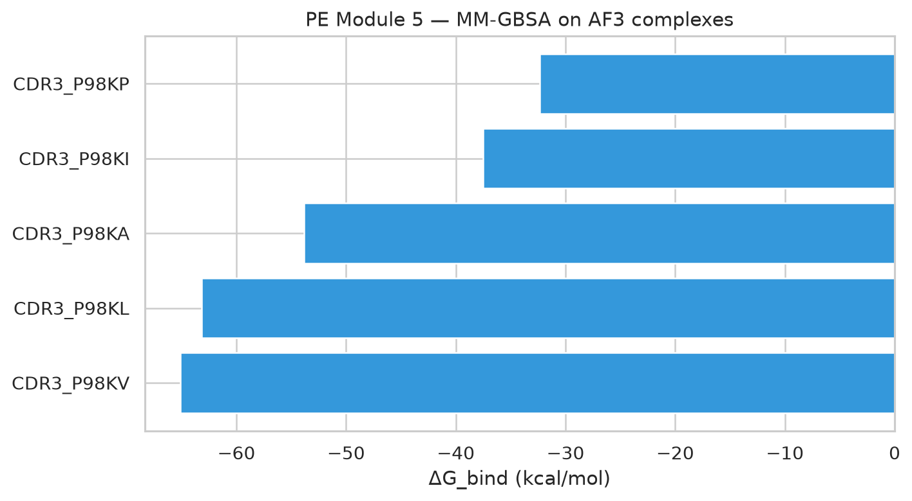

| 项目 | 说明 |
|------|------|
| **图意** | AF3 Top 复合物按 `dG_bind_kcalmol` 升序（越负越好）柱状图 |
| **读图要点** | 柱越向下（更负）结合越有利；需结合 ipTM 看结构置信 |
| **本数据结论** | **CDR3_P98KV（−65.1）** 与 **CDR3_P98KL（−63.1）** 明显优于 P98KI/P98KP |
| **含义与局限** | 隐式溶剂单点 ΔG，绝对值不可直接换算 Kd；用于相对排序 |

##### 图 7c — Top 突变体残基能量拆解

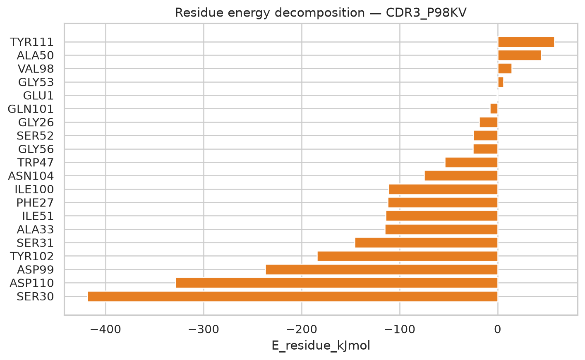

| 项目 | 说明 |
|------|------|
| **图意** | Top1（`CDR3_P98KV`）界面残基 VDW+ELE（kcal/mol）；红色 = 突变位点 |
| **读图要点** | 越负贡献越大；关注 CDR / 框架界面残基是否主导吸引 |
| **本数据结论** | 界面吸引主要由多处极性/芳香残基贡献；突变位点 P98 参与但非唯一主导 |
| **含义与局限** | 真空配对能量，非完整 MM-GBSA 残基分摊；指导下一轮突变设计 |

##### 图 7d — ΔG vs AF3 ipTM

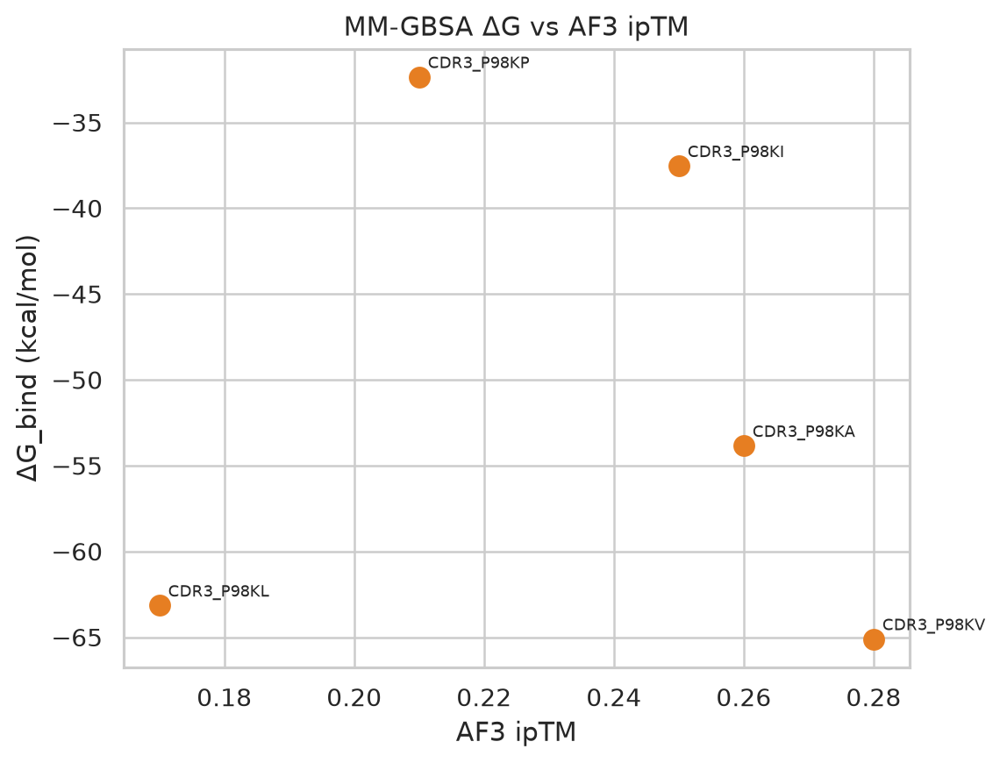

| 项目 | 说明 |
|------|------|
| **图意** | 横轴 AF3 ipTM，纵轴 MM-GBSA ΔG |
| **读图要点** | 理想候选：左上/更负且 ipTM 相对高 |
| **本数据结论** | P98KV 在能量与 ipTM 上均居前；P98KL 能量优但 ipTM 最低（0.17），需谨慎 |
| **含义与局限** | 样本仅 5 点，不宜过度拟合相关 |

---

### Module 6 — 可视化与结果导出

**目的**：将 Module 2–5 数据汇总为图表；刷新筛选漏斗（含 AF3 / MM-GBSA 阶段），并集中展示 Module 4–5 图。

**前置依赖**：`mutation_scores.csv`、`ppi_docking_scores.csv`；可选 `af3_pe_metrics.csv`、`ppi_mmgbsa_summary.csv`。

**输出目录**：`data/screened_results/figures/`

**图号总览**：

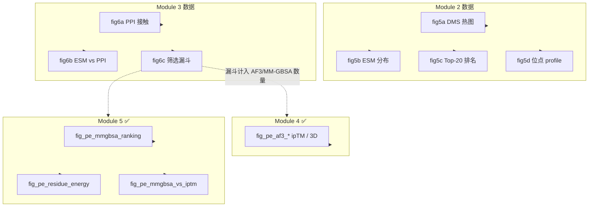

**图号与数据归属**：

| 图号 | 文件名 | 数据来源 |
|------|--------|----------|
| 5a–5d | `fig5a_*` … `fig5d_*` | Module 2 → 解读见 [Module 2](#module-2--esm-2-cdr-饱和突变与序列打分) |
| 6a–6c | `fig6a_*` … `fig6c_*` | Module 3（漏斗含 M4/M5 计数）→ 见下 |
| 7a | `fig_pe_af3_*` | Module 4 → 解读见 [Module 4](#结果解读module-4-可视化) |
| 7b–7d | `fig_pe_mmgbsa_*` / `fig_pe_residue_*` | Module 5 → 解读见 [Module 5](#结果解读module-5-可视化) |

##### 图 6c — PE 筛选漏斗（Modules 2→5）

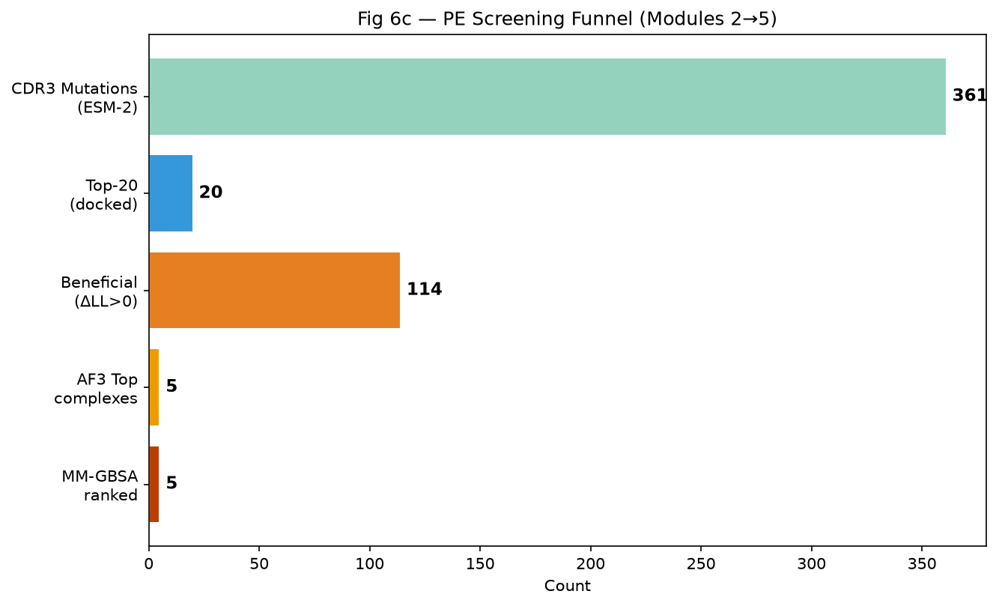

| 项目 | 说明 |
|------|------|
| **图意** | 五阶段：CDR3 突变 → Top-20 对接 → ΔLL>0 → AF3 Top 复合物 → MM-GBSA 排序 |
| **本数据结论** | **361 → 20 → 114 → 5 → 5**，后两阶对 AF3 上传的 Top5 做结构与能量闭环 |
| **含义与局限** | AF3/MM-GBSA 仅覆盖 Top5，不是全库能量筛选 |

> **关于 3D 结合图**：纳米抗体–靶蛋白全原子 3D 见 Module 4 的 `fig_pe_af3_complex.html`；能量排序见 Module 5 图 7b–7d。**DNA/RNA 结合 3D 属于 NA 线路**。

---

## 4. 数据字典

### 4.1 `mutation_scores.csv`（Module 2）

| 列名 | 类型 | 说明 |
|------|------|------|
| `mut_id` | str | 突变 ID，如 `CDR3_P98KV`（区域_位点野生型突变型） |
| `cdr` | str | CDR 区域名（CDR1 / CDR2 / CDR3） |
| `position` | int | 1-based 序列位点 |
| `wt_aa` | str | 野生型氨基酸（单字母） |
| `mut_aa` | str | 突变氨基酸 |
| `sequence` | str | 完整突变序列 |
| `wt_ll` | float | 野生型平均 log-likelihood |
| `mut_ll` | float | 突变体平均 log-likelihood |
| `delta_ll` | float | `mut_ll - wt_ll` |
| `esm_score` | float | 与 `delta_ll` 相同，**越高越好** |

### 4.2 `ppi_docking_scores.csv`（Module 3）

| 列名 | 类型 | 说明 |
|------|------|------|
| `mut_id` | str | 突变 ID |
| `sequence` | str | 突变序列 |
| `esm_score` | float | Module 2 的 ΔLL |
| `ppi_score` | float | 界面综合分（热点加权） |
| `hotspot_contacts` | int | 与 PD-L1 热点残基的 5 Å 接触数 |
| `min_distance_A` | float | 纳米抗体–PD-L1 最近 CA 距离（Å） |
| `contact_count` | int | 总 CA 接触数（5 Å 内） |
| `hdock_score` | float | HDOCKlite 分数（可选，空表示未运行） |
| `nanobody_pdb` | str | 结构文件路径 |
| `fold_method` | str | `extended_ca` / `esmfold` |
| `status` | str | `ok` / 错误状态 |

### 4.3 `af3_pe_metrics.csv`（Module 4）

| 列名 | 类型 | 说明 | 示例 |
|------|------|------|------|
| `mut_id` | str | 突变 ID | `CDR3_P98KV` |
| `job_dir` | str | AF3 结果目录 | `pe_cdr3_p98kv_pdl1` |
| `model` | int | 最佳模型 0–4 | `1` |
| `iptm` | float | 界面置信度 | `0.28` |
| `ptm` | float | 整体折叠置信度 | `0.60` |
| `ranking_score` | float | AF3 排序分 | `0.35` |
| `chain_pair_iptm_AB` | float | 链对界面 ipTM | `0.28` |
| `has_clash` | float | 是否碰撞 | `0.0` |
| `esm_score` | float | 合并自 Module 2 | `0.015` |
| `ppi_score` | float | 合并自 Module 3 | `19.766` |
| `complex_cif` | str | 最佳 CIF 路径 | `data/.../CDR3_P98KV_best.cif` |

### 4.4 `ppi_mmgbsa_summary.csv`（Module 5）

| 列名 | 类型 | 说明 | 示例 |
|------|------|------|------|
| `mut_id` | str | 突变 ID | `CDR3_P98KV` |
| `iptm` / `ptm` / `ranking_score` | float | 合并自 Module 4 | `0.28` / `0.60` / `0.35` |
| `esm_score` / `ppi_score` | float | 合并自 Module 2/3 | `0.015` / `19.766` |
| `E_complex_kJmol` | float | 复合物势能 | — |
| `E_receptor_kJmol` | float | 靶蛋白（链 B）势能 | — |
| `E_ligand_kJmol` | float | 纳米抗体（链 A）势能 | — |
| `dG_bind_kJmol` | float | `E_c − E_r − E_l` | — |
| `dG_bind_kcalmol` | float | ΔG（kcal/mol），**越负越好** | `-65.10` |
| `n_interface_residues` | int | 界面残基数 | `26` |
| `complex_cif` | str | 输入 AF3 CIF | `.../CDR3_P98KV_best.cif` |
| `minimized_pdb` | str | 最小化输出 | `.../CDR3_P98KV_min.pdb` |

### 4.5 `ppi_energy_decomposition.csv`（Module 5）

| 列名 | 类型 | 说明 |
|------|------|------|
| `mut_id` | str | 突变 ID |
| `chain` | str | 纳米抗体链（`A`） |
| `resnum` / `resname` / `aa` | int/str | 残基编号与名称 |
| `is_mutated_site` | bool | 是否为设计突变位点 |
| `min_dist_nm` | float | 到靶蛋白最近重原子距离（nm） |
| `E_vdw_kJmol` | float | 与靶蛋白配对范德华能 |
| `E_elec_kJmol` | float | 与靶蛋白配对静电能 |
| `E_residue_kJmol` | float | `VDW + ELE`，**越负贡献越大** |

### 4.6 `nanobody_cdr_regions.json`（Module 1）

| 字段 | 说明 |
|------|------|
| `seed_id` | 种子标识 |
| `sequence` | 野生型氨基酸序列 |
| `cdr_regions` | CDR1/2/3 起止位点（1-based inclusive） |
| `pdl1_hotspots` | PD-L1 热点残基（三字母+编号） |
| `receptor_pdb` | PD-L1 受体 PDB 路径 |

### 4.7 图文件命名规范

| 前缀 | 含义 |
|------|------|
| `fig5a`–`fig5d` | CDR / ESM-2 突变分析（Module 2） |
| `fig6a`–`fig6c` | PPI 界面与筛选漏斗（Module 3/6） |
| `fig_pe_af3_*` | AF3 纳米抗体–靶蛋白（排名 / 3D，Module 4） |
| `fig_pe_mmgbsa_*` / `fig_pe_residue_*` | MM-GBSA ΔG 排序、ΔG–ipTM、残基拆解（Module 5） |

---

## 5. 跨平台交接（Colab → GPU）

```text
Colab Module 0–4 完成（含 AF3 解析）
    ↓ export_for_local_sync() / git pull
GPU 实例（omniscreen-md + CUDA）
    ↓ Module 5（scripts/pe_module5_mmgbsa.py）
ppi_mmgbsa_summary.csv + ppi_energy_decomposition.csv
    ↓ Module 6 汇总可视化
figures/fig_pe_mmgbsa_*.png
```

**交接文件清单**（Module 4 → 5）：

| 文件 | 必需 |
|------|------|
| `data/screened_results/af3_pe_metrics.csv` | ✅ |
| `data/screened_results/af3_pe_complexes/*_best.cif` | ✅ |
| `data/screened_results/mutation_scores.csv` | 推荐（合并 ESM） |
| `data/screened_results/ppi_docking_scores.csv` | 推荐（合并 PPI） |
| `scripts/pe_module5_mmgbsa.py` | ✅ |
| CUDA OpenMM 环境 | ✅（如 `/venv/omniscreen-md`） |

---

## 6. 常见问题

| 问题 | 原因 | 解决 |
|------|------|------|
| `No module named 'openfold'` | CPU 上强行加载 ESMFold | 保持 `USE_ESMFOLD_ON_CPU = False`，使用 extended-CA |
| `PDB 中未找到 CA 原子` | extended-CA PDB 残基名为单字母 | 已修复：使用三字母残基名（ALA 等） |
| Module 4 找不到结果 | zip 未解压到约定路径 | 解压到 `af3_server/pe/pe_cdr3_*_pdl1/` |
| AF3 ipTM 全部偏低 | 短 PD-L1 片段 / 界面难预测 | 作相对排序；可换更长 PD-L1 胞外域再跑 |
| `CUDA_ERROR_UNSUPPORTED_PTX_VERSION` | OpenMM CUDA 构建与驱动不匹配 | 使用 conda-forge `openmm` + `cuda-version=12` |
| Module 5 `assert CUDA` 失败 | 内核未选 GPU 环境 | 选择 `omniscreen-md` / `.venv` 解释器 |
| `mutation_scores.csv` 不存在 | 未跑 Module 2 | 先完成 Module 2 |
| Colab Secrets 读不到 token | MCP 内核与浏览器 Colab 非同一进程 | CSV 用小文件同步；PNG 用临时文件床；GitHub push 需在正确内核手动注入 token |
| Module 2 很慢 | ESM-2 在 CPU 上推理 | 切换 Colab GPU 运行时 |
| 图在本地找不到 | 未执行同步 | 运行 Module 6 后通过 Agent 下载 `figures/` |

---

## 7. 术语表

| 术语 | 解释 |
|------|------|
| **VHH / 纳米抗体** | 骆驼科重链抗体的可变区，约 15 kDa |
| **CDR** | Complementarity Determining Region，抗体互补决定区 |
| **ESM-2 ΔLL** | 突变序列相对野生型的平均 log-likelihood 差，越高表示序列越「合理」 |
| **DMS 热图** | Deep Mutational Scanning 风格位点×氨基酸效应矩阵 |
| **extended-CA** | 沿序列延伸的 Cα 链占位模型，仅用于流程测试 |
| **热点残基** | PPI 界面中对结合自由能贡献大的残基 |
| **ipTM** | AF3 的界面预测 TM-score，评估复合物置信度 |
| **MM-GBSA** | 分子力学/广义 Born 表面积，结合自由能估算方法 |
| **GBn2** | OpenMM 隐式溶剂模型之一，用于 Module 5 单点 ΔG |

---

## 8. 参考文献

- ESM-2: Lin et al. *Science* **374**, 1427–1431 (2021). https://github.com/facebookresearch/esm
- ESMFold: Lin et al. *Science* **379**, 1123–1130 (2023).
- AlphaFold 3: Abramson et al. *Nature* (2024). https://alphafoldserver.com
- OpenMM: Eastman et al. *J. Phys. Chem. B* (2017). https://openmm.org
- PDB 4ZQK: PD-1 / PD-L1 complex (Zak et al., *PNAS* 2015).
- KN035 纳米抗体: 文献常用 PD-L1 靶向 VHH 骨架（见项目种子注释）。
- HDOCK: Yan et al. *Bioinformatics* **36**, 120–126 (2020).
- MM-GBSA / 残基分解: Genheden & Ryde, *Expert Opin. Drug Discov.* (2015).

---

## 9. 与 SM / NA 线路的关系

OmniScreen-AI 在 **同一 PD-L1 靶点** 上并行三条模态流水线：

| 线路 | 模态 | 候选空间 | 文档 |
|------|------|----------|------|
| **SM** | 小分子 | SMILES / 化学空间 | [SM_MODULES.md](./SM_MODULES.md) |
| **PE** | 蛋白/多肽 | 氨基酸序列 / CDR | 本文档 |
| **NA** | 核酸 | siRNA / Aptamer 序列 | [NA_MODULES.md](./NA_MODULES.md) |

三条线路共享 `data/receptor/` 下的 PD-L1 结构资源，但筛选逻辑、输出 CSV 与可视化图号独立（SM 用 fig3/fig4，PE 用 fig5/fig6/fig_pe_*）。

---

*文档版本：2026-07 · Module 0–6 已实现 · Module 5 = OpenMM MM-GBSA（CUDA）*