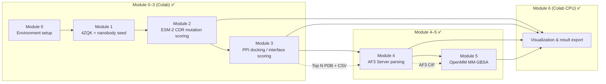
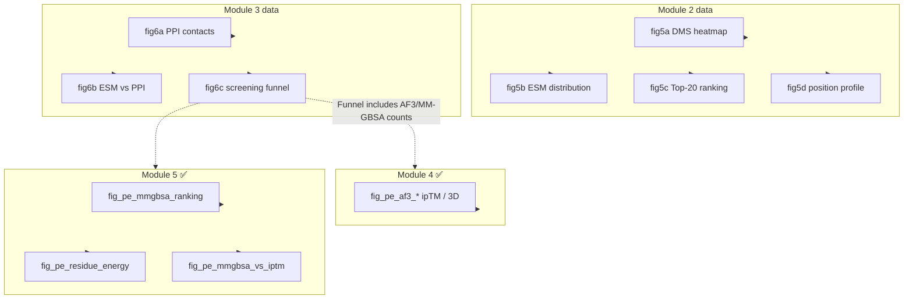

# OmniScreen Protein/Peptide Screening Workflow (PE)

> **Notebook**: [`notebooks/OmniScreen_PE_Workflow.ipynb`](../../notebooks/OmniScreen_PE_Workflow.ipynb)  
> **Target**: PD-L1 (CD274)  
> **Current progress**: Module 0–6 ✅ (Module 5 = OpenMM MM-GBSA / CUDA)

---

## Table of Contents

1. [Overview](#1-overview)
2. [Quick Start](#2-quick-start)
3. [Module Details](#3-module-details)
4. [Data Dictionary](#4-data-dictionary)
5. [Cross-Platform Handoff](#5-cross-platform-handoff-colab--runpod)
6. [FAQ](#6-faq)
7. [Glossary](#7-glossary)
8. [References](#8-references)

---

## 1. Overview

### 1.1 Scientific Background and Project Goals

**PD-L1** (Programmed Death-Ligand 1) is a key tumor immune checkpoint membrane protein. Binding to **PD-1** on T cells suppresses anti-tumor immunity. Beyond small-molecule inhibitors, **protein/peptide modalities** such as **nanobodies (VHH)** and engineered peptides can target the PD-L1 interface, with potential applications in immunotherapy and diagnostics.

The goal of the **OmniScreen PE pipeline** is to establish a reproducible **sequence space → structure space → dynamics/free energy** screening funnel, computationally rank a nanobody CDR saturation mutagenesis library, and provide a candidate list for subsequent high-precision structural validation (AlphaFold 3) and binding free energy analysis.

This pipeline does not replace wet-lab experiments (SPR, cell-based blocking assays, etc.), but instead provides:

- Quantifiable **sequence fitness ranking** (ESM-2 ΔLL)
- Auditable **protein–protein interface coarse scoring** (hotspot contacts + interface score)
- Reusable **modular Notebook workflow** (aligned in structure with SM / NA pipelines)

### 1.2 Technical Route Overview



**Screening logic (funnel)**:

| Stage | Eliminated | Retention criteria |
|------|----------|----------|
| Module 2 | CDR single-point variants with poor sequence fitness | Sort by `esm_score` (ΔLL) descending; default Top 20 proceed to Module 3 |
| Module 3 | Structure generation failures, abnormal interface scores | `status == ok`; combined ESM + PPI metric ranking |
| Module 4 | Low AF3 ipTM, insufficient interface confidence | Relative `iptm` ranking; reference ≥0.6 |
| Module 5 | No binding free energy advantage, unreasonable interface energy decomposition | More negative `dG_bind_kcalmol` is better; interface residue VDW/ELE contributions |

### 1.3 Technology Stack

| Category | Tool / Library | Purpose |
|------|-----------|------|
| Sequence modeling | ESM-2 (`fair-esm`) | CDR mutation sequence log-likelihood / ΔLL scoring |
| Structure prediction (optional) | ESMFold | Nanobody 3D structure on GPU; CPU fallback extended-CA |
| Protein–protein docking | HDOCKlite (optional) | All-atom docking; interface scoring only when unavailable |
| Structure parsing | BioPython | PDB parsing, NeighborSearch contact statistics |
| Visualization | matplotlib, seaborn, py3Dmol | DMS heatmap, funnel, AF3 ranking / 3D HTML, MM-GBSA energy plots |
| Structure validation | AlphaFold 3 Server + local parsing | Nanobody–PD-L1 complex; ipTM / pTM |
| Free energy | OpenMM MM-GBSA (Amber14 + GBn2) | ΔG_bind + interface residue VDW/ELE decomposition (CUDA) |
| Runtime environment | Colab CPU + AF3 Server + GPU | Module 0–3, 6 on CPU; Module 4 Server; Module 5 CUDA GPU |
| Collaboration | Cursor Agent + `export_for_local_sync` | Write cloud results back to local |

### 1.4 Use Cases and Extension Directions

| Scenario | Replace | Keep modules |
|------|--------|----------|
| **Change target** | Receptor PDB (e.g. EGFR, HER2) and corresponding hotspot residue list | Module 0–2 logic; redefine `pdl1_hotspots` in Module 3 |
| **Change antibody scaffold** | `pd_l1_nanobody_seed.fasta` + `nanobody_cdr_regions.json` | Module 2–3 full workflow |
| **Expand CDR scan** | `SCAN_REGIONS = ["CDR1","CDR2","CDR3"]` | Module 2 mutagenesis library size increases |
| **Bispecific / fusion protein** | Multi-chain FASTA, segmented CDR annotations | Module 2 sequence input extension |
| **Peptide (non-VHH)** | Shorter FASTA, CDR definition without FR regions | Module 2 ESM-2 still applies; Module 3 docking strategy needs adjustment |
| **Combined with SM / NA** | Same PD-L1 target, different modalities screened in parallel | Share `data/receptor/`, separate result CSVs |

### 1.5 Current Limitations and Assumptions

- **ESM-2 ΔLL ≠ binding affinity**: Reflects "foldability/stability" trends in evolutionary/language-model terms, not directly equivalent to Kd or IC50.
- **extended-CA coarse model**: When Colab CPU has no GPU, Module 3 uses **CA extended chain** instead of all-atom structure; **all Top mutant PPI geometry metrics may be identical** (as in the current demo: ppi=19.766, hotspot=9); interface plots are for workflow validation only, not publication-grade binding poses.
- **HDOCKlite not mandatory**: Demo workflow relies primarily on **interface contact scoring** (CA contacts within 5 Å + PD-L1 hotspot weighting); full docking requires HDOCKlite installation or ESMFold on GPU.
- **CDR regions are Kabat approximations**: CDR1/2/3 boundaries in `nanobody_cdr_regions.json` should be cross-validated with experiments or ANARCI annotations.
- **Module 4 AF3 interface confidence is low**: Current Top5 ipTM all < 0.3; structures are for relative ranking only; may relate to PD-L1 using only the short 4ZQK IgV fragment.
- **Module 5 MM-GBSA is implicit-solvent single-point estimate**: ΔG computed after minimization of AF3 complex; **not explicit water-box MD / not experimental Kd**. Residue decomposition is vacuum-paired VDW+ELE, without full GB term allocation; use for relative comparison.

---

## 2. Quick Start

### 2.1 Environment Requirements

| Environment | Description |
|------|------|
| **Colab + Cursor (recommended)** | Cursor executes cells via Notebook MCP connected to Colab kernel |
| **Colab GPU (Module 2 recommended)** | ESM-2 scoring significantly faster on GPU; CPU works but slower |
| **Colab CPU** | Module 0–1, 3 (extended-CA), 6 can run on CPU |
| **CUDA GPU (Module 5)** | OpenMM MM-GBSA; recommend `omniscreen-md` environment + A100 |
| **Local** | Python 3.10+, PyTorch, `fair-esm`, `biopython`; Module 3 all-atom docking needs GPU + openfold (ESMFold) |

### 2.2 Recommended Run Order (Module 0–6)

```
Module 0  →  Initialize PATHS / sync functions
    ↓
Module 1  →  Download 4ZQK, write nanobody seed & CDR metadata
    ↓
Module 2  →  Generate mutation_scores.csv (361 CDR3 mutations, ~5–15 min depending on GPU)
    ↓
Module 3  →  Generate ppi_docking_scores.csv + pe_docking/*.pdb (Top 20, ~2–5 min)
    ↓
Module 4  →  Parse AF3 → af3_pe_metrics.csv + fig_pe_af3_*
    ↓
Module 5  →  OpenMM MM-GBSA → ppi_mmgbsa_summary.csv + energy plots (CUDA, ~1 min / complex)
    ↓
Module 6  →  Aggregate fig5* / fig6* / fig_pe_* (including MM-GBSA plots 7b–7d)
```

> **Note**: Module 5 requires a CUDA-capable OpenMM environment (e.g. `omniscreen-md` / A100). Script: `scripts/pe_module5_mmgbsa.py`.

### 2.3 Output Directories

```
data/
├── receptor/
│   ├── 4ZQK.pdb                      # Module 1: PD-1/PD-L1 complex
│   ├── PDL1_4ZQK_chainB.pdb          # Module 1: PD-L1 chain (docking receptor)
│   └── PD1_4ZQK_chainA.pdb           # Module 1: PD-1 chain (reference)
├── raw_libraries/
│   ├── pd_l1_nanobody_seed.fasta     # Module 1: KN035 nanobody seed
│   └── nanobody_cdr_regions.json     # Module 1: CDR regions & hotspot residues
└── screened_results/
    ├── mutation_scores.csv           # Module 2
    ├── ppi_docking_scores.csv        # Module 3
    ├── pe_docking/*.pdb              # Module 3: mutant structures (extended-CA or ESMFold)
    ├── af3_pe_metrics.csv            # Module 4
    ├── af3_pe_complexes/*_best.cif   # Module 4
    ├── ppi_mmgbsa_summary.csv        # Module 5
    ├── ppi_energy_decomposition.csv  # Module 5
    ├── pe_complexes/*_min.pdb        # Module 5: minimized complexes
    └── figures/                      # Module 6 (fig5*/fig6*/fig_pe_*)
```

See [`data/screened_results/README.md`](../../data/screened_results/README.md) for details.

---

## 3. Module Details

> Each module follows a uniform structure: **Purpose → Dependencies → Input → Method → Output → Criteria → Compute → Migration scenarios → Result interpretation (with figures)**

---

### Module 0 — Environment Setup and Path Initialization

**Purpose**: Unify project root `PATHS`, initialize Colab ↔ local sync mechanism.

**Prerequisites**: None.

**Input**: GitHub repo `OmniScreen-AI` (Colab auto-clones to `/content/OmniScreen-AI`).

**Method**:
- Detect Colab / local environment, set `PROJECT_ROOT`
- Define `PATHS = {receptor, raw, results}`
- Provide `persist_to_github()` and `export_for_local_sync()` for data persistence

**Output**: In-memory variables `PATHS`, `PROJECT_ROOT` (no files).

**Compute**: Colab CPU, < 1 minute.

**Migration scenarios**: Any Colab + Cursor collaboration project can copy the Module 0 template.

> Module 0 is infrastructure; scientific content begins at Module 1. Environment and reproducibility details in [§2 Quick Start](#2-quick-start).

---

### Module 1 — Data Preparation: PD-1/PD-L1 Interface & Nanobody Seed

**Purpose**: Obtain PD-1/PD-L1 co-crystal structure as interface reference, load KN035 nanobody seed sequence and CDR annotations.

**Prerequisites**: Module 0.

| Type | Path | Description |
|------|------|------|
| **Input (auto-download)** | — | PDB `4ZQK` (PD-1 / PD-L1 complex) |
| **Input (seed)** | `data/raw_libraries/pd_l1_nanobody_seed.fasta` | KN035 VHH, 122 aa |
| **Output** | `data/receptor/4ZQK.pdb` | Full complex |
| **Output** | `data/receptor/PDL1_4ZQK_chainB.pdb` | PD-L1 chain (Module 3 receptor) |
| **Output** | `data/receptor/PD1_4ZQK_chainA.pdb` | PD-1 chain (interface reference) |
| **Output** | `data/raw_libraries/nanobody_cdr_regions.json` | CDR regions + PD-L1 hotspot residues |

**Method**:
- Download `4ZQK.pdb` from RCSB, split PD-L1 (Chain B) and PD-1 (Chain A) by chain
- Write nanobody seed FASTA and CDR metadata JSON

**Key parameters**:

| Parameter | Value | Description |
|------|-----|------|
| `RECEPTOR_PDB` | `4ZQK` | PD-1/PD-L1 complex (Zak et al.) |
| `PDL1_CHAIN` | `B` | Docking receptor chain |
| CDR regions (Kabat approx.) | CDR1: 25–32, CDR2: 49–56, CDR3: 96–114 | 0-indexed in JSON |
| PD-L1 hotspot residues | TYR56, MET115, ALA121, ASP122, LYS124, TYR123 | Module 3 interface scoring |

**Compute**: Colab CPU, < 2 minutes.

**Migration scenarios**:
- Change target: replace receptor PDB and `pdl1_hotspots`
- Change antibody: replace `SEED_SEQ` and re-annotate CDR

---

### Module 2 — ESM-2 CDR Saturation Mutagenesis and Sequence Scoring

**Purpose**: Perform single-point saturation mutagenesis on CDR regions, use ESM-2 to compute log-likelihood change (ΔLL) relative to wild-type, quickly narrow sequence search space.

**Prerequisites**: Module 0, Module 1.

**Input**:

| File | Description |
|------|------|
| `nanobody_cdr_regions.json` | Wild-type sequence and CDR boundaries |
| `pd_l1_nanobody_seed.fasta` | Seed sequence backup |

**Method**:

| Step | Tool | Description |
|------|------|------|
| Mutagenesis library generation | Custom `iter_cdr_mutations` | 19 amino acid substitutions at each position in specified CDR |
| Sequence scoring | ESM-2 | Average token log-probability |
| ΔLL calculation | `mut_ll - wt_ll` | Written to `esm_score` |

**Key parameters**:

| Parameter | Default | Description |
|------|--------|------|
| `SCAN_REGIONS` | `["CDR3"]` | Can extend to `["CDR1","CDR2","CDR3"]` |
| `MAX_MUTATIONS` | `400` | Upper limit on mutation count |
| `MODEL_NAME` | `esm2_t6_8M_UR50D` | Colab-friendly small model; GPU can use `esm2_t12_35M_UR50D` |

**Output**: `data/screened_results/mutation_scores.csv`

**Criteria**:
- `esm_score > 0`: Mutant sequence trends better than or equal to wild-type in ESM-2 terms (positive ΔLL)
- Ranking: **higher `esm_score` is better** (descending, take Top N)

**Current run results**:
- Generated **361** CDR3 saturation mutations (19 aa × 19 positions)
- **Top 1**: `CDR3_P98KV` (P98K→V), `esm_score = 0.0150`
- Multiple P98, P109 vicinity mutations dominate Top list (related to CDR3 loop flexibility)

**Compute**: Colab GPU recommended, ~**5–15 minutes**; CPU ~**20–40 minutes**.

**Migration scenarios**:
- **Full CDR scan**: Modify `SCAN_REGIONS`, mutations can reach thousands
- **Directed evolution simulation**: Allow only hydrophobic / charged mutations
- **Double mutations**: Add combinatorial enumeration submodule after Module 2

#### Result Interpretation (Module 2 Visualization)

##### Figure 5a — CDR3 Saturation Mutagenesis DMS Heatmap


| Item | Description |
|------|------|
| **Plot meaning** | Rows = mutant amino acids, columns = CDR3 positions; color = ESM-2 ΔLL (red positive, blue negative) |
| **Reading tips** | Black box marks wild-type residue; redder in same column indicates preference for specific substitution at that position |
| **Data conclusion** | Positions P98, P109 tolerate many charged/hydrophobic amino acids; some positions are mutation-sensitive (deep blue) |
| **Meaning & limitations** | Reflects sequence model preference, not binding affinity; needs Module 3/4 structural validation |

##### Figure 5b — ESM Score Distribution


| Item | Description |
|------|------|
| **Plot meaning** | Histogram of 361 mutation ΔLL values; dashed lines for WT (0) and median |
| **Reading tips** | Right-skewed distribution indicates some mutants better than wild-type; negative region = unfavorable mutations |
| **Data conclusion** | Only a few mutations have ΔLL > 0, consistent with random saturation mutagenesis expectation |
| **Meaning & limitations** | Cannot directly infer experimental success rate from distribution |

##### Figure 5c — Top-20 Mutant Ranking


| Item | Description |
|------|------|
| **Plot meaning** | Horizontal bar chart of Top 20 by `esm_score` descending |
| **Data conclusion** | **CDR3_P98KV** ranks first; Top 20 mostly P98X / P109X substitutions |
| **Meaning & limitations** | This ranking is Module 3 input list, not final recommendation |

##### Figure 5d — Per-Position Mutation Tolerance Profile


| Item | Description |
|------|------|
| **Plot meaning** | Mean ΔLL curve per position, shaded min–max range |
| **Reading tips** | Peak positions = high mutation tolerance; flat or negative regions = conserved positions |
| **Data conclusion** | Mid CDR3 region (~98–109) has relatively higher mean ΔLL |
| **Meaning & limitations** | Guides next-round saturation or combinatorial design |

---

### Module 3 — Protein–Protein Docking and Interface Scoring

**Purpose**: Generate nanobody structures for Module 2 Top N mutants, evaluate contact quality at PD-L1 interface, output combined PPI score.

**Prerequisites**: Module 0–2.

**Input**:

| File | Description |
|------|------|
| `mutation_scores.csv` | Top N mutant sequences (default N=20) |
| `PDL1_4ZQK_chainB.pdb` | PD-L1 receptor structure |
| `nanobody_cdr_regions.json` | Hotspot residue numbering |

**Method**:

```text
Mutant sequence  →  ESMFold (GPU) or extended-CA (CPU fallback)  →  nanobody.pdb
nanobody + PD-L1  →  Interface contact statistics (5 Å CA-CA)  →  ppi_score
Optional: HDOCKlite  →  hdock_score
```

**Key parameters**:

| Parameter | Default | Description |
|------|--------|------|
| `TOP_N` | `20` | Take top N mutations from Module 2 |
| `CONTACT_CUTOFF` | `5.0` Å | CA contact distance threshold |
| `USE_ESMFOLD_ON_CPU` | `False` | Disable ESMFold on CPU, use extended-CA |
| PPI scoring formula | `hotspot×2 + contacts×0.1 − min_dist` | Hotspot-weighted interface score |

**Output**:

| File | Description |
|------|------|
| `ppi_docking_scores.csv` | Mutant interface score summary |
| `pe_docking/{mut_id}.pdb` | Nanobody structure (extended-CA or ESMFold) |

**Criteria**:
- `status == ok`: Structure file generated and interface scoring succeeded
- Ranking: Combined `esm_score` and `ppi_score` (in current demo PPI metrics are identical, effectively distinguished by ESM)

**Current run results (CPU / extended-CA)**:

| Metric | Value | Description |
|------|-----|------|
| Docking count | 20 / 20 ok | All succeeded |
| `fold_method` | `extended_ca` | Coarse model, not all-atom fold |
| `ppi_score` | 19.766 (all identical) | Consistent geometry causes metric saturation |
| `hotspot_contacts` | 9 | Consistent with contact count to 9 of 6 PD-L1 hotspots |
| `min_distance_A` | 1.034 | Nearest CA distance (Å) |

**Compute**: Colab CPU + extended-CA, ~**2–5 minutes**; ESMFold needs GPU, ~**10–30 minutes** (20 entries).

**Migration scenarios**:
- **Enable ESMFold on GPU**: Set Colab GPU or `USE_ESMFOLD_ON_CPU = True` (requires openfold)
- **Full HDOCKlite docking**: Install `tools/hdocklite`, obtain `hdock_score`
- **Change receptor conformation**: Use MD-relaxed PD-L1 structure

#### Result Interpretation (Module 3 Visualization)

##### Figure 6a — PPI Interface Contact Metrics


| Item | Description |
|------|------|
| **Plot meaning** | Dual-bar comparison: total contacts vs hotspot contacts (within 5 Å) |
| **Reading tips** | Higher hotspot contact fraction is better; combine with min_dist for interface tightness |
| **Data conclusion** | All 20 mutants have identical metrics (extended-CA consistent geometry), **cannot distinguish interface quality at this stage** |
| **Meaning & limitations** | Workflow validation only; real interface comparison needs ESMFold/AF3 |

##### Figure 6b — ESM Score vs PPI Score


| Item | Description |
|------|------|
| **Plot meaning** | X-axis ESM ΔLL, Y-axis PPI score; color = hotspot contacts |
| **Data conclusion** | Points along horizontal line (identical PPI), **discrimination entirely from ESM axis** |
| **Meaning & limitations** | Before Module 4, avoid claiming "dual-criterion optimization" |

---

### Module 4 — AlphaFold 3 Interface High-Precision Validation

**Purpose**: Parse Top 5 nanobody–PD-L1 complexes downloaded from AlphaFold Server, rank by ipTM / pTM, export best CIF + 3D preview.

**Prerequisites**: Module 3; AF3 results extracted to `data/screened_results/af3_server/pe/pe_cdr3_*_pdl1/`.

**Input**:

| File | Description |
|------|------|
| `af3_server/pe/batch_top5.json` | Upload JSON (already generated) |
| `af3_server/pe/pe_cdr3_*_pdl1/` | Server zip extraction directory |
| `ppi_docking_scores.csv` | Optional merge of ESM / PPI scores |

**Method**:

```text
AF3 Server zip
  → Parse summary_confidences (iptm / ptm / ranking_score / chain_pair_iptm)
  → Select best model by ranking_score
  → Copy *_best.cif → af3_pe_complexes/
  → Merge esm_score / ppi_score
  → Plot ipTM ranking + Top1 py3Dmol HTML
```

**Key metric references**:

| Metric | Reference | Description |
|------|------|------|
| ipTM | ≥ 0.6 more reliable | Interface confidence; this batch used for relative ranking |
| pTM | — | Overall fold confidence |
| chain_pair_iptm_AB | — | Nanobody–PD-L1 chain-pair ipTM |
| has_clash | Should be 0 | Steric clash |

**Output**:

| File | Description |
|------|------|
| `af3_pe_metrics.csv` | ipTM / pTM / ranking + ESM/PPI |
| `af3_pe_complexes/*_best.cif` | Best model per mutant |
| `figures/fig_pe_af3_iptm_ranking.png` | ipTM ranking plot |
| `figures/fig_pe_af3_complex.html` | Top1 interactive 3D |
| `figures/fig_pe_af3_complex.png` | Top1 complex PyMOL cartoon snapshot |

**Current run results (best models)**:

| Mutant | ipTM | pTM | pair_iptm | ESM ΔLL | ranking |
|--------|------|-----|-----------|---------|---------|
| **CDR3_P98KV** | **0.28** | 0.60 | 0.28 | 0.0150 | 0.35 |
| CDR3_P98KA | 0.26 | 0.59 | 0.26 | 0.0142 | 0.33 |
| CDR3_P98KI | 0.25 | 0.56 | 0.25 | 0.0122 | 0.31 |
| CDR3_P98KP | 0.21 | 0.57 | 0.21 | 0.0120 | 0.29 |
| CDR3_P98KL | 0.17 | 0.54 | 0.17 | 0.0129 | 0.25 |

All `has_clash = 0`. ipTM all < 0.3, **none cross 0.6 reference line**; relative ranking aligns with ESM Top direction (P98KV best).

**Compute**: AF3 Server (semi-automated) + local/Colab CPU parsing, < 1 minute.

#### Result Interpretation (Module 4 Visualization)

##### Figure PE-AF3 — ipTM Interface Confidence Ranking


| Item | Description |
|------|------|
| **Plot meaning** | Top 5 nanobody–PD-L1 complexes horizontal bar chart by ipTM; orange = best; red dashed line at ipTM≈0.6 |
| **Reading tips** | Longer bar = more credible interface; this batch all below dashed line, use for relative comparison not absolute trust |
| **Data conclusion** | **CDR3_P98KV (ipTM=0.28)** ranks first; P98KL (0.17) weakest |
| **Meaning & limitations** | Monomer fold acceptable (pTM~0.54–0.60), interface uncertain. May be due to PD-L1 using only short 4ZQK IgV (106 aa) or limited CDR3 single-point differences |

##### Figure PE-AF3 — Top1 Complex 3D


| Item | Description |
|------|------|
| **Plot meaning** | Top1 (`CDR3_P98KV`) PyMOL cartoon static snapshot: blue=nanobody (chain A), orange=target protein (chain B) |
| **Interactive version** | Open [`fig_pe_af3_complex.html`](../../data/screened_results/figures/fig_pe_af3_complex.html) to rotate and zoom |
| **Structure file** | `af3_pe_complexes/CDR3_P98KV_best.cif` |
| **Data conclusion** | ipTM=0.28, pTM=0.60, model=1; dual-color cartoon shows relative interface positioning |
| **Meaning & limitations** | Static prediction snapshot; not directly usable as experimental binding pose; Module 5 MM-GBSA can further assess energy |

---

### Module 5 — Binding Free Energy Analysis (OpenMM MM-GBSA)

**Purpose**: Run OpenMM MM-GBSA on Module 4 AF3 nanobody–target protein complexes, estimate binding free energy ΔG_bind, and decompose interface residues into VDW/ELE (HawkDock-style relative attribution).

**Prerequisites**: Module 4 (`af3_pe_metrics.csv` + `af3_pe_complexes/*_best.cif`); CUDA-capable OpenMM environment.

**Input**:

| File | Description |
|------|------|
| `af3_pe_metrics.csv` | AF3 Top complex list (with ipTM / ESM / PPI) |
| `af3_pe_complexes/{mut_id}_best.cif` | AF3 best model (chain A = nanobody, chain B = target protein) |

**Method**:

```text
AF3 CIF
  → PDBFixer fill missing atoms / add hydrogens
  → Amber14 + GBn2 implicit solvent system setup
  → CUDA energy minimization
  → ΔG_bind ≈ E(complex) − E(receptor) − E(ligand)
  → Interface residues (≤5 Å) paired VDW + ELE decomposition
  → Write CSV + ranking / residue contribution / ΔG–ipTM plots
```

Script entry: [`scripts/pe_module5_mmgbsa.py`](../../scripts/pe_module5_mmgbsa.py). Notebook Module 5 cell calls this script; skips recompute by default when results exist (`FORCE_RERUN=1` forces rerun).

**Key parameters**:

| Parameter | Default | Description |
|------|--------|------|
| Force field | `amber14-all.xml` + `implicit/gbn2.xml` | Protein + GBn2 implicit solvent |
| Platform | CUDA (`Precision=mixed`) | A100 / compatible NVIDIA GPU |
| Minimization | `maxIterations=200` | OpenMM `minimizeEnergy` |
| Nonbonded cutoff | 2.0 nm | `CutoffNonPeriodic` |
| Interface definition | Heavy-atom min dist ≤ 0.5 nm | Nanobody chain A relative to target chain B |
| Residue decomposition | Paired Coulomb + LJ (≤2.0 nm) | Does not include full GB term allocation |

**Output**:

| File | Description |
|------|------|
| `ppi_mmgbsa_summary.csv` | Per-mutant ΔG_bind + merged ipTM/ESM |
| `ppi_energy_decomposition.csv` | Interface residue VDW/ELE contributions |
| `pe_complexes/{mut_id}_min.pdb` | Minimized complex |
| `figures/fig_pe_mmgbsa_ranking.png` | ΔG ranking (Figure 7b) |
| `figures/fig_pe_residue_energy_decomposition.png` | Top mutant residue decomposition (Figure 7c) |
| `figures/fig_pe_mmgbsa_vs_iptm.png` | ΔG vs ipTM (Figure 7d) |
| `ppi_mmgbsa_meta.json` | Method metadata |

**Criteria**:
- **More negative `dG_bind_kcalmol` is better** (more favorable binding)
- Residue level: more negative `E_residue_kJmol` indicates stronger nanobody residue attraction to target
- Recommend reading with Module 4 `iptm`: prioritize those with favorable energy and relatively high ipTM

**Current run results (5 AF3 complexes, A100 CUDA)**:

| Rank | Mutant | ΔG (kcal/mol) | ipTM | ESM ΔLL | Interface residues |
|------|--------|---------------|------|---------|------------|
| 1 | **CDR3_P98KV** | **−65.10** | 0.28 | 0.0150 | 26 |
| 2 | CDR3_P98KL | −63.14 | 0.17 | 0.0129 | 27 |
| 3 | CDR3_P98KA | −53.84 | 0.26 | 0.0142 | 28 |
| 4 | CDR3_P98KI | −37.53 | 0.25 | 0.0122 | 18 |
| 5 | CDR3_P98KP | −32.34 | 0.21 | 0.0120 | 20 |

**Compute**: CUDA GPU (A100 recommended), ~**~1 minute / complex** (including minimization and decomposition); 5 complexes ~**5–8 minutes**.

**Migration scenarios**:
- **Change AF3 batch**: Update `af3_pe_complexes/` and `af3_pe_metrics.csv` then rerun script
- **Explicit-solvent MD**: Add OpenMM tip3p short trajectory after Module 5, then trajectory-averaged MM-GBSA
- **Antibody affinity maturation**: Batch energy ranking for CDR combinatorial mutant complexes

#### Result Interpretation (Module 5 Visualization)

##### Figure 7b — MM-GBSA ΔG Ranking


| Item | Description |
|------|------|
| **Plot meaning** | AF3 Top complexes bar chart by `dG_bind_kcalmol` ascending (more negative is better) |
| **Reading tips** | Bars extending downward (more negative) = more favorable binding; combine with ipTM for structural confidence |
| **Data conclusion** | **CDR3_P98KV (−65.1)** and **CDR3_P98KL (−63.1)** clearly better than P98KI/P98KP |
| **Meaning & limitations** | Implicit-solvent single-point ΔG; absolute values cannot directly convert to Kd; use for relative ranking |

##### Figure 7c — Top Mutant Residue Energy Decomposition


| Item | Description |
|------|------|
| **Plot meaning** | Top1 (`CDR3_P98KV`) interface residue VDW+ELE (kcal/mol); red = mutation site |
| **Reading tips** | More negative = larger contribution; check whether CDR / framework interface residues dominate attraction |
| **Data conclusion** | Interface attraction mainly from multiple polar/aromatic residues; mutation site P98 participates but is not sole driver |
| **Meaning & limitations** | Vacuum-paired energy, not full MM-GBSA residue allocation; guides next-round mutation design |

##### Figure 7d — ΔG vs AF3 ipTM


| Item | Description |
|------|------|
| **Plot meaning** | X-axis AF3 ipTM, Y-axis MM-GBSA ΔG |
| **Reading tips** | Ideal candidate: upper-left / more negative with relatively high ipTM |
| **Data conclusion** | P98KV leads in both energy and ipTM; P98KL has favorable energy but lowest ipTM (0.17), use with caution |
| **Meaning & limitations** | Only 5 data points, avoid overfitting correlation |

---

### Module 6 — Visualization and Result Export

**Purpose**: Aggregate Module 2–5 data into plots; refresh screening funnel (including AF3 / MM-GBSA stages), and centrally display Module 4–5 figures.

**Prerequisites**: `mutation_scores.csv`, `ppi_docking_scores.csv`; optional `af3_pe_metrics.csv`, `ppi_mmgbsa_summary.csv`.

**Output directory**: `data/screened_results/figures/`

**Figure overview**:



**Figure numbers and data provenance**:

| Figure | Filename | Data source |
|------|--------|----------|
| 5a–5d | `fig5a_*` … `fig5d_*` | Module 2 → interpretation in [Module 2](#module-2--esm-2-cdr-saturation-mutagenesis-and-sequence-scoring) |
| 6a–6c | `fig6a_*` … `fig6c_*` | Module 3 (funnel includes M4/M5 counts) → see below |
| 7a | `fig_pe_af3_*` | Module 4 → interpretation in [Module 4](#result-interpretation-module-4-visualization) |
| 7b–7d | `fig_pe_mmgbsa_*` / `fig_pe_residue_*` | Module 5 → interpretation in [Module 5](#result-interpretation-module-5-visualization) |

##### Figure 6c — PE Screening Funnel (Modules 2→5)


| Item | Description |
|------|------|
| **Plot meaning** | Five stages: CDR3 mutations → Top-20 docking → ΔLL>0 → AF3 Top complexes → MM-GBSA ranking |
| **Data conclusion** | **361 → 20 → 114 → 5 → 5**, last two stages close structure/energy loop on AF3-uploaded Top5 |
| **Meaning & limitations** | AF3/MM-GBSA covers Top5 only, not full-library energy screening |

> **About 3D binding figures**: Nanobody–target protein all-atom 3D see Module 4 `fig_pe_af3_complex.html`; energy ranking see Module 5 figures 7b–7d. **DNA/RNA binding 3D belongs to NA pipeline**.

---

## 4. Data Dictionary

### 4.1 `mutation_scores.csv` (Module 2)

| Column | Type | Description |
|------|------|------|
| `mut_id` | str | Mutation ID, e.g. `CDR3_P98KV` (region_positionWTmutant) |
| `cdr` | str | CDR region name (CDR1 / CDR2 / CDR3) |
| `position` | int | 1-based sequence position |
| `wt_aa` | str | Wild-type amino acid (single letter) |
| `mut_aa` | str | Mutant amino acid |
| `sequence` | str | Full mutant sequence |
| `wt_ll` | float | Wild-type average log-likelihood |
| `mut_ll` | float | Mutant average log-likelihood |
| `delta_ll` | float | `mut_ll - wt_ll` |
| `esm_score` | float | Same as `delta_ll`, **higher is better** |

### 4.2 `ppi_docking_scores.csv` (Module 3)

| Column | Type | Description |
|------|------|------|
| `mut_id` | str | Mutation ID |
| `sequence` | str | Mutant sequence |
| `esm_score` | float | Module 2 ΔLL |
| `ppi_score` | float | Combined interface score (hotspot weighted) |
| `hotspot_contacts` | int | 5 Å contacts with PD-L1 hotspot residues |
| `min_distance_A` | float | Nearest CA distance nanobody–PD-L1 (Å) |
| `contact_count` | int | Total CA contacts (within 5 Å) |
| `hdock_score` | float | HDOCKlite score (optional, empty if not run) |
| `nanobody_pdb` | str | Structure file path |
| `fold_method` | str | `extended_ca` / `esmfold` |
| `status` | str | `ok` / error status |

### 4.3 `af3_pe_metrics.csv` (Module 4)

| Column | Type | Description | Example |
|------|------|------|------|
| `mut_id` | str | Mutation ID | `CDR3_P98KV` |
| `job_dir` | str | AF3 result directory | `pe_cdr3_p98kv_pdl1` |
| `model` | int | Best model 0–4 | `1` |
| `iptm` | float | Interface confidence | `0.28` |
| `ptm` | float | Overall fold confidence | `0.60` |
| `ranking_score` | float | AF3 ranking score | `0.35` |
| `chain_pair_iptm_AB` | float | Chain-pair interface ipTM | `0.28` |
| `has_clash` | float | Clash flag | `0.0` |
| `esm_score` | float | Merged from Module 2 | `0.015` |
| `ppi_score` | float | Merged from Module 3 | `19.766` |
| `complex_cif` | str | Best CIF path | `data/.../CDR3_P98KV_best.cif` |

### 4.4 `ppi_mmgbsa_summary.csv` (Module 5)

| Column | Type | Description | Example |
|------|------|------|------|
| `mut_id` | str | Mutation ID | `CDR3_P98KV` |
| `iptm` / `ptm` / `ranking_score` | float | Merged from Module 4 | `0.28` / `0.60` / `0.35` |
| `esm_score` / `ppi_score` | float | Merged from Module 2/3 | `0.015` / `19.766` |
| `E_complex_kJmol` | float | Complex potential energy | — |
| `E_receptor_kJmol` | float | Target protein (chain B) potential energy | — |
| `E_ligand_kJmol` | float | Nanobody (chain A) potential energy | — |
| `dG_bind_kJmol` | float | `E_c − E_r − E_l` | — |
| `dG_bind_kcalmol` | float | ΔG (kcal/mol), **more negative is better** | `-65.10` |
| `n_interface_residues` | int | Interface residue count | `26` |
| `complex_cif` | str | Input AF3 CIF | `.../CDR3_P98KV_best.cif` |
| `minimized_pdb` | str | Minimized output | `.../CDR3_P98KV_min.pdb` |

### 4.5 `ppi_energy_decomposition.csv` (Module 5)

| Column | Type | Description |
|------|------|------|
| `mut_id` | str | Mutation ID |
| `chain` | str | Nanobody chain (`A`) |
| `resnum` / `resname` / `aa` | int/str | Residue number and name |
| `is_mutated_site` | bool | Whether designed mutation site |
| `min_dist_nm` | float | Nearest heavy-atom distance to target (nm) |
| `E_vdw_kJmol` | float | Paired van der Waals energy with target |
| `E_elec_kJmol` | float | Paired electrostatic energy with target |
| `E_residue_kJmol` | float | `VDW + ELE`, **more negative = larger contribution** |

### 4.6 `nanobody_cdr_regions.json` (Module 1)

| Field | Description |
|------|------|
| `seed_id` | Seed identifier |
| `sequence` | Wild-type amino acid sequence |
| `cdr_regions` | CDR1/2/3 start/end positions (1-based inclusive) |
| `pdl1_hotspots` | PD-L1 hotspot residues (three-letter + number) |
| `receptor_pdb` | PD-L1 receptor PDB path |

### 4.7 Figure File Naming Convention

| Prefix | Meaning |
|------|------|
| `fig5a`–`fig5d` | CDR / ESM-2 mutation analysis (Module 2) |
| `fig6a`–`fig6c` | PPI interface and screening funnel (Module 3/6) |
| `fig_pe_af3_*` | AF3 nanobody–target protein (ranking / 3D, Module 4) |
| `fig_pe_mmgbsa_*` / `fig_pe_residue_*` | MM-GBSA ΔG ranking, ΔG–ipTM, residue decomposition (Module 5) |

---

## 5. Cross-Platform Handoff (Colab → GPU)

```text
Colab Module 0–4 complete (including AF3 parsing)
    ↓ export_for_local_sync() / git pull
GPU instance (omniscreen-md + CUDA)
    ↓ Module 5 (scripts/pe_module5_mmgbsa.py)
ppi_mmgbsa_summary.csv + ppi_energy_decomposition.csv
    ↓ Module 6 aggregate visualization
figures/fig_pe_mmgbsa_*.png
```

**Handoff file checklist** (Module 4 → 5):

| File | Required |
|------|------|
| `data/screened_results/af3_pe_metrics.csv` | ✅ |
| `data/screened_results/af3_pe_complexes/*_best.cif` | ✅ |
| `data/screened_results/mutation_scores.csv` | Recommended (merge ESM) |
| `data/screened_results/ppi_docking_scores.csv` | Recommended (merge PPI) |
| `scripts/pe_module5_mmgbsa.py` | ✅ |
| CUDA OpenMM environment | ✅ (e.g. `/venv/omniscreen-md`) |

---

## 6. FAQ

| Issue | Cause | Solution |
|------|------|------|
| `No module named 'openfold'` | Forcing ESMFold load on CPU | Keep `USE_ESMFOLD_ON_CPU = False`, use extended-CA |
| `No CA atoms found in PDB` | extended-CA PDB residue names were single letter | Fixed: use three-letter residue names (ALA etc.) |
| Module 4 cannot find results | zip not extracted to expected path | Extract to `af3_server/pe/pe_cdr3_*_pdl1/` |
| AF3 ipTM all low | Short PD-L1 fragment / difficult interface prediction | Use for relative ranking; try longer PD-L1 extracellular domain |
| `CUDA_ERROR_UNSUPPORTED_PTX_VERSION` | OpenMM CUDA build mismatched with driver | Use conda-forge `openmm` + `cuda-version=12` |
| Module 5 `assert CUDA` fails | Kernel not using GPU environment | Select `omniscreen-md` / `.venv` interpreter |
| `mutation_scores.csv` missing | Module 2 not run | Complete Module 2 first |
| Colab Secrets cannot read token | MCP kernel and browser Colab are different processes | Sync CSV via small files; PNG via temp file staging; GitHub push needs manual token injection in correct kernel |
| Module 2 very slow | ESM-2 inference on CPU | Switch Colab GPU runtime |
| Figures not found locally | Sync not executed | After Module 6, download `figures/` via Agent |

---

## 7. Glossary

| Term | Definition |
|------|------|
| **VHH / Nanobody** | Camelid heavy-chain antibody variable domain, ~15 kDa |
| **CDR** | Complementarity Determining Region |
| **ESM-2 ΔLL** | Average log-likelihood difference of mutant vs wild-type; higher indicates more "reasonable" sequence |
| **DMS heatmap** | Deep Mutational Scanning-style position×amino acid effect matrix |
| **extended-CA** | Cα chain placeholder model extended along sequence, for workflow testing only |
| **Hotspot residue** | PPI interface residue with large binding free energy contribution |
| **ipTM** | AF3 interface predicted TM-score, assesses complex confidence |
| **MM-GBSA** | Molecular Mechanics/Generalized Born Surface Area binding free energy estimation |
| **GBn2** | OpenMM implicit solvent model used for Module 5 single-point ΔG |

---

## 8. References

- ESM-2: Lin et al. *Science* **374**, 1427–1431 (2021). https://github.com/facebookresearch/esm
- ESMFold: Lin et al. *Science* **379**, 1123–1130 (2023).
- AlphaFold 3: Abramson et al. *Nature* (2024). https://alphafoldserver.com
- OpenMM: Eastman et al. *J. Phys. Chem. B* (2017). https://openmm.org
- PDB 4ZQK: PD-1 / PD-L1 complex (Zak et al., *PNAS* 2015).
- KN035 nanobody: Commonly used PD-L1-targeting VHH scaffold in literature (see project seed annotations).
- HDOCK: Yan et al. *Bioinformatics* **36**, 120–126 (2020).
- MM-GBSA / residue decomposition: Genheden & Ryde, *Expert Opin. Drug Discov.* (2015).

---

## 9. Relationship to SM / NA Pipelines

OmniScreen-AI runs three modality pipelines in parallel on the **same PD-L1 target**:

| Pipeline | Modality | Candidate space | Documentation |
|------|------|----------|------|
| **SM** | Small molecule | SMILES / chemical space | [SM_MODULES.md](./SM_MODULES.md) |
| **PE** | Protein/peptide | Amino acid sequence / CDR | This document |
| **NA** | Nucleic acid | siRNA / Aptamer sequence | [NA_MODULES.md](./NA_MODULES.md) |

All three pipelines share PD-L1 structure resources under `data/receptor/`, but screening logic, output CSVs, and visualization figure numbers are independent (SM uses fig3/fig4, PE uses fig5/fig6/fig_pe_*).

---

*Document version: 2026-07 · Module 0–6 implemented · Module 5 = OpenMM MM-GBSA (CUDA)*
