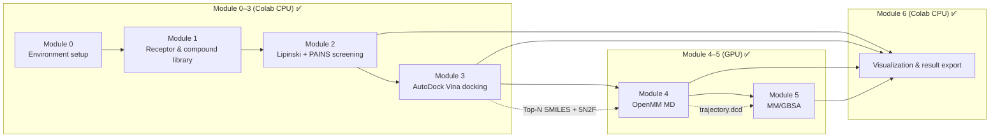
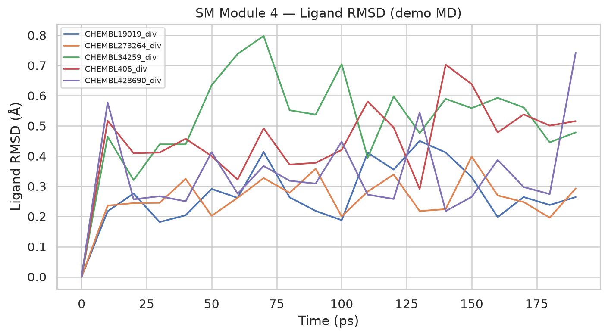
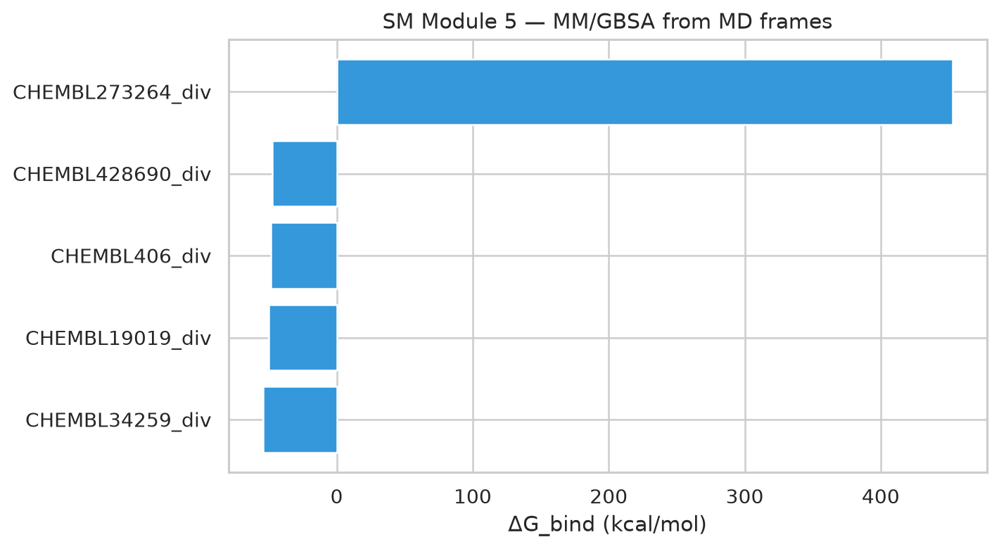
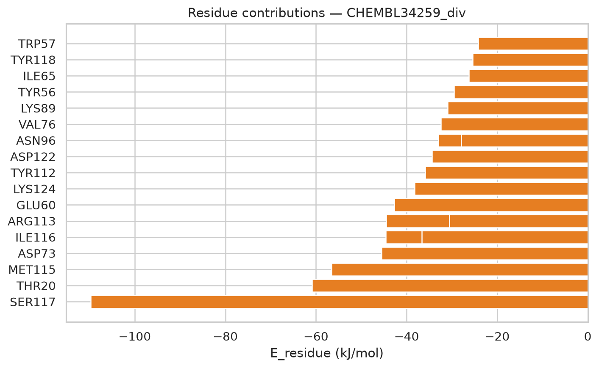
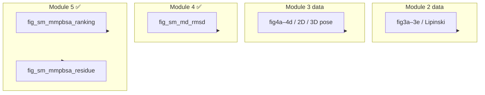

# OmniScreen Small-Molecule Screening Workflow (SM)

> **Notebook**: [`notebooks/OmniScreen_SM_Workflow.ipynb`](../../notebooks/OmniScreen_SM_Workflow.ipynb)  
> **Target**: PD-L1 (CD274)  
> **Current progress**: Module 0–6 ✅ (Module 4–5 = OpenMM MD + MM/GBSA / CUDA)

---

## Table of Contents

1. [Overview](#1-overview)
2. [Quick Start](#2-quick-start)
3. [Module Details](#3-module-details)
4. [Data Dictionary](#4-data-dictionary)
5. [Cross-Platform Handoff (Colab → RunPod)](#5-cross-platform-handoff-colab--runpod)
6. [FAQ](#6-faq)
7. [Glossary](#7-glossary)
8. [References](#8-references)

---

## 1. Overview

### 1.1 Scientific Background and Project Goals

**PD-L1** (Programmed Death-Ligand 1) is a key membrane protein in tumor immune checkpoints. Its binding to PD-1 on T cells can suppress anti-tumor immune responses. Small-molecule inhibitors targeting PD-L1 are an important direction in tumor immunotherapy.

The goal of the **OmniScreen SM pipeline** is to establish a reproducible **high-throughput virtual screening funnel** at the computational level, rapidly narrowing a large pool of candidate compounds and providing structured input for subsequent kinetic validation (MD) and free-energy calculations (MM/PBSA).

This pipeline does not replace wet-lab experiments. Instead, it provides:

- Quantifiable **initial screening rankings** (physicochemical properties + docking scores)
- Auditable **intermediate data** (CSV / structure files)
- Reusable **modular Notebook workflows**

### 1.2 Technical Pipeline Overview



**Screening logic (funnel)**:

| Stage | Eliminated | Retention criteria |
|------|----------|----------|
| Module 2 | Invalid SMILES, Lipinski violations, PAINS substructures, excessive rotatable bonds | `passed_filter == True` |
| Module 3 | Ligand prep failure, Vina run failure | `status == ok`, sorted by `vina_score` |
| Module 4 | Excessive ligand RMSD, system blow-up | Demo-segment ligand RMSD typically < 1 Å acceptable |
| Module 5 | No ΔG advantage / extreme energy outliers | More negative `dG_bind_kcalmol_mean` is better; exclude obvious outliers |

### 1.3 Technology Stack

| Category | Tool / Library | Purpose |
|------|-----------|------|
| Cheminformatics | RDKit | SMILES parsing, descriptors, PAINS filtering, 2D structure diagrams |
| Molecular docking | AutoDock Vina + Open Babel | Receptor/ligand PDBQT, rigid docking scores |
| Machine learning / dimensionality reduction | scikit-learn, t-SNE, UMAP | Chemical-space visualization (Module 6) |
| Structure visualization | py3Dmol, matplotlib, seaborn | 3D poses, statistical plots |
| Dynamics | OpenMM + OpenFF + mdtraj | Explicit-solvent MD, RMSD |
| Free energy | OpenMM MM/GBSA (Amber14 + GBn2) | Trajectory-frame-averaged ΔG + per-residue VDW/ELE |
| Runtime environment | Google Colab (CPU), Vast/RunPod GPU | Tiered compute |
| Collaboration | GitHub + Cursor Agent sync | Cloud results written back to local |

### 1.4 Use Cases and Extension Directions

The methods and code in this workflow can be migrated to:

| Scenario | Replace | Keep modules |
|------|--------|----------|
| **Change target** | Receptor PDB (e.g., EGFR, KRAS) | Module 0–2 logic unchanged; Module 3 redefines docking box |
| **Change compound library** | `initial_compounds.smi` or ChEMBL/ZINC subset | Module 2–3 full pipeline |
| **Lead optimization** | Substituent enumeration on a single scaffold | Module 2 descriptor monitoring + Module 3 re-docking |
| **Fragment screening (FBDD)** | Smaller library, stricter MW threshold | Module 2 parameters tightened |
| **Rapid drug-likeness assessment** | Run Module 2 only | No docking compute required |

### 1.5 Current Limitations and Assumptions

- **Docking score ≠ biological activity**: Vina score reflects only a static binding-affinity estimate; MD / experimental validation is required.
- **Rigid receptor approximation**: Current Vina docking does not account for protein flexibility; the MD stage partially compensates.
- **False negatives**: Ligand prep failure, rigid docking, and Top-N truncation can eliminate potentially good molecules; see [README — Limitations and false negatives](../../README.md#limitations--false-negatives).
- **Test library size**: The current production library has approximately **2,300+** ChEMBL compounds (including 5 seed references); Module 3 docks Top **250**; limits can be adjusted via `SM_CONFIG`.
- **Docking box**: Defined by the geometric center of co-crystal ligand **8HW**; changing target or allosteric site requires recalibration.
- **Module 4 is a demo short trajectory**: Current production segment is **200 ps** (25 ps NVT/NPT each), for pipeline validation; **not production-grade 50 ns MD**. When the repository lacks docking-pose `pdbqt` files, the ligand is placed at the 8HW pocket center before solvation.
- **Module 5 MM/GBSA is implicit-solvent estimation**: Sampled MD frames use `E(complex)−E(receptor)−E(ligand)`; per-residue breakdown is paired VDW+ELE, **not experimental Kd**. `CHEMBL273264_div` shows a very large positive ΔG and should be treated as an outlier, not a candidate.

---

## 2. Quick Start

### 2.1 Environment Requirements

| Environment | Description |
|------|------|
| **Colab (recommended)** | Cursor connected to Colab kernel, or open notebook at colab.research.google.com |
| **Local** | Python 3.10+, RDKit; Module 3 requires system `vina` and `obabel` |
| **Optional** | [Notebook MCP](https://marketplace.visualstudio.com/items?itemName=olavovieiradecarvalho.notebook-mcp-server) for Agent auto-execution of cells |

### 2.2 Recommended Run Order (Module 0–6)

```
Module 0  →  Install dependencies cell  →  (optional) GitHub Token cell
    ↓
Module 1  →  Download 5N2F.pdb + build compound library from ChEMBL
    ↓
Module 2  →  Generate chemical_space_props.csv
    ↓
Module 3  →  Generate docking_scores.csv (longest step; Top-250 docking ~ 1–3 h)
    ↓
Module 4  →  OpenMM explicit-solvent MD (Top-5 demo, CUDA, ~ 3–5 min / ligand)
    ↓
Module 5  →  MM/GBSA → mmpbsa_results.csv + energy plots (CUDA, ~ 1 min / ligand)
    ↓
Module 6  →  Generate all PNGs under figures/ (including fig_sm_md_* / fig_sm_mmpbsa_*)
```

> **Note**: Module 4–5 require a CUDA-capable OpenMM environment (e.g., `omniscreen-md` / A100). Scripts: `scripts/sm_module4_md.py`, `scripts/sm_module5_mmpbsa.py`.

### 2.3 Output Directory

```
data/
├── receptor/5N2F.pdb                 # Module 1
├── raw_libraries/initial_compounds.smi
└── screened_results/
    ├── chemical_space_props.csv      # Module 2
    ├── docking_scores.csv            # Module 3
    ├── docking/*.pdbqt               # Module 3 docking poses (optional)
    ├── top10_ligands.sdf             # Module 4
    ├── md_rmsd.csv                   # Module 4
    ├── md/<mol_id>/trajectory.dcd    # Module 4 (not in Git)
    ├── mmpbsa_results.csv            # Module 5
    ├── mmpbsa_residue_decomposition.csv
    └── figures/                      # Module 6 (fig3*/fig4*/fig_sm_*)
```

See [`data/screened_results/README.md`](../../data/screened_results/README.md) for details.

---

## 3. Module Details

> Each module follows a uniform structure: **Purpose → Dependencies → Input → Method → Output → Acceptance criteria → Compute → Migration scenarios → Result interpretation (with figures)**

---

### Module 0 — Environment Setup and Path Initialization

**Purpose**: Unify project root `PATHS` and initialize Colab ↔ GitHub ↔ local sync.

**Prerequisites**: None.

**Input**: GitHub repository `OmniScreen-AI` (auto-cloned on Colab).

**Method**:
- Detect Colab / local environment, set `PROJECT_ROOT`
- Define `PATHS = {receptor, raw, results}`
- Provide `persist_to_github()` and `export_for_local_sync()` for data persistence

**Output**: In-memory variables `PATHS`, `PROJECT_ROOT` (no files).

**Compute**: Colab CPU, < 1 minute.

**Migration scenarios**: Any project needing Colab cloud compute + local Cursor collaboration can copy the Module 0 `setup_project()` template.

> Module 0 is infrastructure; scientific content begins at Module 1.

---

### Module 1 — Data Preparation: Receptor Structure & Compound Library

**Purpose**: Obtain PD-L1 crystal structure as docking receptor and load the small-molecule screening library.

**Prerequisites**: Module 0.

| Type | Path | Description |
|------|------|------|
| **Input (auto-download)** | — | PDB `5N2F` (PD-L1 / BMS-202 co-crystal, ligand 8HW included) |
| **Input (library file)** | `data/raw_libraries/initial_compounds.smi` | `SMILES  MOL_ID`, space-separated |
| **Output** | `data/receptor/5N2F.pdb` | Receptor structure |
| **Output** | `data/raw_libraries/initial_compounds.smi` | ChEMBL PD-L1 actives + diverse drugs + 5 seed references |

**Method**:
- Download `5N2F.pdb` from RCSB
- Pull PD-L1 target actives via ChEMBL API + diverse drugs, merge 5 seed references, write to `initial_compounds.smi`

**Key parameters**:

| Parameter | Value | Description |
|------|-----|------|
| `RECEPTOR_PDB` | `5N2F` | PD-L1 co-crystal structure, Resolution 2.60 Å |
| `chembl_target_id` | `CHEMBL3580522` | PD-L1 (CD274) target |
| `chembl_max_unique` | 2500 | ChEMBL active compound deduplication cap |
| `chembl_diversity_limit` | 800 | Supplemental diverse-drug cap |
| Seed references | MOL_001–005 | 5 reference molecules including acetaminophen, caffeine (forced retention) |

**Compute**: Colab CPU, < 2 minutes.

**Migration scenarios**:
- Change target: modify `RECEPTOR_PDB` and `SM_CONFIG["chembl_target_id"]`
- Change library: adjust `chembl_max_unique` / `chembl_diversity_limit`, or replace `initial_compounds.smi` directly

---

### Module 2 — Rapid AI Pre-Screen: Lipinski + PAINS Filtering

**Purpose**: Before docking, quickly eliminate molecules that clearly fail oral drug-likeness rules or contain PAINS alert substructures, reducing wasted compute.

**Prerequisites**: Module 0, Module 1.

**Input**: `data/raw_libraries/initial_compounds.smi`

**Method**:

| Step | Tool | Description |
|------|------|------|
| SMILES parsing | RDKit `MolFromSmiles` | Mark `is_valid` |
| Descriptor calculation | RDKit Descriptors | MW, LogP, HBD, HBA, RTB, TPSA |
| Lipinski Rule of Five | Custom thresholds | See table below |
| PAINS filtering | RDKit FilterCatalog | Pan-assay interference compound substructures |
| Rotatable bonds | `NumRotatableBonds` | RTB ≤ 10 |

**Key parameters (`FilterConfig`)**:

| Rule | Threshold |
|------|------|
| MW | ≤ 500 Da |
| LogP | ≤ 5 |
| HBD (hydrogen-bond donors) | ≤ 5 |
| HBA (hydrogen-bond acceptors) | ≤ 10 |
| Rotatable bonds RTB | ≤ 10 |
| PAINS | Must not match |

**Output**: `data/screened_results/chemical_space_props.csv`

**Acceptance criteria**: `passed_filter = True` if and only if: valid SMILES + Lipinski pass + no PAINS + RTB ≤ 10.

**Current run results**: **864** of 2,377 compounds passed pre-screening (~36%); main failure reasons include Lipinski violations, PAINS hits, and excessive RTB.

**Compute**: Colab CPU, < 1 minute.

**Migration scenarios**:
- **Stricter drug-likeness**: Tighten MW / LogP (e.g., MW ≤ 400)
- **BBB penetration screening**: Add TPSA ≤ 90 rule
- **Lead-like screening**: MW 200–350, LogP ≤ 3

#### Result Interpretation (Module 2 Visualization)

##### Figure 3a — Chemical Space Scatter (LogP vs MW)


| Item | Description |
|------|------|
| **Plot meaning** | X-axis LogP (lipophilicity), Y-axis MW (molecular weight); color distinguishes pass/fail |
| **How to read** | Ideal oral drugs typically fall in MW 150–500, LogP 0–5 (Lipinski box) |
| **Conclusion from this data** | ChEMBL library shows continuous distribution on LogP–MW plane; green pass points dominate the drug-like region (MW 150–500, LogP 0–5); some high-MW / high-LogP compounds filtered |
| **Meaning & limitations** | Passing filter ≠ activity; only indicates basic drug-likeness features |

##### Figure 3b — Scaffold Physicochemical Property Radar Chart


| Item | Description |
|------|------|
| **Plot meaning** | Normalized radar chart of MW / LogP / TPSA / HBD / HBA for Top-8 scaffolds |
| **How to read** | Larger area means more "filled-out" physicochemical properties; scaffold shape differences reflect structural diversity |
| **Conclusion from this data** | Top scaffolds differ clearly on TPSA, HBA, etc., reflecting ChEMBL library structural diversity |
| **Meaning & limitations** | Radar chart for scaffold-level comparison; does not reflect docking activity |

##### Figure 3c — Descriptor Distribution (Violin Plot)


| Item | Description |
|------|------|
| **Plot meaning** | Distribution of 6 descriptors across 2,377 compounds |
| **How to read** | Distribution width reflects library diversity; narrow distribution suggests insufficient diversity |
| **Conclusion from this data** | MW / LogP show continuous rather than discrete clusters, consistent with a real diverse compound library |
| **Meaning & limitations** | Real screening should use deduplicated scaffolds or large-scale diversity libraries |

##### Figure 3d — Descriptor Correlation Heatmap


| Item | Description |
|------|------|
| **Plot meaning** | Pearson correlation matrix; red = positive, blue = negative |
| **How to read** | Strongly correlated descriptors (|r| > 0.7) carry redundant information |
| **Conclusion from this data** | Correlations reflect full-library structural diversity; MW and LogP show moderate positive correlation |
| **Meaning & limitations** | Used in library design to identify descriptor redundancy and guide ML feature selection |

##### Figure 3e — Screening Funnel


| Item | Description |
|------|------|
| **Plot meaning** | Three-stage molecule counts: compound library → passed filter → docking success |
| **How to read** | Funnel narrowing reflects screening stringency |
| **Conclusion from this data** | 2,377 → 864 → 244 (244 of Top-250 docking succeeded); funnel narrows significantly at Module 2 |
| **Meaning & limitations** | Funnel shape is a pipeline health indicator, not an activity metric |

##### Lipinski Violation Statistics & Heatmap


| Item | Description |
|------|------|
| **Plot meaning** | Left: violation count per Lipinski rule; right: per-scaffold violation heatmap (green=pass, red=violation) |
| **Conclusion from this data** | Most compounds pass Lipinski; violations concentrated at MW / LogP boundary cases |
| **Meaning & limitations** | Lipinski rules are necessary but not sufficient; Violation 0 does not mean druggable |

---

### Module 3 — High-Throughput Molecular Docking (AutoDock Vina)

**Purpose**: For molecules passing pre-screening, perform rigid docking in the PD-L1 binding pocket to obtain binding-affinity estimate scores for ranking and prioritization.

**Prerequisites**: Module 0–2 (requires `df_props` and `5N2F.pdb`).

**Input**:

| File | Description |
|------|------|
| `data/receptor/5N2F.pdb` | Receptor structure |
| `chemical_space_props.csv` | Molecules with `passed_filter == True` |

**Method**:

```text
5N2F.pdb  →  Open Babel (-xr)  →  receptor.pdbqt
SMILES    →  RDKit 3D conformer + MMFF  →  Open Babel  →  ligand.pdbqt
ligand + receptor  →  AutoDock Vina  →  vina_score + out.pdbqt
```

**Key parameters**:

| Parameter | Value | Description |
|------|-----|------|
| Docking box center | 8HW ligand geometric center | Auto-parsed from PDB HETATM records |
| Box size | 22 × 22 × 22 Å | Covers PD-L1 binding groove |
| `MAX_DOCK` | 250 | Dock Top-N after pre-screen sort (required for libraries of thousands) |
| Vina CPU | 2 cores | Colab default |
| Conformer generation | ETKDG + MMFF | RDKit 3D embedding and optimization |

**Output**:

| File | Description |
|------|------|
| `docking_scores.csv` | Per-docking mol_id, smiles, vina_score, status |
| `docking/{mol_id}_{i}_out.pdbqt` | Docking poses (multi-model) |
| `docking/5N2F_receptor.pdbqt` | Preprocessed receptor (cached) |

**Acceptance criteria**:
- `status == ok`: Vina successfully returned a score
- Ranking: **lower (more negative) vina_score is better** (more favorable binding)

**Current run results (Top 5)**:

| Compound | Vina (kcal/mol) | Notes |
|--------|-----------------|------|
| **CHEMBL19019_div** | **-7.43** | Top 1 |
| CHEMBL428690_div | -6.86 | |
| CHEMBL273264_div | -6.33 | |
| CHEMBL34259_div | -5.85 | |
| CHEMBL406_div | -5.84 | |

**244 / 250** dockings succeeded (`status == ok`).

**Compute**: Colab CPU, Top-250 docking ~ **1–3 hours** (depends on Colab load).

**Migration scenarios**:
- **Covalent docking**: Switch to SMINA / GNINA, define covalent residue
- **Large-scale virtual screening**: Parallelize Vina (multiple instances / RunPod)
- **Induced fit**: Relax with MD after docking (Module 4)

#### Result Interpretation (Module 3 Visualization)

##### Figure 4a — Vina Score Distribution


| Item | Description |
|------|------|
| **Plot meaning** | Histogram / KDE of vina_score for Top-250 dockings |
| **How to read** | Left-skewed (more negative) distribution indicates better overall binding tendency |
| **Conclusion from this data** | Distribution peak ~ -4 ~ -6 kcal/mol; best **CHEMBL19019_div (-7.43 kcal/mol)** |
| **Meaning & limitations** | Absolute scores depend on box definition and conformer sampling; use for relative ranking, not absolute activity |

##### Figure 4b — Scaffold Best-Score Ranking


| Item | Description |
|------|------|
| **Plot meaning** | Horizontal bar chart ranking Top-20 compounds by best vina_score |
| **Conclusion from this data** | **CHEMBL19019_div ranks #1 (-7.43 kcal/mol)**; recommended as Module 4 MD priority candidate |
| **Meaning & limitations** | Ranking reflects static docking, not selectivity or kinetic stability |

##### Figure 4c — Vina Score vs Molecular Weight


| Item | Description |
|------|------|
| **Plot meaning** | Scatter of docking score vs MW; check for "large-molecule inflated score" trend |
| **How to read** | High MW with high score warrants caution; ideal candidates in drug-like MW range with top scores |
| **Conclusion from this data** | Top candidates distributed in MW 300–500 Da; no single MW cluster dominating high scores |
| **Meaning & limitations** | Combine with LogP / TPSA and 3D pose for holistic judgment |

##### Figure 4d — Vina Score vs Physicochemical Properties


| Item | Description |
|------|------|
| **Plot meaning** | Scatter of best vina_score vs LogP / MW / TPSA |
| **Conclusion from this data** | Top candidates have reasonable LogP / MW distribution; CHEMBL19019_div combines good score with moderate properties |
| **Meaning & limitations** | 3-point sample too small for reliable QSAR; expand library for correlation analysis |

> **3D Binding Pose**: See Module 6 [Figure — 3D Binding Pose](#figure--3d-binding-pose) for Top-1 ligand structure in pocket (`fig_3d_binding_pose.png` / `.html`).

---

### Module 4 — OpenMM Molecular Dynamics

**Purpose**: Run explicit-solvent short MD on Vina Top ligands in the PD-L1 (5N2F) binding pocket to assess ligand stability relative to initial pose (RMSD) and provide trajectories for Module 5.

**Prerequisites**: Module 3 (`docking_scores.csv`); `data/receptor/5N2F.pdb`; CUDA-capable OpenMM + OpenFF environment.

**Input**:

| File | Description |
|------|------|
| `docking_scores.csv` | Top-N by `vina_score` (default 5) |
| `data/receptor/5N2F.pdb` | Receptor; pocket center from co-crystal ligand **8HW** COM |

**Method**:

```text
Top-N SMILES
  → RDKit ETKDG + MMFF 3D generation, translate to 8HW pocket center
  → PDBFixer protein prep + OpenFF (Gasteiger charges) ligand parameterization
  → Amber14 / tip3p explicit solvent (padding 1.0 nm, 0.15 M ions)
  → Minimization → NVT → NPT → production MD (CUDA)
  → mdtraj ligand heavy-atom RMSD → CSV + curve plot
```

Script entry: [`scripts/sm_module4_md.py`](../../scripts/sm_module4_md.py). Notebook Module 4 cell invokes this script; skips by default when `md_rmsd.csv` exists (`FORCE_RERUN=1` to force rerun).

**Key parameters**:

| Parameter | Default | Description |
|------|--------|------|
| `--top-n` | 5 | Number of Vina Top ligands for MD |
| `--nvt-ps` / `--npt-ps` | 25 / 25 | Equilibration segments (ps) |
| `--prod-ps` | 200 | **Demo** production segment; production can use 10000–50000 |
| `--report-ps` | 10 | Trajectory / RMSD sampling interval |
| Force field | Amber14 + tip3p + OpenFF-2.1.0 | Protein / water / ligand |
| Platform | CUDA (`Precision=mixed`) | A100, etc. |

**Output**:

| File | Description |
|------|------|
| `top10_ligands.sdf` | Top-10 ligand 3D (for handoff) |
| `md_rmsd.csv` | Per-ligand RMSD summary |
| `md_rmsd_timeseries.csv` | Per-frame RMSD |
| `md/<mol_id>/trajectory.dcd` | Trajectory (**gitignore, not in Git**) |
| `md/<mol_id>/topology.pdb` / `complex_min.pdb` | Topology and minimized structure |
| `md/<mol_id>/md_meta.json` | Atom indices and run metadata |
| `figures/fig_sm_md_rmsd.png` | Ligand RMSD curves |

**Acceptance criteria**:
- Production-segment ligand RMSD typically **< 1 Å** considered relatively stable at demo scale
- System energy blow-up / failed minimization → exclude ligand

**Current run results (Top-5 demo, A100 CUDA)**:

| Compound | Vina | RMSD mean (Å) | RMSD final (Å) |
|--------|------|---------------|----------------|
| **CHEMBL19019_div** | **−7.43** | **0.27** | 0.26 |
| CHEMBL428690_div | −6.86 | 0.34 | 0.74 |
| CHEMBL273264_div | −6.33 | 0.26 | 0.29 |
| CHEMBL34259_div | −5.85 | 0.52 | 0.48 |
| CHEMBL406_div | −5.84 | 0.45 | 0.52 |

**Compute**: CUDA GPU (A100 recommended), ~ **3–5 minutes / ligand** (including parameterization and 250 ps total simulation); Top-5 ~ **15–25 minutes**.

**Migration scenarios**:
- **Longer trajectories**: Increase `--prod-ps` to 10–50 ns
- **Use real docking poses**: When `docking/*_out.pdbqt` available, build complex from pose
- **Change target**: Replace receptor PDB and pocket center definition

#### Result Interpretation (Module 4 Visualization)

##### Figure SM-MD — Ligand RMSD Curves



| Item | Description |
|------|------|
| **Plot meaning** | Production-segment heavy-atom RMSD per ligand (relative to frame 1) over time |
| **How to read** | Flat curves < 1 Å indicate pose did not drift significantly at demo scale |
| **Conclusion from this data** | Top-5 mean RMSD all < 0.6 Å; **CHEMBL19019_div** most stable (~0.27 Å) |
| **Meaning & limitations** | 200 ps insufficient to prove nanosecond-scale binding; pocket-center placement ≠ optimal docking pose |

---

### Module 5 — MM/GBSA Binding Free Energy

**Purpose**: From Module 4 trajectory sampled frames, use OpenMM MM/GBSA to estimate ΔG_bind and decompose receptor residue VDW/ELE contributions, providing relative ranking closer to thermodynamic meaning than Vina.

**Prerequisites**: Module 4 (`md_rmsd.csv` + `md/<mol_id>/trajectory.dcd`); CUDA OpenMM.

**Input**:

| File | Description |
|------|------|
| `md_rmsd.csv` | Ligand list for analysis |
| `md/<mol_id>/trajectory.dcd` + `topology.pdb` | Explicit-solvent trajectory |
| `md/<mol_id>/md_meta.json` | Protein/ligand atom indices and SMILES |

**Method**:

```text
MD trajectory sampled frames (default 5 frames)
  → Extract protein + ligand coordinates (strip solvent)
  → Amber14 + GBn2 + OpenFF rebuild dry complex
  → ΔG ≈ E(complex) − E(receptor) − E(ligand)
  → Frame average / std; last-frame per-residue paired VDW+ELE decomposition
  → CSV + ranking plot / residue contribution plot
```

Script entry: [`scripts/sm_module5_mmpbsa.py`](../../scripts/sm_module5_mmpbsa.py). Skips by default when `mmpbsa_results.csv` exists (`FORCE_RERUN=1` to rerun).

**Key parameters**:

| Parameter | Default | Description |
|------|--------|------|
| `--n-frames` | 5 | Uniformly sampled frame count |
| Force field | `amber14-all.xml` + `implicit/gbn2.xml` + OpenFF-2.1.0 | Implicit-solvent GBSA |
| Nonbonded | `NoCutoff` | Required for implicit solvent |
| Residue decomposition | Paired Coulomb + LJ (≤1.2 nm) | Receptor residues vs ligand |

**Output**:

| File | Description |
|------|------|
| `mmpbsa_results.csv` | Per-ligand mean ΔG ± std + Vina / RMSD |
| `mmpbsa_frame_energies.csv` | Per-frame energies |
| `mmpbsa_residue_decomposition.csv` | Receptor residue VDW/ELE |
| `figures/fig_sm_mmpbsa_ranking.png` | ΔG ranking |
| `figures/fig_sm_mmpbsa_residue.png` | Top ligand residue contributions |

**Acceptance criteria**:
- **More negative `dG_bind_kcalmol_mean` is better**
- Clearly positive / extreme outliers (e.g., hundreds of kcal/mol) → mark abnormal, exclude from candidates
- Recommend joint reading with Module 3 Vina and Module 4 RMSD

**Current run results (5 ligands × 5 frames, A100)**:

| Rank | Compound | ΔG mean ± std (kcal/mol) | Vina | RMSD mean |
|------|--------|--------------------------|------|-----------|
| 1 | **CHEMBL34259_div** | **−54.2 ± 1.1** | −5.85 | 0.52 |
| 2 | CHEMBL19019_div | −49.9 ± 1.7 | −7.43 | 0.27 |
| 3 | CHEMBL406_div | −48.4 ± 2.5 | −5.84 | 0.45 |
| 4 | CHEMBL428690_div | −47.2 ± 1.6 | −6.86 | 0.34 |
| 5 | CHEMBL273264_div | **+452 ± 13 (outlier)** | −6.33 | 0.26 |

**Compute**: CUDA GPU, ~ **~1 minute / ligand**; Top-5 ~ **5–8 minutes**.

**Migration scenarios**:
- **More frames / longer trajectories**: Increase `--n-frames` or extend Module 4 first
- **Change force field / charges**: OpenFF version or AM1-BCC (more accurate but slower)
- **Consensus screening with Vina**: Take intersection of Vina Top ∩ MM/GBSA Top

#### Result Interpretation (Module 5 Visualization)

##### Figure SM-GBSA — MM/GBSA ΔG Ranking



| Item | Description |
|------|------|
| **Plot meaning** | Mean ΔG per ligand (error bars = inter-frame std); more negative is better |
| **How to read** | May disagree with Vina ranking; very large positive values often indicate numerical/pose anomalies |
| **Conclusion from this data** | **CHEMBL34259_div (−54.2)** best energy; CHEMBL19019_div (Vina Top1) ranks #2; CHEMBL273264 is outlier |
| **Meaning & limitations** | Relative ranking under demo pocket placement + short trajectory; not directly experimental affinity |

##### Figure SM-GBSA — Residue Energy Decomposition



| Item | Description |
|------|------|
| **Plot meaning** | VDW+ELE contribution (kcal/mol) of Top ligand (best energy) to receptor residues |
| **How to read** | More negative = stronger attraction between residue and ligand; used for hotspot residue hypotheses |
| **Conclusion from this data** | Shows pocket contact residue contribution spectrum for top-ranked ligand |
| **Meaning & limitations** | Does not include full GB apportionment; qualitative hotspot hint only |

---

### Module 6 — Visualization and Result Export

**Purpose**: Aggregate Module 2–5 data into publication-quality figures; support local sync and GitHub backup.

**Prerequisites**: Module 6.0 requires loading `chemical_space_props.csv` and `docking_scores.csv`; Module 4–5 figures written directly by scripts; Module 6 centralizes archiving and display.

**Output directory**: `data/screened_results/figures/`

**Figure overview**:



**Figure numbers and data provenance**:

| Figure | Filename | Data source |
|------|--------|----------|
| 3a–3e, Lipinski | `fig3a_*` … `fig3e_*`, `fig_lipinski_*` | Module 2 → see [Module 2](#module-2--rapid-ai-pre-screen-lipinski--pains-filtering) |
| 4a–4d | `fig4a_*` … `fig4d_*` | Module 3 → see [Module 3](#module-3--high-throughput-molecular-docking-autodock-vina) |
| Extended | `fig_ext_chem_tsne_umap.png` | Module 2+3 combined |
| Structures | `fig_top5_*`, `fig_ligand_grid_2d.png` | Module 3 Top 5 |
| 3D Binding Pose | `fig_3d_binding_pose.*` | Module 3 Top-1 / Module 4 complex → see [Figure — 3D Binding Pose](#figure--3d-binding-pose) below |
| Pocket schematic | `fig_binding_pocket_schematic.png` | Module 1+3 |
| SM-MD | `fig_sm_md_rmsd.png` | Module 4 → see [Module 4](#result-interpretation-module-4-visualization) |
| SM-GBSA | `fig_sm_mmpbsa_*.png` | Module 5 → see [Module 5](#result-interpretation-module-5-visualization) |

#### Result Interpretation (Module 6 Combined Visualization)

##### Chemical Space t-SNE / UMAP


| Item | Description |
|------|------|
| **Plot meaning** | Left: Morgan fingerprint t-SNE; right: UMAP or PCA reduction; color = best Vina score |
| **How to read** | Structurally similar molecules should cluster; color gradient reflects activity trend |
| **Conclusion from this data** | ChEMBL compounds form multiple clusters in fingerprint space; score color gradient shows activity trends correlate among similar structures |
| **Meaning & limitations** | Sampled subset for visualization; full-library reduction needs more compute |

##### Top 5 Ligand 2D Structures


| Item | Description |
|------|------|
| **Plot meaning** | 2D structures of Top 5 docking-scored molecules, annotated with vina_score |
| **Conclusion from this data** | Top 5 are distinct ChEMBL compounds with good structural diversity; best **CHEMBL19019_div (-7.43 kcal/mol)** |
| **Meaning & limitations** | Docking scores need validation with 3D pose and MD / MM-GBSA |

##### Ligand Structure Grid


| Item | Description |
|------|------|
| **Plot meaning** | 2D structures of representative scaffolds / compounds + each best Vina score |
| **Conclusion from this data** | Shows structural differences and score comparison among Top candidates |

##### Binding Pocket Schematic


| Item | Description |
|------|------|
| **Plot meaning** | Receptor Cα projection + co-crystal ligand 8HW position, marking docking search space |
| **Meaning** | Docking box center aligned to 8HW, ensuring search of PD-L1 native binding groove |

##### Figure — 3D Binding Pose


| Item | Description |
|------|------|
| **Plot meaning** | Top-1 Vina ligand **CHEMBL19019_div** (orange, sticks) binding pose in PD-L1 (blue cartoon) pocket; rendered from Module 4 minimized complex `md/CHEMBL19019_div/complex_min.pdb` |
| **Interactive version** | Open [`fig_3d_binding_pose.html`](../../data/screened_results/figures/fig_3d_binding_pose.html) in browser to rotate and zoom |
| **Meaning & limitations** | Demonstrates pipeline pose (pocket-center placement + short MD minimization); when repository lacks docking `pdbqt`, not full Vina output pose. Dynamics see Module 4 RMSD; free energy see Module 5 |

---

## 4. Data Dictionary

### 4.1 `chemical_space_props.csv` (Module 2)

| Column | Type | Description |
|------|------|------|
| `mol_id` | str | Molecule identifier, e.g. `CHEMBL19019_div` or seed `MOL_001` |
| `smiles` | str | SMILES string |
| `mw` | float | Molecular weight (Da) |
| `logp` | float | Octanol-water partition coefficient estimate |
| `hbd` | int | Hydrogen-bond donor count |
| `hba` | int | Hydrogen-bond acceptor count |
| `rtb` | int | Rotatable bond count |
| `tpsa` | float | Topological polar surface area (Ų) |
| `has_pains` | bool | Whether PAINS substructure matched |
| `passed_lipinski` | bool | Whether Lipinski Rule of Five passed |
| `is_valid` | bool | Whether SMILES is parseable |
| `passed_filter` | bool | Whether combined filter passed |

### 4.2 `docking_scores.csv` (Module 3)

| Column | Type | Description |
|------|------|------|
| `mol_id` | str | Molecule identifier |
| `smiles` | str | SMILES |
| `vina_score` | float | AutoDock Vina docking score (kcal/mol), **lower is better** |
| `status` | str | `ok` / `ligand_prep_failed` / `vina_failed` |

### 4.3 `md_rmsd.csv` (Module 4)

| Column | Type | Description |
|------|------|------|
| `mol_id` | str | Molecule identifier |
| `smiles` | str | SMILES |
| `vina_score` | float | Module 3 docking score |
| `n_atoms_solvated` | int | Solvated system atom count |
| `n_protein_atoms` / `n_ligand_atoms` | int | Dry protein / ligand atom count |
| `nvt_ps` / `npt_ps` / `prod_ps` | float | Duration per stage (ps) |
| `ligand_rmsd_mean_A` | float | Production-segment mean RMSD (Å) |
| `ligand_rmsd_final_A` | float | Final-frame RMSD (Å) |
| `trajectory` / `topology` | str | Relative paths |

### 4.4 `mmpbsa_results.csv` (Module 5)

| Column | Type | Description |
|------|------|------|
| `mol_id` | str | Molecule identifier |
| `vina_score` | float | Module 3 docking score |
| `ligand_rmsd_mean_A` | float | Module 4 mean RMSD |
| `n_frames` | int | GBSA sampled frame count |
| `dG_bind_kcalmol_mean` | float | Mean ΔG (kcal/mol), **more negative is better** |
| `dG_bind_kcalmol_std` | float | Inter-frame standard deviation |
| `dG_bind_kJmol_mean` | float | Mean ΔG (kJ/mol) |

### 4.5 Figure File Naming Convention

| Prefix | Meaning |
|------|------|
| `fig3a`–`fig3e` | Chemical pre-screening (Module 2 data) |
| `fig4a`–`fig4d` | Molecular docking (Module 3 data) |
| `fig_lipinski_*` | Lipinski analysis |
| `fig_ext_*` | Extended analysis figures |
| `fig_top5_*`, `fig_ligand_*` | Structure figures |
| `fig_3d_*`, `fig_binding_*` | 3D / pocket figures |
| `fig_sm_md_*` | Module 4 MD RMSD |
| `fig_sm_mmpbsa_*` | Module 5 MM/GBSA |

---

## 5. Cross-Platform Handoff (Colab → RunPod)

```text
Colab Module 0–3 complete
    ↓ export_for_local_sync() or git push
Local data/ or GitHub
    ↓ git clone / pull
GPU instance (Vast / RunPod)
    ↓ Run Module 4–5 (omniscreen-md)
MD trajectories & MM/GBSA results → git push (exclude *.dcd)
```

**Handoff file checklist** (Module 3 → 4):

| File | Required |
|------|------|
| `data/receptor/5N2F.pdb` | ✅ |
| `data/screened_results/docking_scores.csv` | ✅ |
| `data/screened_results/docking/*_out.pdbqt` | Optional (use real pose if available; otherwise pocket-center placement) |
| `top10_ligands.sdf` | Auto-generated by Module 4 |

**Handoff file checklist** (Module 4 → 5):

| File | Required |
|------|------|
| `md_rmsd.csv` | ✅ |
| `md/<mol_id>/trajectory.dcd` + `topology.pdb` | ✅ |
| `md/<mol_id>/md_meta.json` | ✅ |

---

## 6. FAQ

| Issue | Cause | Solution |
|------|------|------|
| `df_props_uni` undefined | Skipped Module 6.0 | Run Module 6.0 first (requires Module 2–3 data) |
| `docking_scores.csv` missing | Module 3 not run | Complete Module 3 or inject test data |
| UMAP right panel blank | `umap-learn` not installed | Rerun Module 6.0; or accept PCA fallback |
| Module 3 very slow | Top-N Vina serial docking | Normal; reduce `SM_CONFIG["max_dock"]` for quick test |
| Colab disconnect | Session timeout | Reconnect kernel, rerun Module 0 for PATHS |
| No Vina locally | System package not installed | Use Colab, or `brew install autodock-vina open-babel` |
| Module 4 CUDA PTX error | OpenMM CUDA build vs driver mismatch | Use conda OpenMM with `cuda-version=12` (see environment setup) |
| Module 5 ΔG very large positive | Pose clash / charge anomaly | Mark outlier; prioritize molecules with stable RMSD and reasonable ΔG |
| Want to rerun MD/GBSA | Existing CSV causes skip | Set `FORCE_RERUN=1` then rerun corresponding cell / script |

---

## 7. Glossary

| Term | Definition |
|------|------|
| **Vina score** | AutoDock Vina estimated binding free energy change (kcal/mol); more negative = stronger |
| **LogP** | Lipid-water partition coefficient; affects absorption and permeability |
| **TPSA** | Topological polar surface area; related to oral absorption |
| **PAINS** | Pan-Assay Interference Compounds; substructures prone to false positives |
| **Lipinski Rule of Five** | Oral drug-likeness empirical rules (MW, LogP, HBD, HBA) |
| **PDBQT** | AutoDock family atom-type + charge format |
| **RMSD** | Root-mean-square deviation; measures MD trajectory deviation from reference structure |
| **MM/PBSA / MM/GBSA** | Molecular mechanics + continuum solvent (PB or GB) binding free energy estimate |

---

## 8. References

- RDKit: https://www.rdkit.org/
- AutoDock Vina: Trott, O. & Olson, A. J. *J. Comput. Chem.* **31**, 455–461 (2010).
- Lipinski et al. *Adv. Drug Deliv. Rev.* **23**, 3–25 (1997).
- PAINS: Baell, J. B. & Holloway, G. A. *J. Med. Chem.* **53**, 2719–2740 (2010).
- PDB 5N2F: PD-L1 / BMS-202 complex (Zak et al., *PNAS* 2016).
- OpenMM: https://openmm.org/

---

*Document version: July 2026 · Corresponds to Notebook Modules 0–6 implemented (including GPU MD / MM-GBSA)*
