# OmniScreen 小分子筛选流程 (SM)

> **Notebook**：[`notebooks/OmniScreen_SM_Workflow.ipynb`](../../notebooks/OmniScreen_SM_Workflow.ipynb)  
> **靶点**：PD-L1 (CD274)  
> **当前进度**：Module 0–3 ✅ · Module 6 可视化 ✅ · Module 4–5 规划中

---

## 目录

1. [概述](#1-概述)
2. [快速开始](#2-快速开始)
3. [模块详解](#3-模块详解)
4. [数据字典](#4-数据字典)
5. [跨平台交接](#5-跨平台交接-colab--runpod)
6. [常见问题](#6-常见问题)
7. [术语表](#7-术语表)
8. [参考文献](#8-参考文献)

---

## 1. 概述

### 1.1 科学背景与项目目的

**PD-L1**（Programmed Death-Ligand 1）是肿瘤免疫检查点的关键膜蛋白，其与小 T 细胞表面 PD-1 结合可抑制抗肿瘤免疫应答。靶向 PD-L1 的小分子抑制剂是肿瘤免疫治疗的重要方向之一。

**OmniScreen SM 线路**的目标是：在计算层面建立一条可复现的 **高通量虚拟筛选漏斗**，从大量候选化合物中快速缩小范围，并为后续动力学验证（MD）与自由能计算（MM/PBSA）提供结构化输入。

本线路不替代湿实验，而是提供：

- 可量化的**初筛排序**（理化性质 + 对接打分）
- 可审计的**中间数据**（CSV / 结构文件）
- 可复用的**模块化 Notebook 流程**

### 1.2 技术路线总览

```mermaid
flowchart LR
    subgraph M0_3["Module 0–3（Colab CPU）✅"]
        M0[Module 0<br/>环境配置]
        M1[Module 1<br/>受体 & 化合物库]
        M2[Module 2<br/>Lipinski + PAINS 初筛]
        M3[Module 3<br/>AutoDock Vina 对接]
        M0 --> M1 --> M2 --> M3
    end

    subgraph M4_5["Module 4–5（RunPod GPU）🔜"]
        M4[Module 4<br/>OpenMM MD]
        M5[Module 5<br/>MM/PBSA]
        M3 --> M4 --> M5
    end

    subgraph M6["Module 6（Colab CPU）✅"]
        M6[可视化 & 结果导出]
        M2 --> M6
        M3 --> M6
    end

    M3 -.->|top10_ligands.sdf| M4
```

**筛选逻辑（漏斗）**：

| 阶段 | 淘汰对象 | 保留标准 |
|------|----------|----------|
| Module 2 | 无效 SMILES、Lipinski 违规、PAINS 子结构、可旋转键过多 | `passed_filter == True` |
| Module 3 | 配体准备失败、Vina 运行失败 | `status == ok`，按 `vina_score` 排序 |
| Module 4–5（规划） | 轨迹不稳定、结合自由能无优势 | RMSD / ΔG 阈值（待定义） |

### 1.3 技术栈一览

| 类别 | 工具 / 库 | 用途 |
|------|-----------|------|
| 化学信息学 | RDKit | SMILES 解析、描述符、PAINS 过滤、2D 结构图 |
| 分子对接 | AutoDock Vina + Open Babel | 受体/配体 PDBQT、刚性对接打分 |
| 机器学习 / 降维 | scikit-learn、t-SNE、UMAP | 化学空间可视化（Module 6） |
| 结构可视化 | py3Dmol、matplotlib、seaborn | 3D 姿态、统计图 |
| 动力学（规划） | OpenMM | MD 模拟 |
| 自由能（规划） | MM/PBSA | 结合亲和力估算 |
| 运行环境 | Google Colab（CPU）、RunPod（GPU） | 算力分层 |
| 协作 | GitHub + Cursor Agent 同步 | 云端结果写回本地 |

### 1.4 应用场景与可扩展方向

本流程的方法与代码可迁移至：

| 场景 | 替换项 | 保留模块 |
|------|--------|----------|
| **换靶点** | 受体 PDB（如 EGFR、KRAS）| Module 0–2 逻辑不变；Module 3 重定义对接盒子 |
| **换化合物库** | `initial_compounds.smi` 或 ChEMBL/ZINC 子集 | Module 2–3 全流程 |
| **先导化合物优化** | 对单一骨架做取代基枚举 | Module 2 描述符监控 + Module 3 重对接 |
| **片段筛选（FBDD）** | 更小分子库、更严格 MW 阈值 | Module 2 参数调严 |
| **类药性快速评估** | 仅跑 Module 2 | 无需对接算力 |

### 1.5 当前局限性与假设

- **对接分数 ≠ 生物活性**：Vina score 仅反映静态结合亲和力估算，需 MD / 实验验证。
- **受体刚性近似**：当前 Vina 对接未考虑蛋白柔性；MD 阶段将部分弥补。
- **漏检（false negative）**：配体准备失败、刚性对接与 Top-N 截断均可能淘汰潜在好分子；详见 [README — 方案局限与漏检](../../README.md#方案局限与漏检)。
- **测试库规模**：当前正式库约 **2,300+** 条 ChEMBL 化合物（含 5 个种子参照），Module 3 对接 Top **250**；可按 `SM_CONFIG` 调整上限。
- **对接盒子**：以共晶配体 **8HW** 几何中心定义，换靶点或变构位点需重新标定。

---

## 2. 快速开始

### 2.1 环境要求

| 环境 | 说明 |
|------|------|
| **Colab（推荐）** | Cursor 连接 Colab 内核，或 colab.research.google.com 打开 notebook |
| **本地** | Python 3.10+，RDKit；Module 3 需系统安装 `vina` 与 `obabel` |
| **可选** | [Notebook MCP](https://marketplace.visualstudio.com/items?itemName=olavovieiradecarvalho.notebook-mcp-server) 供 Agent 自动执行 cell |

### 2.2 推荐运行顺序（Module 0–3）

```
Module 0  →  安装依赖 cell  →  （可选）GitHub Token cell
    ↓
Module 1  →  下载 5N2F.pdb + 从 ChEMBL 构建化合物库
    ↓
Module 2  →  生成 chemical_space_props.csv
    ↓
Module 3  →  生成 docking_scores.csv（耗时最长，Top-250 对接约 1–3 h）
    ↓
Module 6  →  生成 figures/ 下全部 PNG
```

### 2.3 输出目录

```
data/
├── receptor/5N2F.pdb              # Module 1
├── raw_libraries/initial_compounds.smi
└── screened_results/
    ├── chemical_space_props.csv   # Module 2
    ├── docking_scores.csv         # Module 3
    ├── docking/*.pdbqt            # Module 3 对接姿态
    └── figures/*.png, fig_3d_binding_pose.html   # Module 6
```

详见 [`data/screened_results/README.md`](../../data/screened_results/README.md)。

---

## 3. 模块详解

> 每个模块采用统一结构：**目的 → 依赖 → 输入 → 方法 → 输出 → 判定标准 → 算力 → 可迁移场景 → 结果解读（含图）**

---

### Module 0 — 环境配置与路径初始化

**目的**：统一项目根目录 `PATHS`，初始化 Colab ↔ GitHub ↔ 本地同步机制。

**前置依赖**：无。

**输入**：GitHub 仓库 `OmniScreen-AI`（Colab 自动 clone）。

**方法**：
- 检测 Colab / 本地环境，设置 `PROJECT_ROOT`
- 定义 `PATHS = {receptor, raw, results}`
- 提供 `persist_to_github()` 与 `export_for_local_sync()` 用于数据持久化

**输出**：内存变量 `PATHS`、`PROJECT_ROOT`（无文件）。

**算力**：Colab CPU，< 1 分钟。

**可迁移场景**：任何需要 Colab 云端算力 + 本地 Cursor 协作的项目，可复制 Module 0 的 `setup_project()` 模板。

> Module 0 为基础设施模块，科学内容从 Module 1 开始。

---

### Module 1 — 数据准备：受体结构 & 化合物库

**目的**：获取 PD-L1 晶体结构作为对接受体，加载待筛选小分子库。

**前置依赖**：Module 0。

| 类型 | 路径 | 说明 |
|------|------|------|
| **输入（自动下载）** | — | PDB `5N2F`（PD-L1 / BMS-202 共晶，含配体 8HW） |
| **输入（库文件）** | `data/raw_libraries/initial_compounds.smi` | `SMILES  MOL_ID`，空格分隔 |
| **输出** | `data/receptor/5N2F.pdb` | 受体结构 |
| **输出** | `data/raw_libraries/initial_compounds.smi` | ChEMBL PD-L1 活性 + 多样性药物 + 5 个种子参照 |

**方法**：
- 从 RCSB 下载 `5N2F.pdb`
- 通过 ChEMBL API 拉取 PD-L1 靶点活性化合物 + 多样性药物，合并 5 个种子参照，写入 `initial_compounds.smi`

**关键参数**：

| 参数 | 值 | 说明 |
|------|-----|------|
| `RECEPTOR_PDB` | `5N2F` | PD-L1 共晶结构，Resolution 2.60 Å |
| `chembl_target_id` | `CHEMBL3580522` | PD-L1 (CD274) 靶点 |
| `chembl_max_unique` | 2500 | ChEMBL 活性化合物去重上限 |
| `chembl_diversity_limit` | 800 | 补充多样性药物上限 |
| 种子参照 | MOL_001–005 | 对乙酰氨基酚、咖啡因等 5 个参照分子（强制保留） |

**算力**：Colab CPU，< 2 分钟。

**可迁移场景**：
- 换靶点：修改 `RECEPTOR_PDB` 与 `SM_CONFIG["chembl_target_id"]`
- 换库：调整 `chembl_max_unique` / `chembl_diversity_limit`，或直接替换 `initial_compounds.smi`

---

### Module 2 — AI 闪电初筛：Lipinski + PAINS 过滤

**目的**：在对接前用计算化学规则快速剔除明显不符合口服类药性、含 PAINS 警示结构的分子，降低算力浪费。

**前置依赖**：Module 0、Module 1。

**输入**：`data/raw_libraries/initial_compounds.smi`

**方法**：

| 步骤 | 工具 | 说明 |
|------|------|------|
| SMILES 解析 | RDKit `MolFromSmiles` | 标记 `is_valid` |
| 描述符计算 | RDKit Descriptors | MW, LogP, HBD, HBA, RTB, TPSA |
| Lipinski 五规则 | 自定义阈值 | 见下表 |
| PAINS 过滤 | RDKit FilterCatalog | 泛活性干扰化合物子结构 |
| 可旋转键 | `NumRotatableBonds` | RTB ≤ 10 |

**关键参数（`FilterConfig`）**：

| 规则 | 阈值 |
|------|------|
| MW | ≤ 500 Da |
| LogP | ≤ 5 |
| HBD（氢键供体） | ≤ 5 |
| HBA（氢键受体） | ≤ 10 |
| 可旋转键 RTB | ≤ 10 |
| PAINS | 不得匹配 |

**输出**：`data/screened_results/chemical_space_props.csv`

**判定标准**：`passed_filter = True` 当且仅当：有效 SMILES + Lipinski 通过 + 无 PAINS + RTB ≤ 10。

**当前运行结果**：2,377 条化合物中 **864** 条通过初筛（约 36%）；未通过主因包括 Lipinski 违规、PAINS 命中与 RTB 过高。

**算力**：Colab CPU，< 1 分钟。

**可迁移场景**：
- **更严格类药性**：收紧 MW / LogP（如 MW ≤ 400）
- **BBB 渗透筛选**：增加 TPSA ≤ 90 规则
- **Lead-like 筛选**：MW 200–350，LogP ≤ 3

#### 结果解读（Module 2 可视化）

##### 图 3a — 化学空间散点图（LogP vs MW）

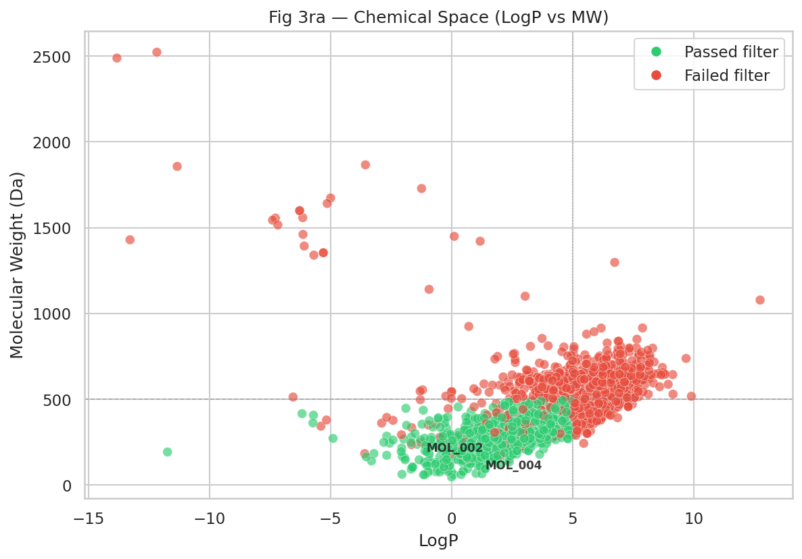

| 项目 | 说明 |
|------|------|
| **图意** | 横轴 LogP（亲脂性），纵轴 MW（分子量）；颜色区分是否通过过滤 |
| **读图要点** | 理想口服药物通常落在 MW 150–500、LogP 0–5 区域（Lipinski 框） |
| **本数据结论** | ChEMBL 库在 LogP–MW 平面上呈连续分布，类药区（MW 150–500、LogP 0–5）内绿色通过点占多数；部分高 MW / 高 LogP 化合物被过滤 |
| **含义与局限** | 通过过滤 ≠ 有活性；仅说明具备基本类药性特征 |

##### 图 3b — 骨架理化性质雷达图

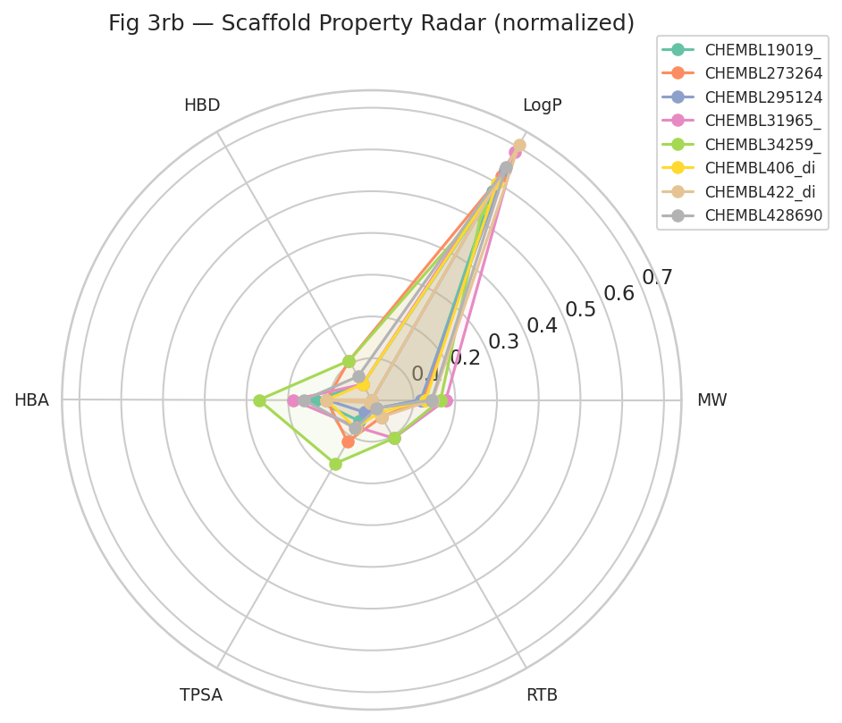

| 项目 | 说明 |
|------|------|
| **图意** | Top-8 骨架的 MW / LogP / TPSA / HBD / HBA 归一化雷达图 |
| **读图要点** | 面积越大表示理化性质越「饱满」；各骨架形状差异反映结构多样性 |
| **本数据结论** | Top 骨架在 TPSA、HBA 等维度差异明显，反映 ChEMBL 库的结构多样性 |
| **含义与局限** | 雷达图用于骨架级比较，不反映对接活性 |

##### 图 3c — 描述符分布（小提琴图）

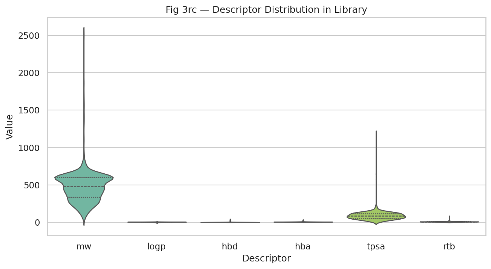

| 项目 | 说明 |
|------|------|
| **图意** | 6 种描述符在 2,377 条化合物中的分布 |
| **读图要点** | 分布宽度反映库内多样性；若分布过窄说明库多样性不足 |
| **本数据结论** | MW / LogP 呈连续分布而非离散簇，符合真实多样性化合物库特征 |
| **含义与局限** | 真实筛选应使用去重后的骨架或大规模多样性库 |

##### 图 3d — 描述符相关性热图

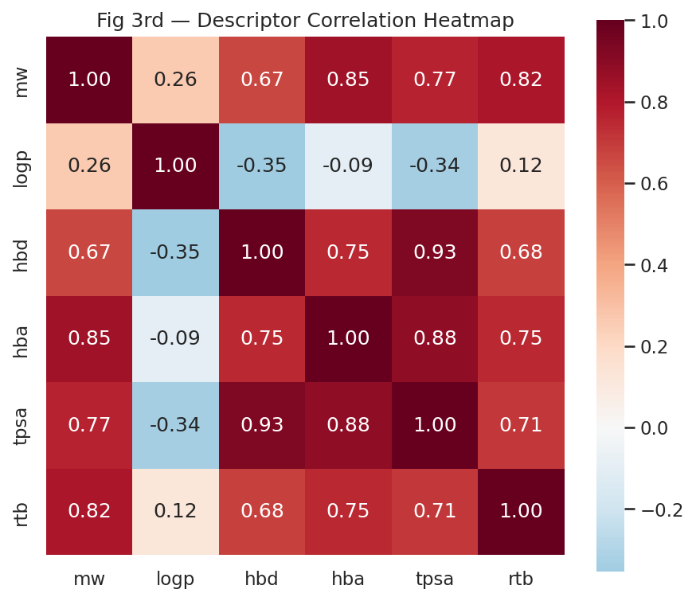

| 项目 | 说明 |
|------|------|
| **图意** | Pearson 相关系数矩阵，红色正相关、蓝色负相关 |
| **读图要点** | 强相关（|r| > 0.7）的描述符携带冗余信息 |
| **本数据结论** | 相关性反映全库结构多样性；MW 与 LogP 呈中等正相关 |
| **含义与局限** | 用于库设计阶段识别描述符冗余，指导后续 ML 特征选择 |

##### 图 3e — 筛选漏斗


| 项目 | 说明 |
|------|------|
| **图意** | 三阶段分子数：化合物库 → 通过过滤 → 对接成功 |
| **读图要点** | 漏斗收窄幅度反映筛选强度 |
| **本数据结论** | 2,377 → 864 → 244（对接 Top-250 中 244 条成功），漏斗在 Module 2 显著收窄 |
| **含义与局限** | 漏斗形状是流程健康度指标，非活性指标 |

##### Lipinski 违规统计 & 热图

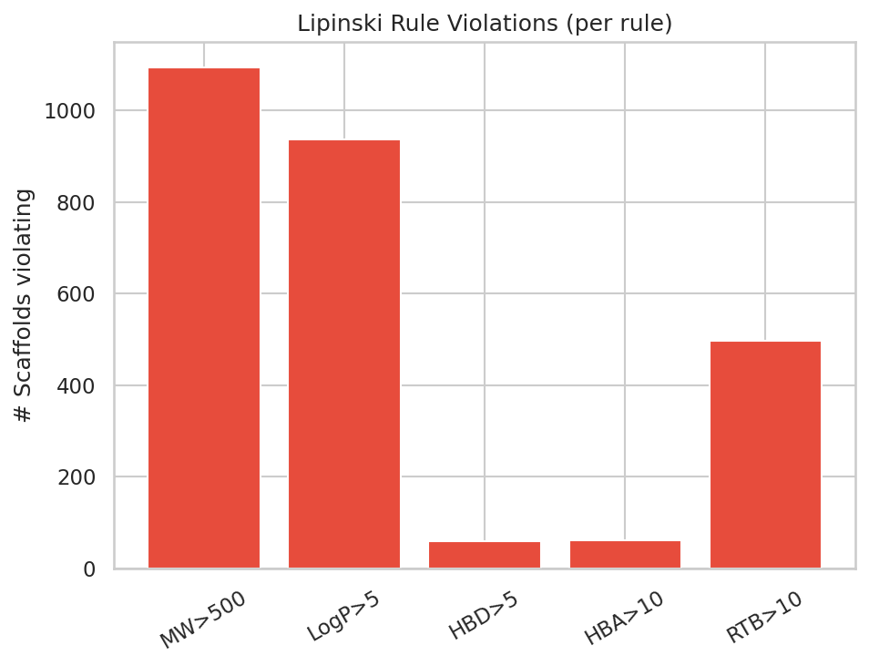

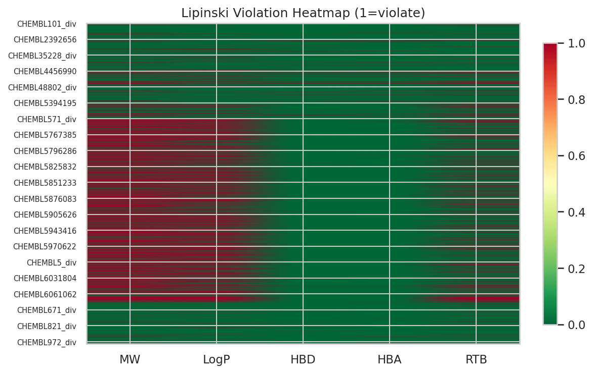

| 项目 | 说明 |
|------|------|
| **图意** | 左：五规则各自违规骨架数；右：每骨架违规热图（绿=通过，红=违规） |
| **本数据结论** | 多数化合物通过 Lipinski；违规集中在 MW / LogP 边界案例 |
| **含义与局限** | Lipinski 规则为必要非充分条件；Violation 0 不代表可成药 |

---

### Module 3 — 高通量分子对接 (AutoDock Vina)

**目的**：对通过初筛的分子，在 PD-L1 结合口袋内进行刚性对接，获得结合亲和力估算分数，用于排序与优选。

**前置依赖**：Module 0–2（需 `df_props` 与 `5N2F.pdb`）。

**输入**：

| 文件 | 说明 |
|------|------|
| `data/receptor/5N2F.pdb` | 受体结构 |
| `chemical_space_props.csv` | `passed_filter == True` 的分子 |

**方法**：

```text
5N2F.pdb  →  Open Babel (-xr)  →  receptor.pdbqt
SMILES    →  RDKit 3D 构象 + MMFF  →  Open Babel  →  ligand.pdbqt
ligand + receptor  →  AutoDock Vina  →  vina_score + out.pdbqt
```

**关键参数**：

| 参数 | 值 | 说明 |
|------|-----|------|
| 对接盒子中心 | 8HW 配体几何中心 | 自动从 PDB HETATM 行解析 |
| 盒子大小 | 22 × 22 × 22 Å | 覆盖 PD-L1 结合沟槽 |
| `MAX_DOCK` | 250 | 按初筛排序后对接 Top-N（全库数千条时必需） |
| Vina CPU | 2 核 | Colab 默认 |
| 构象生成 | ETKDG + MMFF | RDKit 3D 嵌入与优化 |

**输出**：

| 文件 | 说明 |
|------|------|
| `docking_scores.csv` | 每次对接的 mol_id, smiles, vina_score, status |
| `docking/{mol_id}_{i}_out.pdbqt` | 对接姿态（含多 model） |
| `docking/5N2F_receptor.pdbqt` | 预处理受体（缓存） |

**判定标准**：
- `status == ok`：Vina 成功返回分数
- 排序：**vina_score 越低（越负）越好**（结合越有利）

**当前运行结果（Top 5）**：

| 化合物 | Vina (kcal/mol) | 说明 |
|--------|-----------------|------|
| **CHEMBL19019_div** | **-7.43** | Top 1 |
| CHEMBL428690_div | -6.86 | |
| CHEMBL273264_div | -6.33 | |
| CHEMBL34259_div | -5.85 | |
| CHEMBL406_div | -5.84 | |

共 **244 / 250** 次对接成功（`status == ok`）。

**算力**：Colab CPU，Top-250 对接约 **1–3 小时**（取决于 Colab 负载）。

**可迁移场景**：
- **共价对接**：换用 SMINA / GNINA，定义共价残基
- **虚拟筛选大规模库**：并行化 Vina（多实例 / RunPod）
- **诱导契合**：对接后用 MD 松弛（Module 4）

#### 结果解读（Module 3 可视化）

##### 图 4a — Vina 得分分布

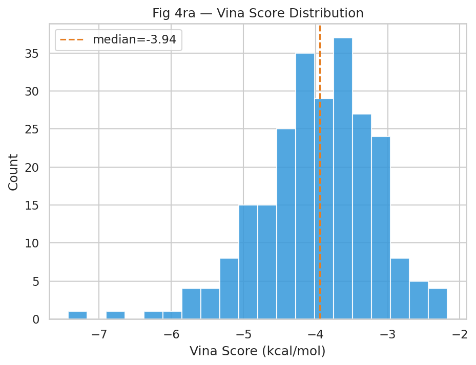

| 项目 | 说明 |
|------|------|
| **图意** | Top-250 对接的 vina_score 直方图 / 核密度 |
| **读图要点** | 分布向左偏移（更负）说明整体结合倾向更好 |
| **本数据结论** | 分布主峰约 -4 ~ -6 kcal/mol；最优 **CHEMBL19019_div（-7.43 kcal/mol）** |
| **含义与局限** | 分数绝对值受盒子定义、构象采样影响，宜做相对排序而非绝对活性判断 |

##### 图 4b — 骨架最佳得分排名

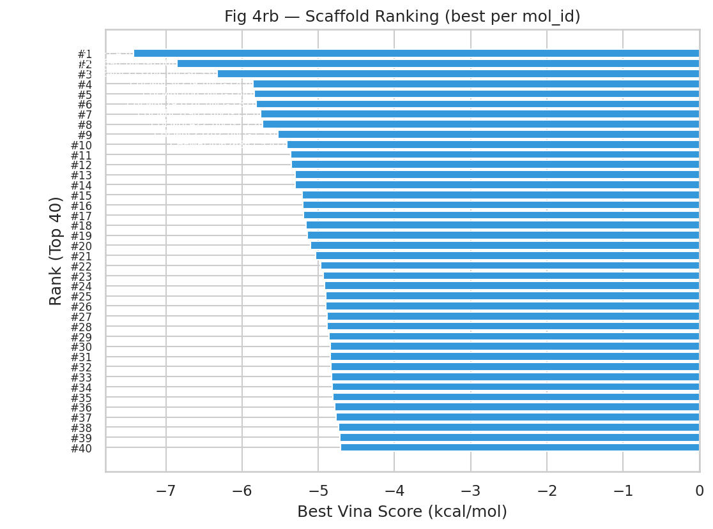

| 项目 | 说明 |
|------|------|
| **图意** | Top-20 化合物按最佳 vina_score 横向条形图排名 |
| **本数据结论** | **CHEMBL19019_div 排名第一（-7.43 kcal/mol）**，建议作为 Module 4 MD 优先候选 |
| **含义与局限** | 排名反映静态对接，不代表选择性或动力学稳定性 |

##### 图 4c — Vina 得分 vs 分子量

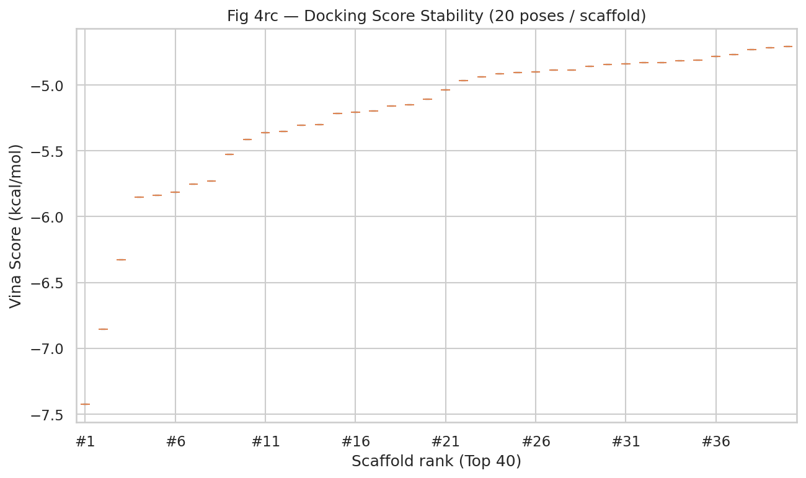

| 项目 | 说明 |
|------|------|
| **图意** | 对接得分与 MW 的散点关系，观察是否存在「大分子虚高」趋势 |
| **读图要点** | 高 MW 且高分需警惕；理想候选落在类药 MW 区间且得分靠前 |
| **本数据结论** | Top 候选分布在 MW 300–500 Da，未出现单一 MW 簇垄断高分 |
| **含义与局限** | 需结合 LogP / TPSA 与 3D 姿态综合判断 |

##### 图 4d — Vina 得分 vs 理化性质

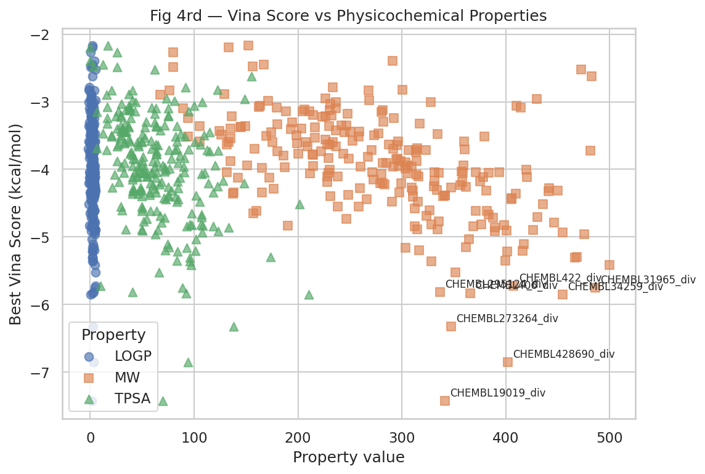

| 项目 | 说明 |
|------|------|
| **图意** | 最佳 vina_score 与 LogP / MW / TPSA 的散点关系 |
| **本数据结论** | Top 候选在 LogP / MW 上分布合理，CHEMBL19019_div 兼具较好得分与适中理化性质 |
| **含义与局限** | 3 点样本过少，无法建立可靠 QSAR；扩展库后可做相关性分析 |

---

### Module 4 — OpenMM 分子动力学（规划中）

**目的**：在显式溶剂中对 Top 对接复合物进行纳秒级 MD，验证结合姿态稳定性，观察关键相互作用。

**前置依赖**：Module 3（`top10_ligands.sdf` 或对接 PDBQT）。

**预期输入**：Top N 配体-受体复合物、力场参数（AMBER / OpenFF）。

**预期输出**：`md_rmsd.csv`、轨迹文件（`.dcd`，不纳入 Git）。

**算力**：**RunPod GPU**（推荐 A100 / RTX 4090），单体系 10–50 ns 约 1–4 小时。

**可迁移场景**：蛋白-配体、蛋白-蛋白任意复合物 MD 验证流程。

---

### Module 5 — MM/PBSA 结合自由能（规划中）

**目的**：基于 Module 4 轨迹，估算结合自由能 ΔG_bind，提供比 Vina score 更接近热力学意义的排序。

**前置依赖**：Module 4 轨迹。

**预期输出**：`mmpbsa_results.csv`

**算力**：RunPod GPU。

---

### Module 6 — 可视化与结果导出

**目的**：将 Module 2–3 的数据汇总为发表级图表，支持本地同步与 GitHub 备份。

**前置依赖**：Module 6.0 需先成功加载 `chemical_space_props.csv` 与 `docking_scores.csv`（即 Module 2–3 已跑完）。

**输出目录**：`data/screened_results/figures/`

**图号与数据归属**：

| 图号 | 文件名 | 数据来源 |
|------|--------|----------|
| 3a–3e, Lipinski | `fig3a_*` … `fig3e_*`, `fig_lipinski_*` | Module 2 → 解读见 [Module 2](#module-2--ai-闪电初筛lipinski--pains-过滤) |
| 4a–4d | `fig4a_*` … `fig4d_*` | Module 3 → 解读见 [Module 3](#module-3--高通量分子对接-autodock-vina) |
| 扩展 | `fig_ext_chem_tsne_umap.png` | Module 2+3 融合 |
| 结构 | `fig_top5_*`, `fig_ligand_grid_2d.png` | Module 3 Top 5 |
| 3D | `fig_binding_pocket_schematic.png`, `fig_3d_binding_pose.*` | Module 1+3 |

#### 结果解读（Module 6 综合可视化）

##### 化学空间 t-SNE / UMAP

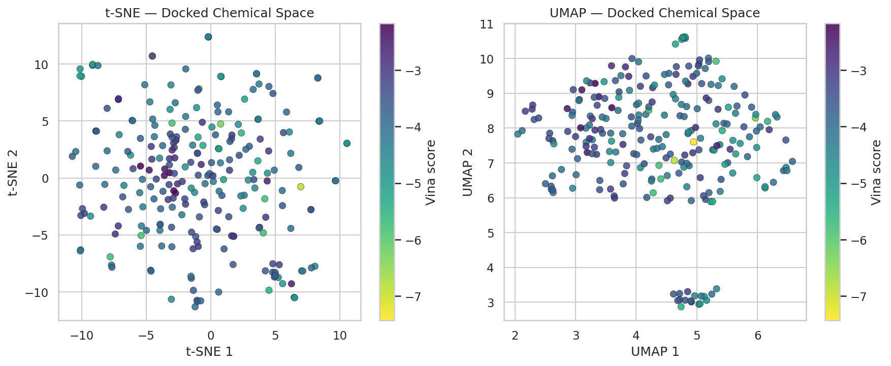

| 项目 | 说明 |
|------|------|
| **图意** | 左：Morgan 指纹 t-SNE；右：UMAP 或 PCA 降维；颜色 = 最佳 Vina score |
| **读图要点** | 结构相近的分子应聚类；颜色梯度反映活性趋势 |
| **本数据结论** | ChEMBL 化合物在指纹空间中形成多个簇，得分颜色梯度显示结构相近分子活性趋势相关 |
| **含义与局限** | 采样子集用于可视化；全库降维需更大算力 |

##### Top 5 配体 2D 结构

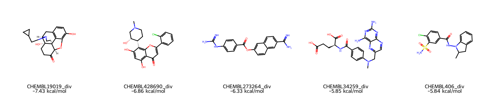

| 项目 | 说明 |
|------|------|
| **图意** | 对接得分 Top 5 分子的 2D 结构式，标注 vina_score |
| **本数据结论** | Top 5 为不同 ChEMBL 化合物，结构多样性良好；最优 **CHEMBL19019_div（-7.43 kcal/mol）** |
| **含义与局限** | 对接得分需结合 3D 姿态与 MD 验证 |

##### 配体结构网格

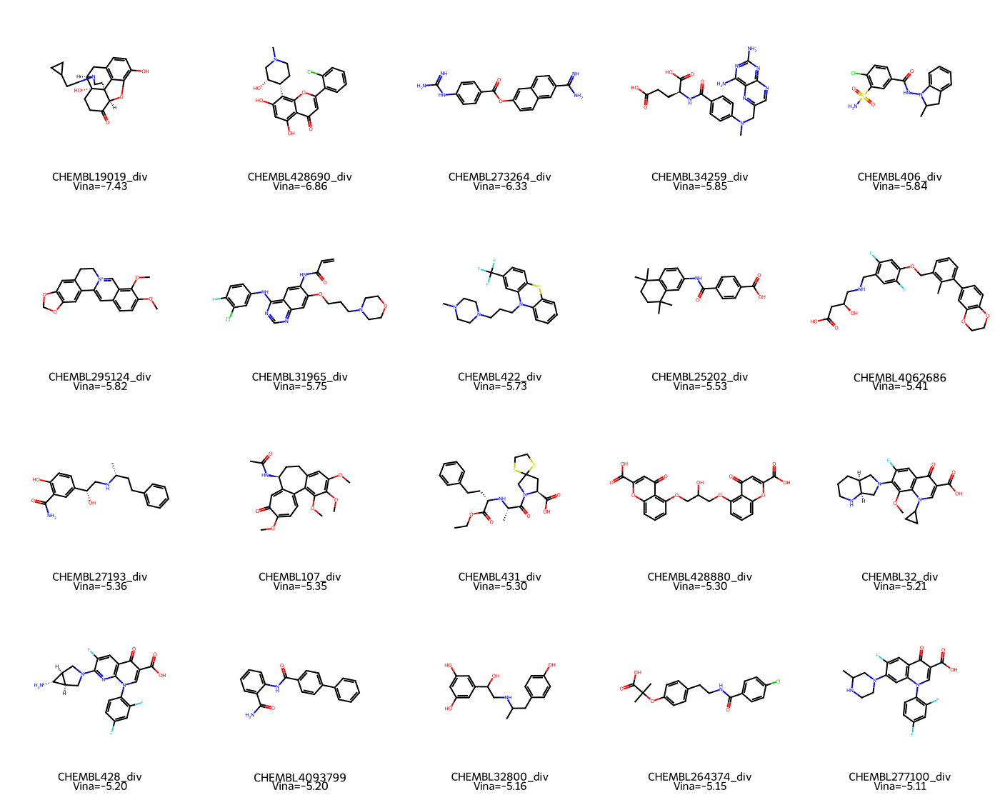

| 项目 | 说明 |
|------|------|
| **图意** | 代表性骨架 / 化合物的 2D 结构 + 各自最佳 Vina 分 |
| **本数据结论** | 展示 Top 候选的结构差异与得分对比 |

##### 结合口袋示意图

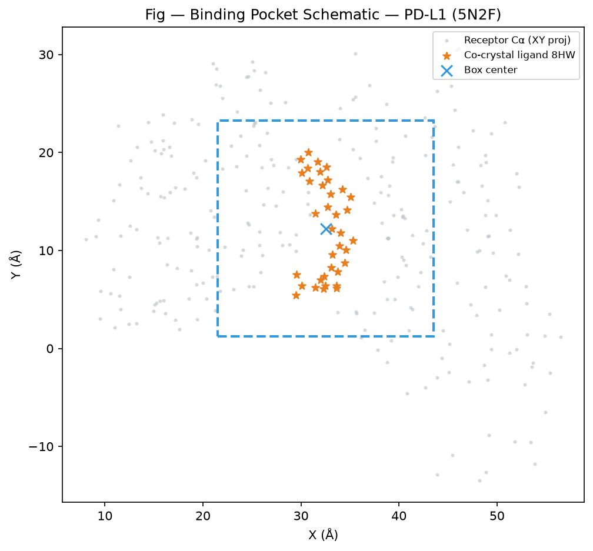

| 项目 | 说明 |
|------|------|
| **图意** | 受体 Cα 投影 + 共晶配体 8HW 位置，标示对接搜索空间 |
| **含义** | 对接盒子中心对齐 8HW，确保搜索 PD-L1 天然结合沟槽 |

##### 3D 结合姿态


| 项目 | 说明 |
|------|------|
| **图意** | py3Dmol 渲染的 Top 1 配体（CHEMBL19019_div）在 PD-L1 口袋中的 3D 姿态 |
| **交互版** | 打开 `fig_3d_binding_pose.html` 可在浏览器中旋转、缩放 |
| **含义与局限** | 静态姿态；需 Module 4 MD 确认是否保持结合 |

---

## 4. 数据字典

### 4.1 `chemical_space_props.csv`（Module 2）

| 列名 | 类型 | 说明 |
|------|------|------|
| `mol_id` | str | 分子标识符，如 `CHEMBL19019_div` 或种子 `MOL_001` |
| `smiles` | str | SMILES 字符串 |
| `mw` | float | 分子量 (Da) |
| `logp` | float | 辛醇-水分配系数估算 |
| `hbd` | int | 氢键供体数 |
| `hba` | int | 氢键受体数 |
| `rtb` | int | 可旋转键数 |
| `tpsa` | float | 拓扑极性表面积 (Ų) |
| `has_pains` | bool | 是否匹配 PAINS 子结构 |
| `passed_lipinski` | bool | 是否通过 Lipinski 五规则 |
| `is_valid` | bool | SMILES 是否可解析 |
| `passed_filter` | bool | 综合过滤是否通过 |

### 4.2 `docking_scores.csv`（Module 3）

| 列名 | 类型 | 说明 |
|------|------|------|
| `mol_id` | str | 分子标识符 |
| `smiles` | str | SMILES |
| `vina_score` | float | AutoDock Vina 对接分数 (kcal/mol)，**越低越好** |
| `status` | str | `ok` / `ligand_prep_failed` / `vina_failed` |

### 4.3 图文件命名规范

| 前缀 | 含义 |
|------|------|
| `fig3a`–`fig3e` | 化学初筛（Module 2 数据） |
| `fig4a`–`fig4d` | 分子对接（Module 3 数据） |
| `fig_lipinski_*` | Lipinski 分析 |
| `fig_ext_*` | 扩展分析图 |
| `fig_top5_*`, `fig_ligand_*` | 结构图 |
| `fig_3d_*`, `fig_binding_*` | 3D / 口袋图 |

---

## 5. 跨平台交接（Colab → RunPod）

```text
Colab Module 0–3 完成
    ↓ export_for_local_sync() 或 git push
本地 data/ 或 GitHub
    ↓ git clone / pull
RunPod 实例
    ↓ 运行 Module 4–5
MD 轨迹 & MM/PBSA 结果
```

**交接文件清单**（Module 3 → 4）：

| 文件 | 必需 |
|------|------|
| `data/receptor/5N2F.pdb` | ✅ |
| `data/screened_results/docking_scores.csv` | ✅ |
| `data/screened_results/docking/*_out.pdbqt` | ✅（Top N 姿态） |
| `top10_ligands.sdf` | 🔜 Module 3 扩展输出 |

---

## 6. 常见问题

| 问题 | 原因 | 解决 |
|------|------|------|
| `df_props_uni` 未定义 | 跳过 Module 6.0 | 先跑 Module 6.0（需 Module 2–3 数据） |
| `docking_scores.csv` 不存在 | Module 3 未跑 | 先完成 Module 3 或注入测试数据 |
| UMAP 右图空白 | `umap-learn` 未安装 | 重跑 Module 6.0；或接受 PCA 降级 |
| Module 3 很慢 | Top-N Vina 串行对接 | 正常；可减小 `SM_CONFIG["max_dock"]` 做快速测试 |
| Colab 断连 | 会话超时 | 重连内核，从 Module 0 重跑 PATHS |
| 本地无 Vina | 未安装系统包 | 使用 Colab，或 `brew install autodock-vina open-babel` |

---

## 7. 术语表

| 术语 | 解释 |
|------|------|
| **Vina score** | AutoDock Vina 估算的结合自由能变化 (kcal/mol)，越负越强 |
| **LogP** | 脂水分配系数，影响吸收与渗透 |
| **TPSA** | 拓扑极性表面积，与口服吸收相关 |
| **PAINS** | Pan-Assay Interference Compounds，易假阳性的子结构 |
| **Lipinski 五规则** | 口服类药性经验规则（MW, LogP, HBD, HBA） |
| **PDBQT** | AutoDock 家族使用的原子类型 + 电荷格式 |
| **RMSD** | 均方根偏差，衡量 MD 轨迹相对参考结构的偏离 |
| **MM/PBSA** | 分子力学/泊松-玻尔兹曼表面积，结合自由能计算方法 |

---

## 8. 参考文献

- RDKit: https://www.rdkit.org/
- AutoDock Vina: Trott, O. & Olson, A. J. *J. Comput. Chem.* **31**, 455–461 (2010).
- Lipinski et al. *Adv. Drug Deliv. Rev.* **23**, 3–25 (1997).
- PAINS: Baell, J. B. & Holloway, G. A. *J. Med. Chem.* **53**, 2719–2740 (2010).
- PDB 5N2F: PD-L1 / BMS-202 complex (Zak et al., *PNAS* 2016).
- OpenMM: https://openmm.org/

---

*文档版本：2026-07 · 对应 Notebook Module 0–3, 6 已实现*
